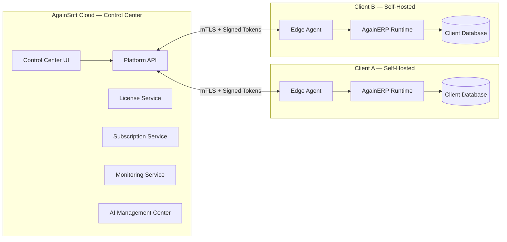
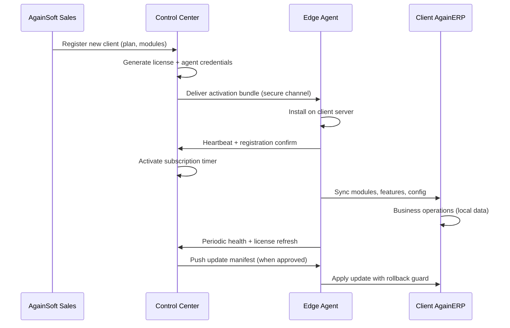
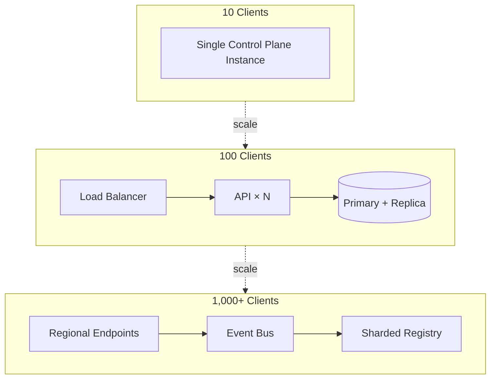

# AgainERP Control Center — System Vision

> **Status:** Architecture Documentation  
> **Version:** 1.0  
> **Step:** 01 of 17  
> **Document Type:** Enterprise Architecture — Vision  
> **Parent Index:** [MASTER_INDEX.md](./MASTER_INDEX.md)  
> **Governance:** [AgainERP GOVERNANCE](../../againerp/docs/00-foundation/GOVERNANCE.md)

---

## Purpose

Define the strategic vision for the **AgainERP Control Center** — the centralized platform operated by AgainSoft that manages every AgainERP client installation without ever storing client business data.

## Scope

| In scope | Out of scope |
|----------|--------------|
| Business and technical goals | Implementation code |
| Problem statement and value proposition | UI mockups |
| Future vision and scale targets | Client-side ERP modules |
| Alignment with hybrid licensed ERP model | Tenant business workflows |

---

## Architecture

### The Fundamental Split

AgainERP follows a **Central Control Plane + Client Edge Agent** model:

**Rule:** Client business data stays on the client. Control Center stores **metadata only** — client identity, license state, health signals, subscription records, and operational telemetry (policy-gated, anonymized where required).

---

## Why Control Center Exists

### The Problem

Enterprise ERP customers require:

- **Data sovereignty** — their database, files, and domain on infrastructure they control
- **Offline resilience** — business operations must continue during network outages
- **IP protection** — AgainSoft must protect platform intelligence (AI OS, marketplace, licensing)
- **Operational visibility** — AgainSoft must monitor license compliance, health, and updates at scale
- **Revenue integrity** — subscriptions, modules, and AI credits must be enforced reliably

Without a dedicated control plane, these requirements conflict. A traditional multi-tenant SaaS model forces data centralization. A pure self-hosted model loses platform intelligence and revenue control.

### The Solution

Control Center resolves the tension by operating as a **metadata-only management layer**:

| AgainSoft manages | Client owns |
|-------------------|-------------|
| Client registry & identity | PostgreSQL database |
| License & subscription state | Media and file storage |
| Module entitlements & feature flags | Docker environment |
| Update manifests & rollout policy | Domain and TLS certificates |
| Health & monitoring aggregates | Customer, order, product, financial data |
| AI orchestration (cloud-only) | Local ERP configuration |
| Billing & audit for platform services | Custom modules and extensions |

This model is documented in [HYBRID_LICENSED_ERP_ARCHITECTURE.md](../../againerp/docs/01-architecture/HYBRID_LICENSED_ERP_ARCHITECTURE.md) and expanded across this documentation series.

---

## Business Goals

| Goal | Success Metric |
|------|----------------|
| **Scale client base** | 10 → 100 → 1,000 → 10,000+ clients without architecture change |
| **Protect recurring revenue** | License enforcement with < 0.1% false-positive lockouts |
| **Reduce support cost** | Proactive health alerts; 60% issues detected before client report |
| **Accelerate onboarding** | Registration to production-ready client in < 4 hours (automated path) |
| **Enable partner ecosystem** | Marketplace modules distributed via signed packages |
| **Enterprise trust** | SOC 2 / ISO 27001-ready audit trail and data boundary proof |
| **Global reach** | Multi-region control plane; clients in any jurisdiction |

---

## Technical Goals

| Goal | Design implication |
|------|-------------------|
| **Zero Trust** | mTLS between Edge Agent and Control Plane; JWT with short TTL |
| **API First** | Every UI action backed by versioned REST/Agent API |
| **Event Driven** | Client lifecycle, health, billing emit immutable domain events |
| **Multi-version** | Control Center tracks client ERP version; updates are staged |
| **Docker Native** | Edge Agent and client stack run as containerized services |
| **Offline Grace** | License validation continues during connectivity loss (signed cache) |
| **Observability** | Unified metrics, logs, traces from agent heartbeat pipeline |
| **Disaster Recovery** | Control Center RPO ≤ 15 min; client backup orchestration metadata |
| **AI First** | Specialized AI agents assist ops; no autonomous destructive actions |

---

## Problems It Solves

### For AgainSoft (Platform Operator)

| Problem | Control Center capability |
|---------|---------------------------|
| No visibility into client health | Monitoring Service + heartbeat pipeline |
| Manual license management | License Service with automated renewal |
| Risky update rollouts | Update Service with staged deployment and rollback |
| Module sprawl | Module Management with dependency resolution |
| Support ticket overload | AI Monitoring Agent + proactive alerts |
| Billing disputes | Audit Service + immutable event log |
| Security incidents | Security architecture with tamper detection reports |

### For Client Organizations

| Problem | Control Center capability |
|---------|---------------------------|
| Fear of vendor lock-in on data | Data stays on client infrastructure |
| Downtime during updates | Staged updates with rollback; maintenance windows |
| License uncertainty | Clear entitlement dashboard via Edge Agent sync |
| Module compatibility | Version compatibility matrix before install |
| Disaster recovery | Backup orchestration with verification reports |
| AI cost control | AI credit metering and budget alerts |

### For System Integrators & Partners

| Problem | Control Center capability |
|---------|---------------------------|
| Multi-client management | Client Registry with fleet view |
| Custom module distribution | Marketplace with signed packages |
| Deployment repeatability | Standard Docker Compose / K8s manifests |
| API integration | Documented REST + webhook contracts |

---

## Responsibilities

Control Center is responsible for:

1. **Client identity** — registration, activation, suspension, termination
2. **Commercial enforcement** — plans, subscriptions, licenses, billing metadata
3. **Technical governance** — modules, features, versions, updates
4. **Operational intelligence** — health, monitoring, alerts, backup status
5. **Platform AI** — AI agent registry, credit metering, audit (cloud-only execution)
6. **Security & compliance** — RBAC, audit logs, token lifecycle, anomaly detection

Control Center is **not** responsible for:

- Storing or processing client business transactions
- Direct database access to client PostgreSQL
- Running client-side business logic
- Customer-facing storefront operations

---

## Workflow — Vision to Operation

---

## Scale Vision

The architecture must support linear operational growth:

| Scale tier | Clients | Control plane implication |
|------------|---------|---------------------------|
| **Seed** | 10 | Single-region Docker Compose |
| **Growth** | 100 | Horizontal API replicas; read replicas |
| **Scale** | 1,000 | Event bus partitioning; regional edge endpoints |
| **Enterprise** | 10,000+ | Multi-region active-active; sharded client registry |

**No architectural rewrite** between tiers — only horizontal scaling, caching, and partitioning.

---

## Future Vision

### Near Term (Phase 1–2)

- Full client lifecycle automation
- Module marketplace integration
- AI-assisted monitoring and update recommendations
- Self-service client portal for AgainSoft operators

### Medium Term (Phase 3)

- Multi-region control plane with geo-routing
- Partner white-label control plane instances
- Advanced anomaly detection and predictive maintenance
- Fleet-wide configuration templates

### Long Term

- **Global CDN** for update artifacts and marketplace packages
- **Edge computing** — regional agent relay nodes for latency-sensitive clients
- **Cluster management** — clients running multi-node ERP clusters
- **Autonomous operations** — AI Automation Agent with human-in-the-loop approval for destructive actions
- **Compliance packs** — GDPR, HIPAA, PCI audit templates per client tier

Detail: [17 — Future Roadmap](./17_Roadmap.md)

---

## Best Practices

| Practice | Rationale |
|----------|-----------|
| Document before code | AgainERP PRE_CODE_GATE — architecture approved first |
| Metadata-only storage | Never store client PII or business records in Control Center DB |
| Fail closed on license | Invalid license → read-only mode on client, not silent bypass |
| Immutable audit log | All operator and agent actions append-only |
| Version everything | API, agent protocol, and license payload formats are versioned |
| Design for offline | Client operations continue; sync catches up on reconnect |

---

## Security Notes

- Control Center is a **high-value target** — it holds signing keys, agent credentials, and billing metadata
- All operator access requires **MFA** and **RBAC** with least privilege
- Agent authentication uses **mutual TLS** plus rotating bearer tokens — network location is never sufficient
- License signing keys stored in **HSM or cloud KMS** — never in application config files
- Client business data **must never** be requested or persisted by Control Center APIs

Detail: [13 — Security Architecture](./13_Security.md)

---

## Future Improvements

| Improvement | Target step |
|-------------|-------------|
| Formal SLA definitions per client tier | [05 — Client Lifecycle](./05_Client_Lifecycle.md) |
| Component-level dependency map | [03 — Component Architecture](./03_Component_Architecture.md) |
| OpenAPI specification (design) | [07 — API Architecture](./07_API_Architecture.md) |
| AI agent interaction model | [14 — AI Control](./14_AI_Control.md) |

---

## Summary

The AgainERP Control Center exists to **manage client installations at scale** while **respecting data sovereignty**. It is the AgainSoft-operated control plane for licenses, subscriptions, modules, updates, monitoring, and AI — connected to each client through a secure Edge Agent. The same architecture scales from 10 to 10,000+ clients through horizontal expansion, not redesign.

**Next:** [02 — High Level Architecture](./02_High_Level_Architecture.md)
