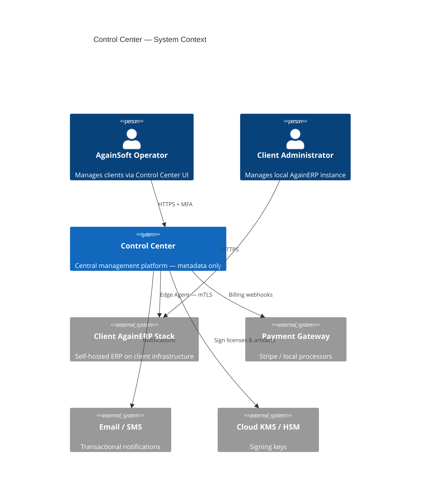
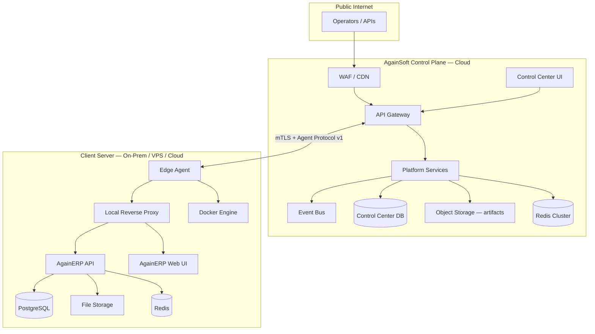
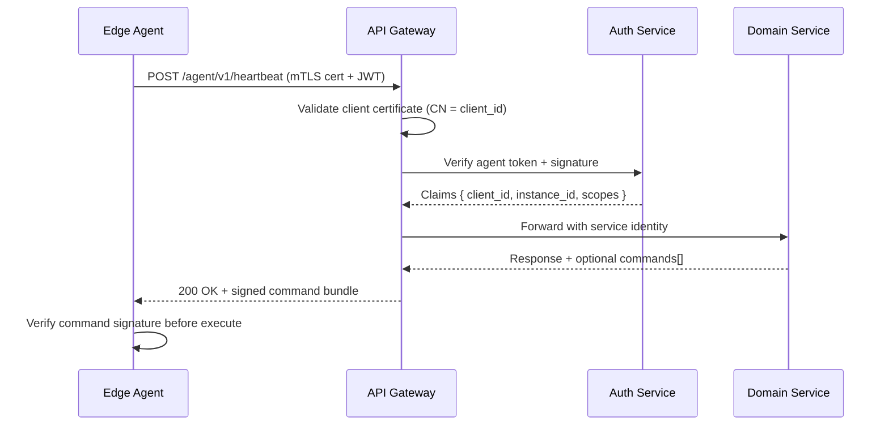
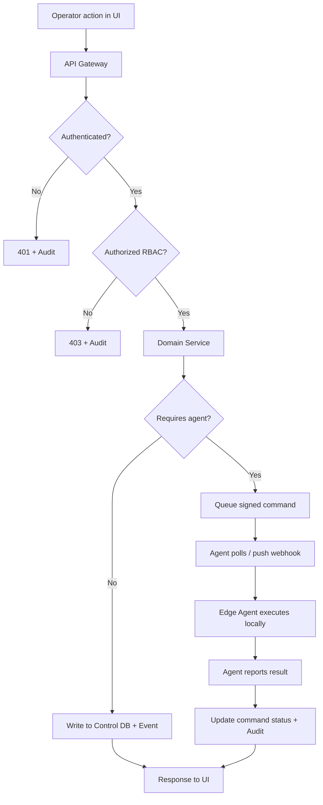

# AgainERP Control Center — High Level Architecture

> **Status:** Architecture Documentation  
> **Version:** 1.0  
> **Step:** 02 of 17  
> **Document Type:** Enterprise Architecture — High Level  
> **Parent Index:** [MASTER_INDEX.md](./MASTER_INDEX.md)  
> **Previous:** [01 — System Vision](./01_System_Vision.md)

---

## Purpose

Define the high-level system architecture for the AgainERP Control Center — how the central control plane, client servers, Edge Agent, secure communication layer, and cloud components interact at scale.

## Scope

| In scope | Out of scope |
|----------|--------------|
| System topology and boundaries | Service implementation code |
| Communication patterns | Database DDL |
| Deployment zones | UI wireframes |
| Scale characteristics | Client ERP module internals |

---

## Architecture

### System Context

### Logical Architecture

---

## Central Control Plane

The Control Plane is operated exclusively by AgainSoft. It is the authoritative source for:

| Domain | Authority |
|--------|-----------|
| Client identity | Control Center |
| License & subscription state | Control Center |
| Module entitlements | Control Center |
| Update manifests | Control Center |
| AI agent registry & credits | Control Center |
| Operator audit trail | Control Center |

### Control Plane Layers

```mermaid
flowchart LR
    subgraph Presentation["Presentation Layer"]
        WEB_UI[Admin UI — Next.js]
        PORTAL[Client Self-Service Portal]
    end

    subgraph Gateway["Gateway Layer"]
        APIGW[API Gateway]
        AUTH[Auth Service]
        RL[Rate Limiter]
    end

    subgraph Domain["Domain Services Layer"]
        CR[Client Registry]
        LS[License Service]
        SS[Subscription Service]
        MS[Module Service]
        US[Update Service]
        MON[Monitoring Service]
        BS[Backup Service]
        AIS[AI Service]
        NS[Notification Service]
        BIL[Billing Service]
        AUD[Audit Service]
    end

    subgraph Data["Data Layer"]
        PG_C[(PostgreSQL)]
        RD[(Redis)]
        S3[Object Storage]
        EB[Event Bus]
    end

    WEB_UI --> APIGW
    PORTAL --> APIGW
    APIGW --> AUTH --> RL
    RL --> Domain
    Domain --> Data
```

---

## Client Servers

Each client operates an independent AgainERP stack:

| Component | Technology | Owner |
|-----------|------------|-------|
| Web UI | Next.js | Client |
| API | FastAPI modular monolith | Client |
| Database | PostgreSQL | Client |
| Cache | Redis | Client |
| File storage | MinIO / S3-compatible | Client |
| Container runtime | Docker / Docker Compose | Client |
| Reverse proxy | Nginx / Traefik | Client |
| TLS certificates | Client domain | Client |

**Critical rule:** Control Center never connects directly to client PostgreSQL. All interaction flows through the Edge Agent API surface.

---

## Edge Agent

The Edge Agent is a lightweight, always-on service deployed on every client server. It is the **only** component permitted to communicate with the Control Plane on behalf of the client.

| Function | Direction |
|----------|-----------|
| Heartbeat & health telemetry | Client → Control Plane |
| License refresh | Bidirectional |
| Configuration sync | Control Plane → Client |
| Module manifest sync | Control Plane → Client |
| Update apply / rollback | Control Plane → Client (agent executes) |
| Backup status report | Client → Control Plane |
| Remote command execution | Control Plane → Client (signed, audited) |

Detail: [04 — Client Edge Agent](./04_Client_Edge_Agent.md)

---

## Secure Communication

### Communication Model

### Security Properties

| Property | Mechanism |
|----------|-----------|
| **Transport encryption** | TLS 1.3 minimum |
| **Mutual authentication** | Client certificate per installation |
| **Message integrity** | Request/response HMAC or JWS signatures |
| **Replay protection** | Nonce + timestamp window (±5 min) |
| **Least privilege** | Agent scopes limited to assigned client_id |
| **Audit** | Every agent request logged with correlation ID |

### Network Topology Options

| Mode | Agent egress | Control Plane ingress |
|------|--------------|----------------------|
| **Standard** | Client initiates outbound HTTPS | Public endpoint + mTLS |
| **Enterprise** | Fixed IP allowlist | Dedicated endpoint per client tier |
| **Air-gapped relay** | Scheduled batch sync via secure file drop | Optional Phase 3 |

---

## Cloud Components

Aligned with [CLOUD_CONTROL_PLANE.md](../../againerp/docs/07-saas/CLOUD_CONTROL_PLANE.md):

| Component | Role | Agent interaction |
|-----------|------|-------------------|
| **Control Center UI** | Operator dashboard | None (human via browser) |
| **API Gateway** | Routing, auth, rate limit | All agent traffic |
| **Client Registry** | Client metadata CRUD | Registration, heartbeat |
| **License Service** | Sign, validate, renew | Token refresh |
| **Subscription Service** | Plans, billing cycles | Entitlement sync |
| **Feature Flag Service** | Module/feature toggles | Config sync |
| **Update Service** | Version manifests, rollout | Update commands |
| **Monitoring Service** | Health aggregation | Heartbeat ingestion |
| **Backup Service** | Backup policy orchestration | Status reports |
| **AI Service** | Agent registry, credit metering | Proxy queue from client |
| **Notification Service** | Email, SMS, webhooks | Event-driven |
| **Billing Service** | Invoices, payment sync | Subscription events |
| **Audit Service** | Immutable action log | All write operations |

Detail: [03 — Component Architecture](./03_Component_Architecture.md)

---

## Responsibilities

| Layer | Owns | Does not own |
|-------|------|--------------|
| **Control Plane** | Platform metadata, entitlements, ops intelligence | Client business data |
| **Edge Agent** | Sync, local command execution, telemetry | Business logic |
| **Client ERP** | All business operations | License signing, AI model hosting |

---

## Workflow — End-to-End Request Flow

---

## Scale Characteristics

| Clients | Control Plane pattern | Agent pattern |
|---------|----------------------|---------------|
| 10 | Monolith services, single DB | Poll interval 60s |
| 100 | Service replicas behind LB | Poll interval 60s; Redis cache |
| 1,000 | Event bus; DB read replicas | Regional gateway endpoints |
| 10,000+ | Sharded registry; multi-region | Adaptive heartbeat; command queue partitions |

**Design invariant:** Agent always initiates outbound connections (except optional push webhooks for enterprise tier). This simplifies client firewall configuration.

---

## Best Practices

- **Outbound-only agent default** — clients whitelist Control Plane URL; no inbound ports required
- **Idempotent commands** — every remote command carries `command_id` for safe retry
- **Correlation IDs** — trace operator action → command → agent result end-to-end
- **Circuit breakers** — isolate failing clients from degrading control plane
- **Separate read/write paths** — heartbeat ingestion is write-heavy; use async processing

---

## Security Notes

- Control Plane endpoints exposed to internet must pass WAF + DDoS protection
- Agent certificates are **per installation**, revoked on termination
- No shared secrets across clients — credential compromise affects one client only
- Operator UI sessions are distinct from agent tokens — separate auth flows

Detail: [13 — Security Architecture](./13_Security.md)

---

## Future Improvements

| Improvement | Phase |
|-------------|-------|
| gRPC option for agent protocol (lower overhead) | Phase 2 |
| WebSocket push for real-time commands | Phase 2 |
| Private Link / VPC peering for enterprise | Phase 3 |
| Agent mesh for multi-node client clusters | Phase 3 |

---

## Summary

The high-level architecture separates **AgainSoft's metadata control plane** from **client-owned business runtime**. The Edge Agent is the secure bridge — mTLS, signed commands, outbound-initiated connections. Cloud components are modular domain services behind an API Gateway, scaling horizontally from 10 to 10,000+ clients without redesign.

**Next:** [03 — Component Architecture](./03_Component_Architecture.md)
