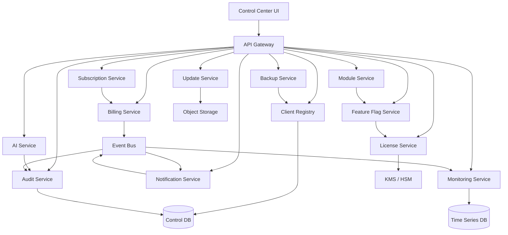
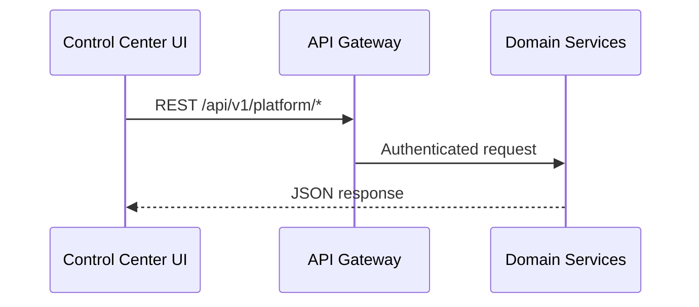
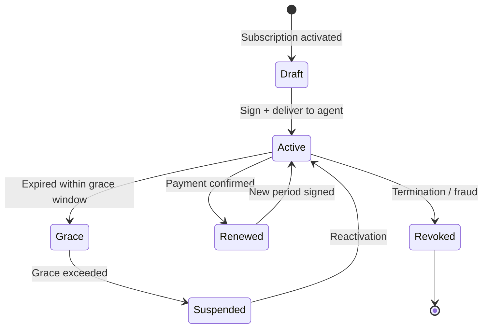
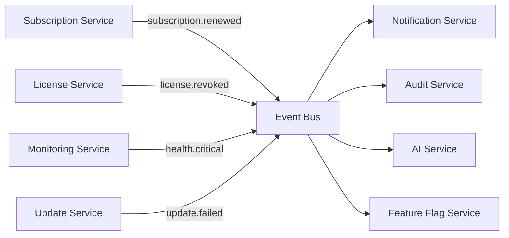

# AgainERP Control Center — Component Architecture

> **Status:** Architecture Documentation  
> **Version:** 1.0  
> **Step:** 03 of 17  
> **Document Type:** Enterprise Architecture — Components  
> **Parent Index:** [MASTER_INDEX.md](./MASTER_INDEX.md)  
> **Previous:** [02 — High Level Architecture](./02_High_Level_Architecture.md)

---

## Purpose

Document every major Control Center component — responsibility, dependencies, interactions, and boundaries.

## Scope

Control Plane components only. Client-side AgainERP modules are referenced but not specified here.

---

## Architecture

### Component Map

---

## Component Catalog

### 1. Control Center UI

| Attribute | Value |
|-----------|-------|
| **Responsibility** | Operator dashboard for client fleet management |
| **Technology** | Next.js (App Router), design system aligned with AgainERP admin |
| **Dependencies** | API Gateway, Auth Service |
| **Consumers** | AgainSoft operators, support staff, account managers |

**Capabilities:** Client list/detail, subscription management, license overview, health dashboard, update rollout console, module management, AI usage reports, audit log viewer, operator settings.

**Interactions:**

---

### 2. API Gateway

| Attribute | Value |
|-----------|-------|
| **Responsibility** | Single entry point; routing, auth, rate limiting, request validation |
| **Dependencies** | Auth Service, Redis (rate limit counters) |
| **Routes** | `/api/v1/platform/*` (operator), `/agent/v1/*` (Edge Agent) |

**Capabilities:** JWT validation (operators), mTLS + agent token validation (agents), request size limits, API versioning, correlation ID injection, OpenTelemetry trace propagation.

---

### 3. License Service

| Attribute | Value |
|-----------|-------|
| **Responsibility** | License generation, signing, validation, renewal, revocation |
| **Dependencies** | KMS/HSM, Client Registry, Subscription Service, Audit Service |
| **Authority** | Sole issuer of signed license payloads |

**Workflow:**

Detail: [09 — Subscription & License](./09_Subscription_License.md)

---

### 4. Subscription Service

| Attribute | Value |
|-----------|-------|
| **Responsibility** | Plans, billing cycles, trials, add-ons, seat limits, AI credits |
| **Dependencies** | Billing Service, License Service, Feature Flag Service, Notification Service |
| **Events emitted** | `subscription.created`, `subscription.renewed`, `subscription.suspended`, `subscription.cancelled` |

**Plan dimensions:** Base plan tier, included modules, seat count, AI credit allocation, API rate limits, support SLA tier, update channel (stable/beta).

---

### 5. Client Registry

| Attribute | Value |
|-----------|-------|
| **Responsibility** | Canonical record of every client installation |
| **Dependencies** | Audit Service, Control DB |
| **Key entities** | Client, Server, Instance, Domain, Deployment mode |

**Stored metadata (never business data):**
- Client legal name, contact, tier
- Server hostname, IP (last seen), region, Docker version
- Instance ID, ERP version, agent version
- Registration status, activation date, tags

Detail: [05 — Client Lifecycle](./05_Client_Lifecycle.md) · [06 — Database Architecture](./06_Database_Architecture.md)

---

### 6. Feature Flag Service

| Attribute | Value |
|-----------|-------|
| **Responsibility** | Evaluate and distribute feature/module entitlements |
| **Dependencies** | License Service, Subscription Service, Module Service |
| **Sync target** | Edge Agent → local feature cache on client |

**Evaluation order:** Subscription plan → License payload → Manual override (operator) → Client-specific exception (enterprise).

Detail: [08 — Module Management](./08_Module_Management.md)

---

### 7. Update Service

| Attribute | Value |
|-----------|-------|
| **Responsibility** | Version manifests, artifact signing, staged rollout, rollback coordination |
| **Dependencies** | Object Storage, Client Registry, Notification Service, Audit Service |
| **Artifacts** | Docker images, migration bundles, hotfix patches |

**Rollout stages:** Canary (internal) → Early adopters → Tier-based → General availability.

Detail: [12 — Update Manager](./12_Update_Manager.md)

---

### 8. Monitoring Service

| Attribute | Value |
|-----------|-------|
| **Responsibility** | Ingest heartbeat, aggregate health, trigger alerts |
| **Dependencies** | Time-series store, Notification Service, AI Service |
| **Metrics** | CPU, RAM, disk, Docker, DB connectivity, queue depth, response time |

Detail: [10 — Monitoring & Health](./10_Monitoring.md)

---

### 9. Backup Service

| Attribute | Value |
|-----------|-------|
| **Responsibility** | Backup policy definition, schedule orchestration, verification tracking |
| **Dependencies** | Client Registry, Edge Agent (execution), Notification Service |
| **Note** | Backup **files** stay on client or client-chosen remote storage; Control Center stores **metadata only** |

Detail: [11 — Backup & Disaster Recovery](./11_Backup.md)

---

### 10. AI Service

| Attribute | Value |
|-----------|-------|
| **Responsibility** | AI agent registry, credit metering, request routing, audit |
| **Dependencies** | Audit Service, Subscription Service, external LLM providers |
| **Rule** | AI models run cloud-only; client sends context via signed API proxy |

**Sub-agents:** Chief AI, Health AI, Recommendation AI, Update AI, License AI, Monitoring AI, Automation AI.

Detail: [14 — AI Management Center](./14_AI_Control.md)

---

### 11. Notification Service

| Attribute | Value |
|-----------|-------|
| **Responsibility** | Deliver email, SMS, in-app, and webhook notifications |
| **Dependencies** | Event Bus, template store, external providers |
| **Consumers** | Operators, client admins (policy-gated), external integrations |

**Event sources:** Subscription changes, health alerts, update failures, license expiry warnings, security anomalies.

---

### 12. Billing Service

| Attribute | Value |
|-----------|-------|
| **Responsibility** | Invoice generation, payment sync, dunning, usage metering |
| **Dependencies** | Subscription Service, external payment gateway, Audit Service |
| **Metered dimensions** | Seats, AI credits, storage allocation (policy), API calls (SaaS tier) |

---

### 13. Audit Service

| Attribute | Value |
|-----------|-------|
| **Responsibility** | Immutable append-only log of all platform actions |
| **Dependencies** | Control DB (append-only partition), Object Storage (archival) |
| **Logged actors** | Operators, system services, Edge Agents |

**Audit fields:** `timestamp`, `actor_type`, `actor_id`, `action`, `resource_type`, `resource_id`, `before`, `after`, `correlation_id`, `ip`, `user_agent`.

---

## Interaction Matrix

| Component | Reads from | Writes to | Calls |
|-----------|------------|-----------|-------|
| UI | All via API | Via API | API Gateway |
| API Gateway | Redis | Redis | Auth, all services |
| Client Registry | Control DB | Control DB | Audit |
| License Service | Control DB, KMS | Control DB | Subscription, Audit |
| Subscription Service | Control DB | Control DB | Billing, License, Notification |
| Feature Flag Service | Control DB | Control DB | License, Module |
| Module Service | Control DB | Control DB | Feature Flag, Update |
| Update Service | Object Storage | Control DB | Client Registry, Agent queue |
| Monitoring Service | Time-series | Time-series | Notification, AI |
| Backup Service | Control DB | Control DB | Agent commands |
| AI Service | Control DB | Control DB | Audit, LLM providers |
| Notification Service | Templates | Delivery log | External providers |
| Billing Service | Control DB | Control DB | Payment gateway |
| Audit Service | — | Audit store | — |

---

## Event-Driven Integration

**Event contract rules:**
- At-least-once delivery with idempotent consumers
- Schema version in event envelope
- Dead letter queue for failed processing
- 90-day hot retention; cold archive to object storage

---

## Responsibilities Summary

| Concern | Primary owner |
|---------|---------------|
| Who is this client? | Client Registry |
| What can they use? | License + Feature Flag + Module |
| Are they paying? | Subscription + Billing |
| Are they healthy? | Monitoring |
| Are they current? | Update Service |
| Are backups OK? | Backup Service |
| Who did what? | Audit Service |
| AI usage & agents | AI Service |

---

## Best Practices

- **Single writer per aggregate** — Client Registry owns client state; others reference by ID
- **Saga for cross-service workflows** — Registration spans Registry + Subscription + License
- **Cache entitlements** — Feature flags cached in Redis; invalidate on license change event
- **Async by default for agent commands** — synchronous only for critical path (license refresh)

---

## Security Notes

- Audit Service is append-only — no UPDATE or DELETE on audit records
- License Service is the only component with KMS sign access
- AI Service never persists raw client business payloads — metadata and token counts only
- Cross-service calls use mTLS service mesh identity (production)

---

## Future Improvements

| Component | Improvement |
|-----------|-------------|
| API Gateway | GraphQL federation for complex dashboard queries |
| Monitoring | OpenTelemetry native agent protocol |
| AI Service | Federated learning on anonymized metrics (opt-in) |
| Module Service | Dependency graph visualization in UI |

---

## Summary

The Control Center comprises thirteen domain services orchestrated through an API Gateway and Event Bus. Each component owns a narrow responsibility; client business data never enters any service. The Edge Agent is the execution arm for client-side operations initiated by Update, Backup, Module, and Feature Flag services.

**Next:** [04 — Client Edge Agent](./04_Client_Edge_Agent.md)
