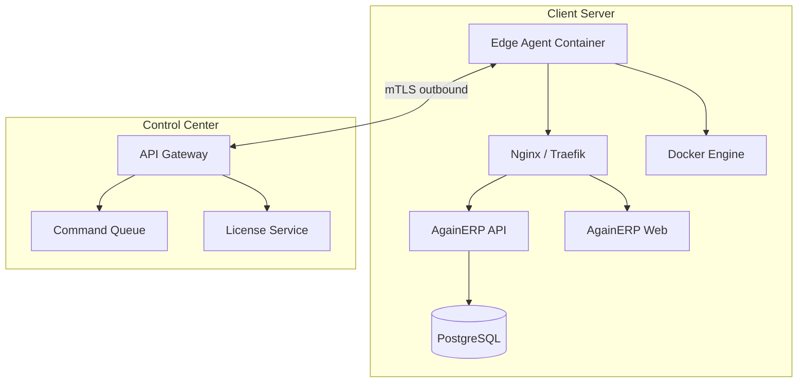
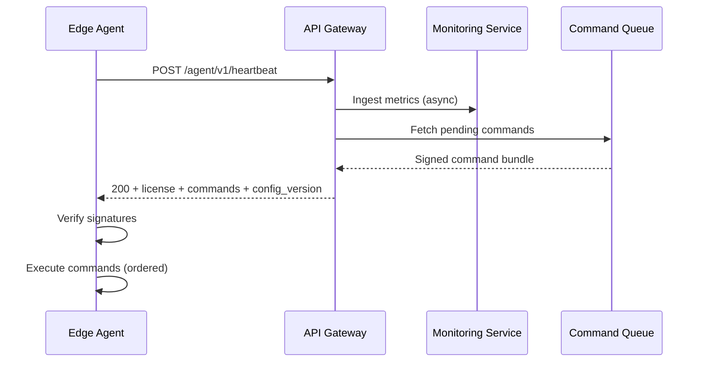
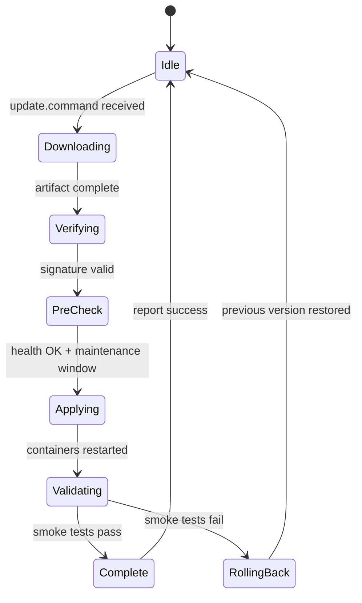
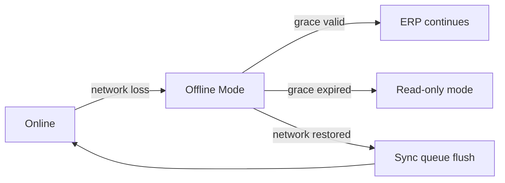

# AgainERP Control Center — Client Edge Agent

> **Status:** Architecture Documentation  
> **Version:** 1.0  
> **Step:** 04 of 17  
> **Document Type:** Enterprise Architecture — Edge Agent  
> **Parent Index:** [MASTER_INDEX.md](./MASTER_INDEX.md)  
> **Previous:** [03 — Component Architecture](./03_Component_Architecture.md)

---

## Purpose

Specify the Client Edge Agent — the secure, always-on bridge between each client AgainERP installation and the AgainSoft Control Center.

## Scope

Edge Agent design only. Client ERP application internals are out of scope.

---

## Architecture

### Agent Placement



---

## Purpose

The Edge Agent exists because:

1. **Security boundary** — Control Plane never touches client database directly
2. **Firewall friendly** — outbound-only connections from client to cloud
3. **Offline resilience** — local license cache and command queue
4. **Operational automation** — updates, backups, config sync without SSH access
5. **Telemetry** — standardized health reporting across all clients

---

## Responsibilities

| Responsibility | Description |
|----------------|-------------|
| **Identity** | Prove client + instance identity to Control Plane |
| **Heartbeat** | Periodic health and status telemetry |
| **License sync** | Refresh signed license; maintain local cache |
| **Config sync** | Apply platform configuration deltas |
| **Module sync** | Install/enable/disable modules per entitlement |
| **Update execution** | Pull artifacts; apply with rollback guard |
| **Backup reporting** | Execute backup jobs; report verification status |
| **Command execution** | Run signed remote commands from Control Plane |
| **AI proxy queue** | Queue AI requests when offline; flush on reconnect |
| **Tamper reporting** | Detect modified runtime; report to Security Center |

---

## Heartbeat

### Schedule

| Client tier | Default interval | Adaptive |
|-------------|------------------|----------|
| Standard | 60 seconds | ±10% jitter |
| Enterprise | 30 seconds | Configurable 15–300s |
| Degraded network | 300 seconds | Auto-detect via failure count |

### Heartbeat Payload (conceptual)

```json
{
  "agent_version": "1.2.0",
  "instance_id": "inst_abc123",
  "erp_version": "2026.6.1",
  "timestamp": "2026-06-28T10:00:00Z",
  "nonce": "uuid-v4",
  "health": {
    "cpu_percent": 42.1,
    "memory_percent": 68.3,
    "disk_percent": 55.0,
    "docker": { "running": 6, "unhealthy": 0 },
    "database": { "reachable": true, "latency_ms": 12 },
    "redis": { "reachable": true },
    "queue": { "pending_jobs": 3 }
  },
  "license": {
    "expires_at": "2027-06-12T00:00:00Z",
    "grace_active": false
  },
  "last_command_results": []
}
```

### Heartbeat Response

Control Plane may return:
- Updated license token
- Pending commands array (signed)
- Configuration delta
- Feature flag snapshot version



---

## Authentication

### Credential Model

| Credential | Purpose | Lifetime |
|------------|---------|----------|
| **Client certificate (mTLS)** | Transport identity | Until revocation |
| **Agent bootstrap token** | One-time activation | 24 hours |
| **Agent access token (JWT)** | API authorization | 15 minutes |
| **Agent refresh token** | Token renewal | 7 days (rotated) |

### Activation Flow

```mermaid
sequenceDiagram
    participant OP as Operator
    participant CC as Control Center
    participant EA as Edge Agent (new)

    OP->>CC: Generate activation bundle
    CC->>CC: Create client_id + bootstrap token + cert CSR template
    OP->>EA: Install agent + paste activation code
    EA->>EA: Generate key pair + CSR
    EA->>CC: POST /agent/v1/activate { bootstrap_token, csr }
    CC->>CC: Validate bootstrap; sign certificate
    CC-->>EA: Client cert + initial license + agent tokens
    EA->>EA: Store credentials in secure local vault
    EA->>CC: POST /agent/v1/heartbeat (confirmed)
```

### Token Refresh

- Agent refreshes JWT 2 minutes before expiry
- Failed refresh → use cached license until grace period rules apply
- Refresh token rotation on every use — old token invalidated

---

## Configuration Sync

| Config domain | Source of truth | Local cache |
|---------------|-----------------|-------------|
| Feature flags | Control Plane | `/var/againerp/agent/cache/features.json` |
| Module manifest | Control Plane | `/var/againerp/agent/cache/modules.json` |
| Platform settings | Control Plane | Redis on client (via API notify) |
| AI credit budget | Control Plane | Local counter synced hourly |

**Sync strategy:** Version-based delta. Agent sends `config_version`; Control Plane returns full snapshot or patch.

---

## Module Sync

1. Agent receives module manifest with entitlements
2. Compares with locally installed modules
3. For new modules: download signed package from Update Service CDN
4. Verify signature + license entitlement
5. Execute install script via Docker Compose overlay
6. Report success/failure to Control Plane
7. On failure: rollback to previous module version

Detail: [08 — Module Management](./08_Module_Management.md)

---

## Update Process



**Pre-checks:** Disk space, DB backup completed (if required), no active critical jobs.

---

## Backup Process

| Step | Agent action |
|------|--------------|
| 1 | Receive backup policy from Control Plane |
| 2 | Schedule local cron or trigger on-demand |
| 3 | Execute `pg_dump` + media archive per policy |
| 4 | Encrypt with client-managed or platform-provided key |
| 5 | Store locally or push to client S3 (client credentials) |
| 6 | Run verification (restore test to temp DB optional) |
| 7 | Report metadata: size, duration, checksum, status |

Control Center stores: last backup time, size, verification status — **not backup file contents**.

Detail: [11 — Backup & Disaster Recovery](./11_Backup.md)

---

## Remote Commands

| Command type | Risk level | Approval |
|--------------|------------|----------|
| `config.reload` | Low | Auto |
| `module.enable` | Medium | Auto if entitled |
| `update.apply` | High | Scheduled window |
| `backup.run` | Medium | Auto or operator trigger |
| `agent.restart` | Medium | Auto |
| `diagnostics.collect` | Low | Auto |
| `container.restart` | High | Operator approval (enterprise) |

**Command envelope:**
```json
{
  "command_id": "cmd_uuid",
  "type": "update.apply",
  "payload": { "version": "2026.6.2", "channel": "stable" },
  "issued_at": "2026-06-28T10:00:00Z",
  "expires_at": "2026-06-28T11:00:00Z",
  "signature": "JWS..."
}
```

Agent rejects expired or duplicate `command_id` (idempotent).

---

## Security

| Control | Implementation |
|---------|----------------|
| Credential storage | Linux secret mount / HashiCorp Vault (enterprise) |
| Certificate pinning | Control Plane root CA pinned in agent |
| Command verification | JWS with Control Plane signing key |
| Local API surface | Agent admin API bound to localhost only |
| Tamper detection | Hash verify ERP binaries; report mismatch |
| Log redaction | No PII in agent logs sent to cloud |

Detail: [13 — Security Architecture](./13_Security.md)

---

## Offline Mode

| Capability | Offline behavior |
|------------|------------------|
| Business ERP operations | **Full** — local DB |
| License validation | **Grace period** — signed cache |
| Feature flags | **Cached** — last known state |
| Updates | **Queued** — apply when online |
| AI requests | **Queued** — flush on reconnect |
| Heartbeat | **Buffered** — summary sent on reconnect (optional) |



---

## Recovery

| Scenario | Recovery procedure |
|----------|-------------------|
| Agent crash | Docker restart policy `always`; systemd watchdog |
| Corrupted cache | Full config resync on next heartbeat |
| Lost credentials | Operator re-issues bootstrap (revokes old cert) |
| Certificate expiry | Auto-renewal 30 days before; alert at 7 days |
| Complete server rebuild | New activation with same client_id; instance_id updated |
| Split-brain instance | Control Plane rejects duplicate instance_id; audit alert |

---

## Best Practices

- Run agent as non-root container with minimal capabilities
- Separate agent network from public web traffic
- Log all command executions locally before cloud report
- Support `--dry-run` for update pre-check via operator command

---

## Security Notes

- Bootstrap tokens are single-use and IP-bound (optional enterprise)
- Agent never stores Control Plane signing private keys
- Remote shell access is **not** a default command — diagnostics bundle only

---

## Future Improvements

| Improvement | Phase |
|-------------|-------|
| Multi-node agent leader election | Phase 3 |
| eBPF-based tamper detection | Phase 3 |
| Compressed delta config sync | Phase 2 |

---

## Summary

The Edge Agent is the secure, outbound-initiated bridge between client infrastructure and the Control Plane. It handles heartbeat, authentication, configuration/module sync, updates, backups, and signed remote commands — with full offline grace for business continuity.

**Next:** [05 — Client Lifecycle](./05_Client_Lifecycle.md)
