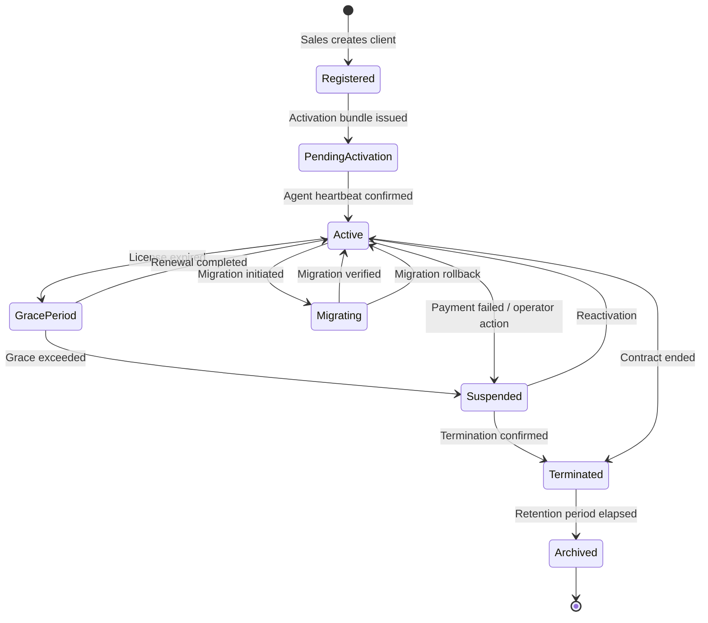
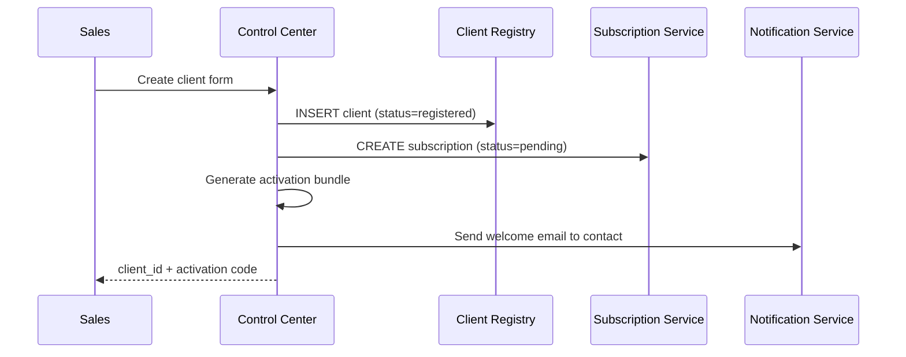
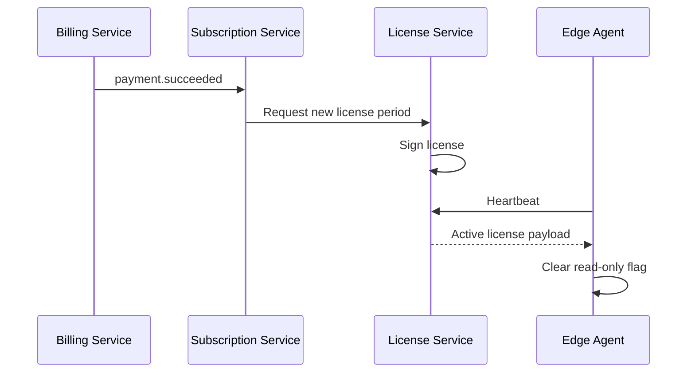
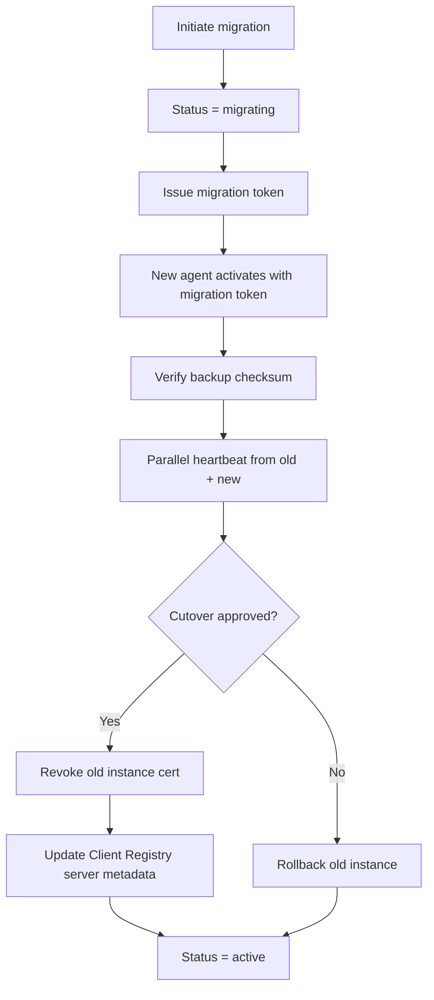

# AgainERP Control Center — Client Lifecycle

> **Status:** Architecture Documentation  
> **Version:** 1.0  
> **Step:** 05 of 17  
> **Document Type:** Enterprise Architecture — Lifecycle  
> **Parent Index:** [MASTER_INDEX.md](./MASTER_INDEX.md)  
> **Previous:** [04 — Client Edge Agent](./04_Client_Edge_Agent.md)

---

## Purpose

Document the complete lifecycle of an AgainERP client installation — from registration through termination and migration — as managed by the Control Center.

## Scope

Platform-managed lifecycle states and workflows. Client internal business onboarding is out of scope.

---

## Architecture

### Lifecycle State Machine



---

## Registration

### Trigger
AgainSoft sales or partner creates a new client record in Control Center UI or via partner API.

### Inputs

| Field | Required | Notes |
|-------|----------|-------|
| Legal entity name | Yes | Billing identity |
| Primary contact email | Yes | Notifications |
| Deployment mode | Yes | SaaS / Hybrid / Enterprise |
| Initial plan | Yes | Starter, Business, Professional, Enterprise |
| Region preference | No | Data residency hint |
| Partner ID | No | Channel attribution |

### Outputs
- `client_id` (immutable)
- Pending subscription record
- Activation bundle (bootstrap token + install instructions)

### Workflow



---

## Activation

### Prerequisites
- Client server meets minimum requirements (Docker, PostgreSQL, TLS domain)
- Edge Agent installed with activation bundle
- Network egress to Control Plane URL allowed

### Steps

1. Agent calls `POST /agent/v1/activate`
2. Control Center validates bootstrap token
3. Issues client certificate + initial signed license
4. First heartbeat received → status `pending_activation` → `active`
5. Subscription timer starts
6. Default modules enabled per plan
7. Welcome notification to operator dashboard

### Failure handling
- Bootstrap expired → operator reissues bundle
- Invalid CSR → agent logs error; support ticket auto-created
- Duplicate activation attempt → audit alert

---

## License Validation

Continuous validation loop (not a one-time activation):

| Check | Frequency | Actor |
|-------|-----------|-------|
| JWT refresh | Every 15 min | Edge Agent |
| Full license re-sign | Daily or on subscription change | License Service |
| Entitlement sync | Every heartbeat | Feature Flag Service |
| Tamper check | Every 6 hours | Edge Agent |

**States affecting client runtime:**

| License state | Client ERP behavior |
|---------------|---------------------|
| Active | Full operation |
| Grace period | Full operation + admin warnings |
| Suspended | Read-only mode |
| Revoked | Read-only + support contact banner |

Detail: [09 — Subscription & License](./09_Subscription_License.md)

---

## Subscription

### Plan attachment
Each active client has exactly one primary subscription record linking:
- Plan tier
- Billing cycle
- Included modules and seats
- AI credit allocation
- Support SLA

### Subscription events

```mermaid
flowchart LR
    CREATE[Created] --> TRIAL{Trial?}
    TRIAL -->|Yes| TRIAL_ACTIVE[Trial Active]
    TRIAL -->|No| ACTIVE[Active]
    TRIAL_ACTIVE --> ACTIVE: Trial converts
    TRIAL_ACTIVE --> SUSPENDED: Trial expires unpaid
    ACTIVE --> RENEWED[Renewed]
    RENEWED --> ACTIVE
    ACTIVE --> SUSPENDED: Payment failure
```

---

## Renewal

### Automatic renewal (default)
1. Billing Service charges payment method 7 days before expiry
2. On success → Subscription Service extends period
3. License Service issues new signed license
4. Agent receives updated license on next heartbeat
5. Notification: receipt email to client contact

### Manual renewal (enterprise)
1. Invoice issued 30 days before expiry
2. Payment confirmed by finance
3. Operator marks invoice paid → same license flow

### Renewal failure
- Day 0: payment failed → retry + email
- Day 3: second retry + operator alert
- Day 7: enter grace period (license still valid with warning)
- Grace end: suspension

---

## Suspension

### Causes
- Payment failure beyond grace
- License violation (tamper report confirmed)
- Operator manual suspension (abuse, legal)
- Contract dispute

### Effects

| Layer | Behavior |
|-------|----------|
| Control Center | Status `suspended`; no new commands except reactivation |
| Edge Agent | Receives suspension flag; caches locally |
| Client ERP | Read-only mode — no writes, exports allowed |
| AI Service | Requests blocked |
| Updates | Blocked |

### Operator override
Enterprise clients may have contractual "suspension delay" of 14 days for payment disputes.

---

## Reactivation

1. Root cause resolved (payment, tamper cleared, operator approval)
2. Subscription status → `active`
3. New license signed and pushed
4. Agent confirms on heartbeat
5. Client ERP exits read-only mode
6. Audit log entry with reactivation reason



---

## Termination

### Triggers
- Client request (contract end)
- AgainSoft decision (non-payment, ToS violation)
- Partner offboarding

### Termination workflow

| Step | Action |
|------|--------|
| 1 | Operator initiates termination (requires approval) |
| 2 | 30-day export window notification to client |
| 3 | License revoked at termination date |
| 4 | Agent certificate revoked |
| 5 | Client ERP enters terminal read-only (export only) |
| 6 | After export window: agent disconnects |
| 7 | Control Center record → `terminated` → `archived` after retention |

**Data note:** Client business data remains on client server — AgainSoft does not delete client DB.

---

## Migration

### Migration types

| Type | Description |
|------|-------------|
| **Server migration** | Same client_id, new hardware/IP |
| **Instance rebuild** | Fresh install, restore from backup |
| **Version migration** | Major ERP upgrade with data migration |
| **Provider migration** | On-prem → cloud VPS or reverse |

### Migration workflow



### Rules
- Only one active instance_id per client at cutover
- Migration token valid 72 hours
- Old instance auto-revoked 24h after successful cutover if not manually done

---

## Responsibilities

| Phase | Primary service |
|-------|-----------------|
| Registration | Client Registry |
| Activation | Client Registry + License Service |
| Subscription | Subscription + Billing |
| License | License Service |
| Suspension/Reactivation | Subscription + License + Notification |
| Termination | Client Registry + License + Audit |
| Migration | Client Registry + Edge Agent coordination |

---

## Best Practices

- Immutable `client_id` — never reuse after termination
- All state transitions emit domain events and audit records
- Grace periods configurable per plan tier but bounded (max 30 days enterprise)
- Termination requires two-person approval for enterprise tier

---

## Security Notes

- Bootstrap and migration tokens are single-use, time-bound
- Suspension for tamper requires Security Center confirmation — not automated on first report
- Termination revokes all agent credentials within 60 seconds (CRL/cache propagation)

---

## Future Improvements

| Improvement | Phase |
|-------------|-------|
| Self-service client portal for renewal | Phase 2 |
| Automated migration health scoring | Phase 2 |
| Lifecycle webhooks for partner CRM integration | Phase 2 |

---

## Summary

Client lifecycle is a state machine managed entirely through Control Center services — registration, activation, continuous license validation, subscription renewal, suspension, reactivation, termination, and migration. Every transition is audited, event-driven, and reflected to the Edge Agent without direct access to client business data.

**Next:** [06 — Database Architecture](./06_Database_Architecture.md)
