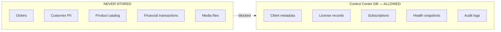
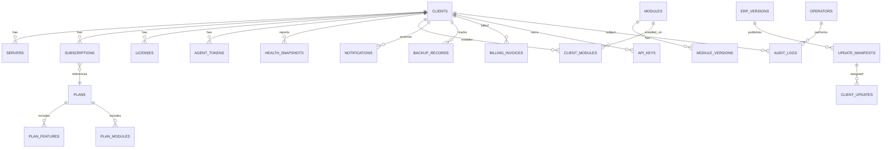
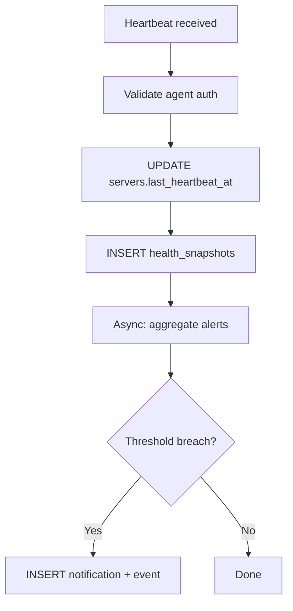

# AgainERP Control Center — Database Architecture

> **Status:** Architecture Documentation  
> **Version:** 1.0  
> **Step:** 06 of 17  
> **Document Type:** Enterprise Architecture — Database  
> **Parent Index:** [MASTER_INDEX.md](./MASTER_INDEX.md)  
> **Previous:** [05 — Client Lifecycle](./05_Client_Lifecycle.md)

---

## Purpose

Design the Control Center database schema — metadata-only storage for client management, licensing, monitoring, and platform operations. **No client business data.**

## Scope

Logical schema design and entity relationships. DDL migrations are out of scope (implementation phase).

---

## Architecture

### Data Boundary Rule

---

## Technology Stack

| Component | Choice | Rationale |
|-----------|--------|-----------|
| Primary DB | PostgreSQL 16+ | AgainERP standard; JSONB for flexible payloads |
| Cache | Redis | Session, rate limits, entitlement cache |
| Time-series | TimescaleDB or Prometheus remote write | Health metrics |
| Object storage | S3-compatible | Artifacts, audit archives — not relational |
| Search | PostgreSQL FTS or OpenSearch | Audit log search (Phase 2) |

---

## Entity Relationship Overview

---

## Core Entities

### clients

Canonical client record.

| Column | Type | Notes |
|--------|------|-------|
| id | UUID PK | Immutable `client_id` |
| legal_name | VARCHAR(255) | Billing entity |
| contact_email | VARCHAR(255) | Encrypted at rest |
| status | ENUM | registered, pending_activation, active, grace, suspended, migrating, terminated, archived |
| deployment_mode | ENUM | saas, hybrid, enterprise |
| partner_id | UUID FK nullable | Channel partner |
| region | VARCHAR(32) | Preferred region |
| tags | JSONB | Operator labels |
| created_at | TIMESTAMPTZ | |
| updated_at | TIMESTAMPTZ | |

**No business data columns.**

---

### servers

Physical or virtual server metadata per client.

| Column | Type | Notes |
|--------|------|-------|
| id | UUID PK | |
| client_id | UUID FK | |
| hostname | VARCHAR(255) | |
| ip_last_seen | INET | Updated from heartbeat |
| os_info | JSONB | Kernel, distro |
| docker_version | VARCHAR(32) | |
| agent_version | VARCHAR(32) | |
| erp_version | VARCHAR(32) | |
| is_primary | BOOLEAN | Active instance flag |
| last_heartbeat_at | TIMESTAMPTZ | |
| created_at | TIMESTAMPTZ | |

---

### subscriptions

| Column | Type | Notes |
|--------|------|-------|
| id | UUID PK | |
| client_id | UUID FK | |
| plan_id | UUID FK | |
| status | ENUM | pending, trial, active, past_due, suspended, cancelled |
| billing_cycle | ENUM | monthly, annual |
| current_period_start | TIMESTAMPTZ | |
| current_period_end | TIMESTAMPTZ | |
| trial_ends_at | TIMESTAMPTZ nullable | |
| seats_purchased | INT | |
| ai_credits_monthly | INT | |
| payment_method_ref | VARCHAR(255) | Tokenized ref only |
| created_at | TIMESTAMPTZ | |

---

### plans

| Column | Type | Notes |
|--------|------|-------|
| id | UUID PK | |
| code | VARCHAR(64) UNIQUE | starter, business, professional, enterprise |
| name | VARCHAR(128) | |
| base_price | DECIMAL | |
| max_seats | INT | |
| grace_days | INT | Default grace period |
| features | JSONB | Feature bundle |
| is_active | BOOLEAN | |

---

### licenses

| Column | Type | Notes |
|--------|------|-------|
| id | UUID PK | |
| client_id | UUID FK | |
| subscription_id | UUID FK | |
| license_key_hash | VARCHAR(64) | Never store plaintext key |
| payload | JSONB | Signed claims snapshot |
| signature | TEXT | JWS signature |
| issued_at | TIMESTAMPTZ | |
| expires_at | TIMESTAMPTZ | |
| status | ENUM | active, grace, revoked, superseded |
| revoked_at | TIMESTAMPTZ nullable | |
| revoke_reason | TEXT nullable | |

---

### modules

Platform module registry.

| Column | Type | Notes |
|--------|------|-------|
| id | UUID PK | |
| code | VARCHAR(64) UNIQUE | ecommerce, crm, hospital |
| name | VARCHAR(128) | |
| category | ENUM | core, business, industry, extension |
| is_marketplace | BOOLEAN | |
| dependencies | JSONB | Module codes array |
| created_at | TIMESTAMPTZ | |

---

### module_versions

| Column | Type | Notes |
|--------|------|-------|
| id | UUID PK | |
| module_id | UUID FK | |
| version | VARCHAR(32) | Semver |
| min_erp_version | VARCHAR(32) | |
| max_erp_version | VARCHAR(32) nullable | |
| artifact_url | TEXT | CDN path |
| checksum | VARCHAR(64) | SHA-256 |
| signature | TEXT | |
| released_at | TIMESTAMPTZ | |

---

### client_modules

| Column | Type | Notes |
|--------|------|-------|
| id | UUID PK | |
| client_id | UUID FK | |
| module_id | UUID FK | |
| module_version_id | UUID FK | |
| status | ENUM | enabled, disabled, installing, failed |
| enabled_at | TIMESTAMPTZ | |
| disabled_at | TIMESTAMPTZ nullable | |

---

### features

| Column | Type | Notes |
|--------|------|-------|
| id | UUID PK | |
| code | VARCHAR(128) UNIQUE | ai.chat, marketplace.install |
| name | VARCHAR(128) | |
| module_id | UUID FK nullable | |
| default_enabled | BOOLEAN | |

---

### plan_features / plan_modules

Junction tables linking plans to entitlements.

---

### erp_versions

| Column | Type | Notes |
|--------|------|-------|
| id | UUID PK | |
| version | VARCHAR(32) UNIQUE | 2026.6.1 |
| channel | ENUM | stable, beta, lts |
| release_notes_url | TEXT | |
| min_agent_version | VARCHAR(32) | |
| released_at | TIMESTAMPTZ | |
| deprecated_at | TIMESTAMPTZ nullable | |

---

### update_manifests

| Column | Type | Notes |
|--------|------|-------|
| id | UUID PK | |
| erp_version_id | UUID FK | |
| rollout_stage | ENUM | canary, early, general |
| artifact_manifest | JSONB | Images, migrations, checksums |
| signature | TEXT | |
| published_at | TIMESTAMPTZ | |

---

### client_updates

| Column | Type | Notes |
|--------|------|-------|
| id | UUID PK | |
| client_id | UUID FK | |
| update_manifest_id | UUID FK | |
| status | ENUM | pending, downloading, applying, complete, failed, rolled_back |
| scheduled_at | TIMESTAMPTZ | |
| completed_at | TIMESTAMPTZ nullable | |
| error_message | TEXT nullable | |

---

### health_snapshots

Time-series partitioned table (TimescaleDB hypertable recommended).

| Column | Type | Notes |
|--------|------|-------|
| id | BIGSERIAL | |
| client_id | UUID FK | |
| server_id | UUID FK | |
| recorded_at | TIMESTAMPTZ | Partition key |
| cpu_percent | DECIMAL(5,2) | |
| memory_percent | DECIMAL(5,2) | |
| disk_percent | DECIMAL(5,2) | |
| docker_status | JSONB | |
| db_latency_ms | INT | |
| redis_reachable | BOOLEAN | |
| queue_depth | INT | |
| raw_payload | JSONB | Full heartbeat (retention 7d) |

**Retention:** Hot 30 days → aggregate rollups 1 year → delete raw.

---

### backup_records

Metadata only — not backup files.

| Column | Type | Notes |
|--------|------|-------|
| id | UUID PK | |
| client_id | UUID FK | |
| backup_type | ENUM | full, incremental, media |
| status | ENUM | scheduled, running, complete, failed, verified |
| size_bytes | BIGINT | |
| duration_seconds | INT | |
| checksum | VARCHAR(64) | |
| storage_location | ENUM | local, client_s3 — path not stored |
| verified_at | TIMESTAMPTZ nullable | |
| created_at | TIMESTAMPTZ | |

---

### notifications

| Column | Type | Notes |
|--------|------|-------|
| id | UUID PK | |
| client_id | UUID FK nullable | |
| operator_id | UUID FK nullable | |
| channel | ENUM | email, sms, in_app, webhook |
| template_code | VARCHAR(64) | |
| status | ENUM | pending, sent, failed |
| payload | JSONB | Template variables — no PII beyond contact |
| sent_at | TIMESTAMPTZ nullable | |

---

### audit_logs

Append-only. No UPDATE/DELETE permissions for application role.

| Column | Type | Notes |
|--------|------|-------|
| id | BIGSERIAL | |
| timestamp | TIMESTAMPTZ | |
| actor_type | ENUM | operator, system, agent |
| actor_id | VARCHAR(64) | |
| action | VARCHAR(128) | |
| resource_type | VARCHAR(64) | |
| resource_id | VARCHAR(64) | |
| client_id | UUID FK nullable | |
| before_state | JSONB nullable | |
| after_state | JSONB nullable | |
| correlation_id | UUID | |
| ip_address | INET nullable | |
| metadata | JSONB | |

**Partitioning:** Monthly partitions. Archive to object storage after 12 months.

---

### billing_invoices

| Column | Type | Notes |
|--------|------|-------|
| id | UUID PK | |
| client_id | UUID FK | |
| subscription_id | UUID FK | |
| invoice_number | VARCHAR(32) UNIQUE | |
| amount | DECIMAL | |
| currency | CHAR(3) | |
| status | ENUM | draft, open, paid, void, uncollectible |
| period_start | TIMESTAMPTZ | |
| period_end | TIMESTAMPTZ | |
| external_ref | VARCHAR(255) | Payment gateway ID |
| paid_at | TIMESTAMPTZ nullable | |

---

### api_keys

Operator and partner API access.

| Column | Type | Notes |
|--------|------|-------|
| id | UUID PK | |
| name | VARCHAR(128) | |
| key_prefix | VARCHAR(16) | Display only |
| key_hash | VARCHAR(64) | bcrypt/argon2 |
| owner_type | ENUM | operator, partner, integration |
| owner_id | UUID | |
| scopes | JSONB | |
| expires_at | TIMESTAMPTZ nullable | |
| last_used_at | TIMESTAMPTZ | |
| revoked_at | TIMESTAMPTZ nullable | |

---

### agent_tokens

| Column | Type | Notes |
|--------|------|-------|
| id | UUID PK | |
| client_id | UUID FK | |
| server_id | UUID FK | |
| token_type | ENUM | bootstrap, refresh |
| token_hash | VARCHAR(64) | |
| cert_fingerprint | VARCHAR(64) | mTLS cert |
| expires_at | TIMESTAMPTZ | |
| revoked_at | TIMESTAMPTZ nullable | |
| created_at | TIMESTAMPTZ | |

---

## Indexing Strategy

| Table | Index | Purpose |
|-------|-------|---------|
| clients | status, partner_id | Fleet queries |
| servers | client_id, last_heartbeat_at | Stale agent detection |
| health_snapshots | (client_id, recorded_at DESC) | Dashboard charts |
| audit_logs | (client_id, timestamp DESC) | Client audit view |
| licenses | (client_id, status) | Active license lookup |
| subscriptions | current_period_end | Expiry batch jobs |

---

## Workflow — Heartbeat Write Path

---

## Best Practices

- **Encrypt PII columns** — contact_email, payment refs using pgcrypto or app-layer encryption
- **Row-level security** — partner users see only their clients (Phase 2)
- **Separate DB roles** — read-only analytics role; append-only audit writer
- **No CASCADE DELETE on clients** — soft delete / archive only
- **JSONB schemas validated** — license payload, feature flags versioned

---

## Security Notes

- Database never exposed to client networks
- Backups of Control Center DB encrypted at rest; tested quarterly
- Agent tokens stored as hashes only
- Audit log table: REVOKE UPDATE, DELETE from app role

---

## Future Improvements

| Improvement | Phase |
|-------------|-------|
| Read replicas for analytics dashboards | Phase 2 |
| Client registry sharding by region | Phase 3 |
| Event sourcing for subscription state | Phase 3 |

---

## Summary

The Control Center database stores **platform metadata only** — clients, servers, subscriptions, licenses, modules, versions, health snapshots, backup records, notifications, audit logs, billing, API keys, and agent tokens. Client business data is architecturally excluded. Time-series health data is partitioned with aggressive retention; audit logs are append-only and archived.

**Next:** [07 — API Architecture](./07_API_Architecture.md)
