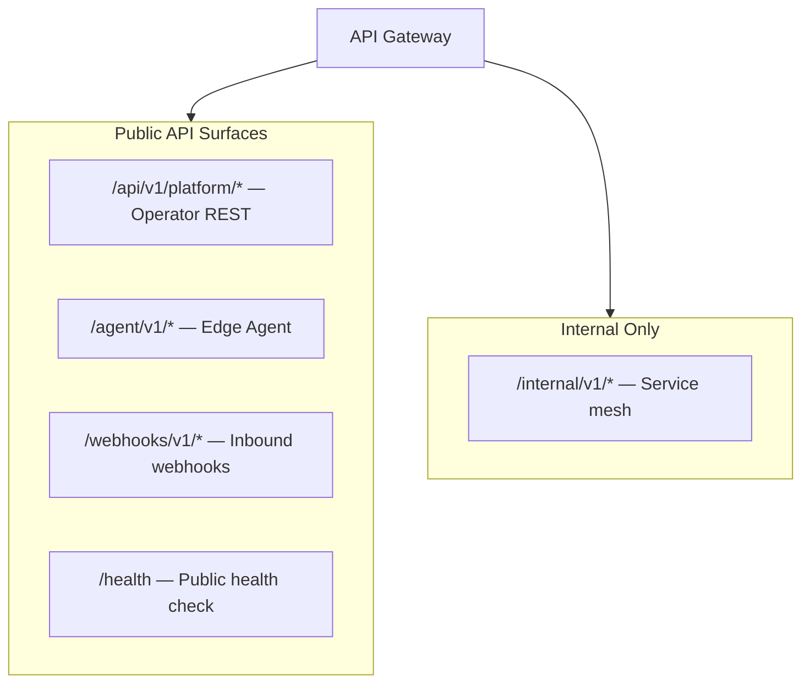
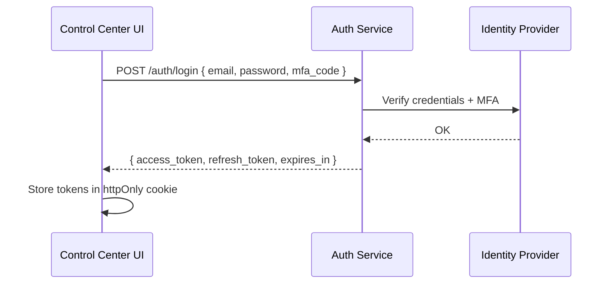
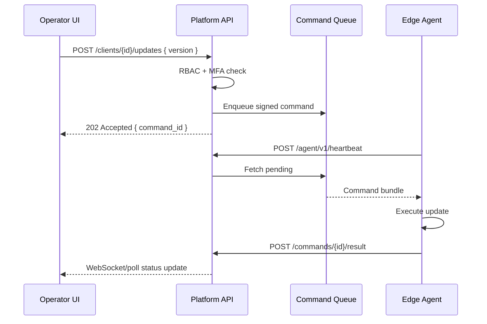

# AgainERP Control Center — API Architecture

> **Status:** Architecture Documentation  
> **Version:** 1.0  
> **Step:** 07 of 17  
> **Document Type:** Enterprise Architecture — API  
> **Parent Index:** [MASTER_INDEX.md](./MASTER_INDEX.md)  
> **Previous:** [06 — Database Architecture](./06_Database_Architecture.md)

---

## Purpose

Define the API architecture for the Control Center — REST endpoints for operators, Agent APIs for Edge Agents, authentication, authorization, versioning, rate limiting, webhooks, and error standards.

## Scope

API design contracts only. No implementation code or OpenAPI file generation in this phase.

---

## Architecture

### API Surfaces



---

## REST APIs (Operator)

Base URL: `https://control.againerp.com/api/v1/platform`

Aligned with [CLOUD_CONTROL_PLANE.md](../../againerp/docs/07-saas/CLOUD_CONTROL_PLANE.md) prefixes.

### Resource Groups

| Group | Prefix | Methods |
|-------|--------|---------|
| Clients | `/clients` | GET, POST, PATCH |
| Servers | `/clients/{id}/servers` | GET, PATCH |
| Subscriptions | `/subscriptions` | GET, POST, PATCH |
| Licenses | `/licenses` | GET, POST (reissue) |
| Modules | `/modules` | GET, POST, PATCH |
| Client modules | `/clients/{id}/modules` | GET, POST, DELETE |
| Updates | `/updates` | GET, POST |
| Client updates | `/clients/{id}/updates` | GET, POST |
| Health | `/clients/{id}/health` | GET |
| Backups | `/clients/{id}/backups` | GET, POST |
| Billing | `/billing/invoices` | GET |
| Notifications | `/notifications` | GET, POST |
| Audit | `/audit-logs` | GET |
| Operators | `/operators` | GET, POST, PATCH |
| API keys | `/api-keys` | GET, POST, DELETE |
| AI usage | `/ai/usage` | GET |
| Feature flags | `/features` | GET, PATCH |

### Example — List Clients

```
GET /api/v1/platform/clients?status=active&page=1&limit=50
Authorization: Bearer {operator_jwt}
X-Correlation-Id: {uuid}
```

Response:
```json
{
  "data": [
    {
      "id": "cli_abc123",
      "legal_name": "Acme Retail Ltd",
      "status": "active",
      "deployment_mode": "enterprise",
      "plan": "professional",
      "last_heartbeat_at": "2026-06-28T09:58:00Z"
    }
  ],
  "meta": { "page": 1, "limit": 50, "total": 142 }
}
```

---

## Agent APIs

Base URL: `https://control.againerp.com/agent/v1`

All agent endpoints require **mTLS client certificate** + **Bearer agent JWT**.

| Endpoint | Method | Purpose |
|----------|--------|---------|
| `/activate` | POST | Initial activation |
| `/heartbeat` | POST | Health + command poll |
| `/token/refresh` | POST | JWT refresh |
| `/license/refresh` | POST | Force license re-fetch |
| `/commands/{id}/result` | POST | Report command outcome |
| `/backup/report` | POST | Backup status metadata |
| `/update/report` | POST | Update progress |
| `/diagnostics` | POST | Upload diagnostics bundle ref |
| `/ai/queue` | POST | Flush queued AI proxy requests |

### Agent Authentication Headers

```
Authorization: Bearer {agent_jwt}
X-Agent-Version: 1.2.0
X-Instance-Id: inst_abc123
X-Request-Nonce: {uuid}
X-Request-Timestamp: 2026-06-28T10:00:00Z
X-Request-Signature: {hmac_sha256}
```

---

## Authentication

### Operator Authentication



| Token | TTL | Storage |
|-------|-----|---------|
| Access JWT | 15 minutes | httpOnly cookie |
| Refresh token | 7 days | httpOnly cookie, rotated |

**JWT claims (operator):**
```json
{
  "sub": "op_uuid",
  "role": "platform_admin",
  "permissions": ["clients.read", "clients.write", "licenses.reissue"],
  "mfa_verified": true,
  "iss": "control.againerp.com",
  "aud": "platform-api"
}
```

### Agent Authentication

Dual layer:
1. **mTLS** — client certificate CN = `client_id`
2. **JWT** — scoped to `client_id` + `instance_id`

Certificate renewal: `POST /agent/v1/cert/renew` with CSR 30 days before expiry.

---

## Authorization

### RBAC Roles

| Role | Scope |
|------|-------|
| `super_admin` | Full platform access |
| `platform_admin` | Client management, no billing config |
| `support_agent` | Read + limited commands (diagnostics) |
| `billing_admin` | Subscriptions, invoices |
| `partner_admin` | Own partner clients only |
| `read_only` | GET endpoints only |

### Permission Model

Format: `{resource}.{action}` — e.g. `clients.read`, `updates.deploy`, `licenses.revoke`.

High-risk actions require **step-up MFA** (re-auth within 5 minutes):
- License revocation
- Client termination
- Production update rollout
- Operator role assignment

### Agent Authorization

Agents authorized only for their own `client_id`. Cross-client requests return `403` + security audit event.

---

## JWT Standards

| Property | Value |
|----------|-------|
| Algorithm | RS256 (operator), RS256 (agent) |
| Issuer | `https://control.againerp.com` |
| Key rotation | 90 days; 7-day overlap |
| Validation | iss, aud, exp, nbf, signature |

License payloads use separate JWS signing key (License Service / KMS).

---

## API Keys

For partner integrations and CI/CD automation.

| Property | Rule |
|----------|------|
| Format | `agp_live_{32_random}` |
| Storage | Hash only in DB |
| Scopes | Explicit per key |
| Rate limit | Per-key bucket |
| Expiry | Optional; max 1 year recommended |

Header: `Authorization: Bearer agp_live_...`

---

## Versioning

| Strategy | Detail |
|----------|--------|
| URL path | `/api/v1/`, `/agent/v1/` |
| Breaking changes | New major version only |
| Deprecation | 12-month notice; `Sunset` header |
| Agent protocol | Negotiated via `X-Agent-Version`; backward compat 2 major versions |

---

## Rate Limiting

| Actor | Limit | Window |
|-------|-------|--------|
| Operator JWT | 1000 req | 1 minute |
| API key (standard) | 500 req | 1 minute |
| API key (partner) | 2000 req | 1 minute |
| Agent heartbeat | 2 req | 1 minute per instance |
| Agent other | 60 req | 1 minute |

Headers:
```
X-RateLimit-Limit: 1000
X-RateLimit-Remaining: 847
X-RateLimit-Reset: 1719561600
```

Exceeded → `429 Too Many Requests` with `Retry-After`.

---

## Webhook Design

### Outbound Webhooks (Control Center → Client systems)

Partners register webhook endpoints for events:

| Event | Payload |
|-------|---------|
| `client.activated` | client_id, plan |
| `subscription.renewed` | client_id, period_end |
| `health.critical` | client_id, metric, threshold |
| `update.failed` | client_id, version, error |
| `license.expiring` | client_id, expires_at |

**Delivery guarantees:** At-least-once; exponential backoff (1m, 5m, 30m, 2h, 24h); max 5 retries.

**Signature:**
```
X-AgainERP-Signature: sha256={hmac}
X-AgainERP-Timestamp: {unix}
X-AgainERP-Event-Id: {uuid}
```

### Inbound Webhooks

| Source | Endpoint | Purpose |
|--------|----------|---------|
| Stripe | `/webhooks/v1/stripe` | Payment events |
| SendGrid | `/webhooks/v1/email` | Delivery status |

Inbound webhooks verify provider signature before processing.

---

## Error Standards

### Envelope

```json
{
  "error": {
    "code": "LICENSE_EXPIRED",
    "message": "Client license expired and grace period ended.",
    "details": [
      { "field": "client_id", "issue": "status is suspended" }
    ],
    "correlation_id": "uuid",
    "docs_url": "https://docs.againerp.com/errors/LICENSE_EXPIRED"
  }
}
```

### HTTP Status Mapping

| Status | Usage |
|--------|-------|
| 400 | Validation error |
| 401 | Missing/invalid auth |
| 403 | Forbidden / insufficient scope |
| 404 | Resource not found |
| 409 | Conflict (duplicate, invalid state) |
| 422 | Semantic error |
| 429 | Rate limited |
| 500 | Internal error |
| 503 | Maintenance |

### Standard Error Codes

| Code | HTTP |
|------|------|
| `VALIDATION_ERROR` | 400 |
| `UNAUTHORIZED` | 401 |
| `FORBIDDEN` | 403 |
| `NOT_FOUND` | 404 |
| `CLIENT_SUSPENDED` | 409 |
| `LICENSE_EXPIRED` | 409 |
| `AGENT_CERT_REVOKED` | 403 |
| `RATE_LIMITED` | 429 |
| `INTERNAL_ERROR` | 500 |

---

## Workflow — Operator Action to Agent Command



---

## Best Practices

- Idempotency-Key header on all POST/PATCH from operators
- Pagination cursor-based for audit logs (high volume)
- ETag support on GET for cacheable resources (module catalog)
- Never return full API key or bootstrap token after creation — show once

---

## Security Notes

- All APIs TLS 1.3 only
- Agent endpoints reject requests without valid mTLS cert regardless of JWT
- CORS restricted to Control Center UI origins for operator API
- Webhook secrets rotatable without downtime (dual-secret window)

Detail: [13 — Security Architecture](./13_Security.md)

---

## Future Improvements

| Improvement | Phase |
|-------------|-------|
| OpenAPI 3.1 spec publication | Phase 2 |
| GraphQL read API for dashboards | Phase 2 |
| gRPC agent protocol option | Phase 3 |

---

## Summary

The Control Center exposes two primary API surfaces — operator REST at `/api/v1/platform/*` and agent APIs at `/agent/v1/*`. Authentication uses JWT for operators (MFA-enforced) and mTLS + JWT for agents. RBAC governs operator access; agents are scoped to single clients. Rate limiting, versioned paths, signed webhooks, and standardized error envelopes ensure enterprise-grade integration.

**Next:** [08 — Module Management](./08_Module_Management.md)
