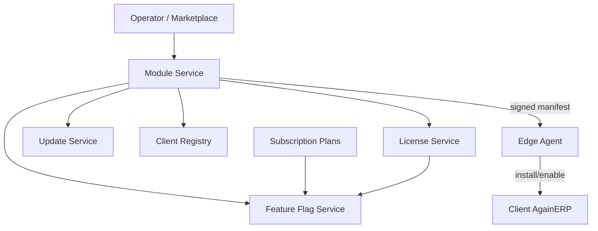
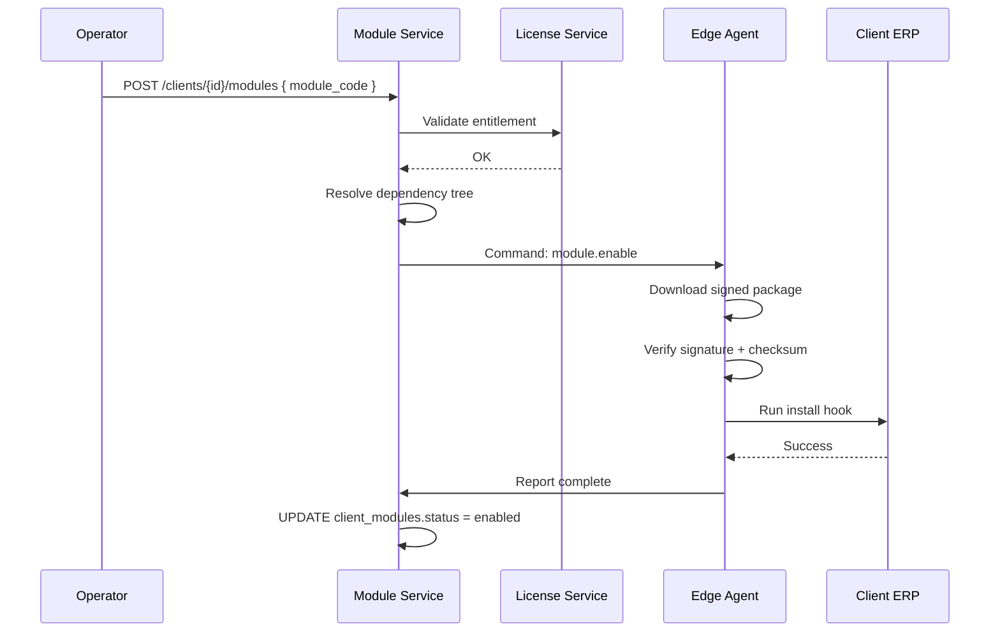
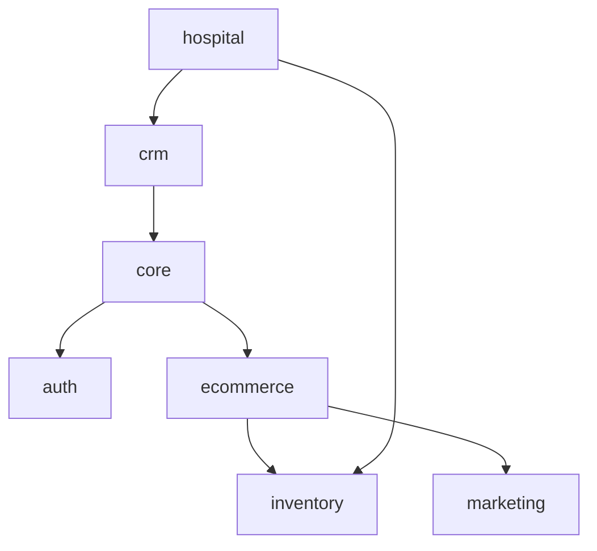
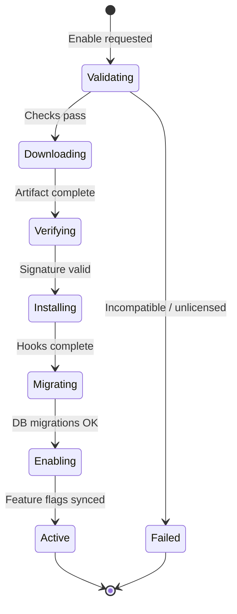

# AgainERP Control Center — Module Management

> **Status:** Architecture Documentation  
> **Version:** 1.0  
> **Step:** 08 of 17  
> **Document Type:** Enterprise Architecture — Modules  
> **Parent Index:** [MASTER_INDEX.md](./MASTER_INDEX.md)  
> **Previous:** [07 — API Architecture](./07_API_Architecture.md)

---

## Purpose

Define how the Control Center enables, disables, and manages AgainERP modules across client installations — including dependencies, feature flags, version compatibility, and license validation.

## Scope

Platform module governance. Individual module business logic is documented in AgainERP module architecture files.

---

## Architecture



---

## Enable Module

### Preconditions

| Check | Service |
|-------|---------|
| Module entitled in subscription plan | Subscription Service |
| Valid license active | License Service |
| ERP version compatible | Module Service |
| Dependencies satisfied | Module Service |
| No conflicting modules | Module Service |

### Workflow



---

## Disable Module

### Rules
- Disabling a module **does not delete** client business data — tables remain, UI hidden
- Dependent modules must be disabled first (topological order)
- Core modules (`core`, `auth`) cannot be disabled

### Workflow
1. Operator or automated policy triggers disable
2. Module Service checks no active dependents
3. Agent receives `module.disable` command
4. ERP runs disable hook (menu hide, route unregister)
5. Feature flags updated; cache invalidated on next heartbeat

---

## Dependencies

### Dependency Graph Example



### Resolution Rules

| Rule | Behavior |
|------|----------|
| Enable parent required | Auto-suggest or auto-enable dependencies (configurable) |
| Circular deps | Rejected at module registry publish time |
| Optional deps | Soft — feature degraded if missing |
| Version deps | `module_version.min_erp_version` enforced |

---

## Feature Flags

Feature flags operate at finer granularity than modules:

| Level | Example |
|-------|---------|
| Module | `ecommerce` enabled/disabled |
| Feature | `ecommerce.digital_products` |
| AI feature | `ai.chat`, `ai.automation` |
| Experimental | `beta.checkout_v2` |

### Evaluation pipeline

```mermaid
flowchart LR
    PLAN[Plan entitlements] --> MERGE[Merge overrides]
    LIC[License payload] --> MERGE
    OP[Operator override] --> MERGE
    MERGE --> SNAPSHOT[Feature snapshot v{n}]
    SNAPSHOT --> AGENT[Edge Agent cache]
    AGENT --> ERP[Local enforcement]
```

**Enforcement points:**
- Control Center API (platform ops)
- Edge Agent sync → client Redis cache
- Client ERP middleware (route guards, menu visibility)

---

## Version Compatibility

### Compatibility Matrix

| Module version | Min ERP | Max ERP | Notes |
|----------------|---------|---------|-------|
| ecommerce 3.2.0 | 2026.4.0 | 2026.6.x | Current stable |
| ecommerce 3.1.0 | 2026.2.0 | 2026.5.x | LTS |
| hospital 1.0.0 | 2026.6.0 | — | Requires CRM 2.0+ |

### Pre-install validation

Agent runs compatibility check before download:
1. Compare `erp_version` with module manifest
2. Verify dependency versions installed
3. Check disk space threshold
4. Abort with detailed error if incompatible

---

## License Validation

Module operations require valid license claims:

```json
{
  "modules": ["ecommerce", "crm", "inventory"],
  "features": ["ai.chat", "marketplace.install"],
  "plan": "professional",
  "expires_at": "2027-06-12T00:00:00Z"
}
```

| Action | License check |
|--------|-----------------|
| Enable module | Module in `modules[]` array |
| Enable AI feature | Feature in `features[]` array |
| Marketplace install | `marketplace.install` feature + module entitlement |
| Trial module | Time-boxed in subscription trial record |

Failed check → command rejected; audit event logged.

Detail: [09 — Subscription & License](./09_Subscription_License.md)

---

## Module Installation Flow

### Full installation pipeline



### Artifact structure (conceptual)

```
module-ecommerce-3.2.0.agpkg (signed)
├── manifest.json
├── docker-compose.overlay.yml
├── migrations/
├── seeds/
├── hooks/
│   ├── install.sh
│   ├── enable.sh
│   └── disable.sh
└── checksums.sha256
```

### Rollback
If install fails at any stage after migrations:
1. Agent runs `rollback.sh` hook
2. Restores previous module version from local cache
3. Reports failure reason to Control Center
4. Operator notified

---

## Marketplace Integration

| Source | Flow |
|--------|------|
| AgainSoft official | Pre-approved in module registry |
| Partner published | Review queue + signing |
| Client custom | Enterprise only; manual approval |

Marketplace catalog synced to agent periodically — install still requires license entitlement.

---

## Responsibilities

| Component | Role |
|-----------|------|
| Module Service | Registry, dependency resolution, install orchestration |
| License Service | Entitlement authority |
| Feature Flag Service | Snapshot generation |
| Update Service | Artifact hosting and CDN |
| Edge Agent | Download, verify, execute |
| Client ERP | Hooks, migrations, runtime registration |

---

## Best Practices

- Semver strictly enforced for module versions
- Breaking module changes require major version bump
- Disable before uninstall (uninstall is enterprise-only, destructive)
- Module install never runs during peak hours unless emergency flag

---

## Security Notes

- All module packages signed by AgainSoft code signing key
- Agent rejects unsigned or tampered packages — no override except break-glass HSM key
- Marketplace partner packages sandboxed in review environment before publish

---

## Future Improvements

| Improvement | Phase |
|-------------|-------|
| Visual dependency graph in UI | Phase 2 |
| Module A/B testing per client cohort | Phase 3 |
| Automated compatibility CI on publish | Phase 2 |

---

## Summary

Module management flows through the Module Service with license and dependency validation before the Edge Agent executes signed install/enable/disable commands. Feature flags provide fine-grained control synced to each client. Version compatibility is enforced pre-install; failed operations roll back automatically.

**Next:** [09 — Subscription & License](./09_Subscription_License.md)
