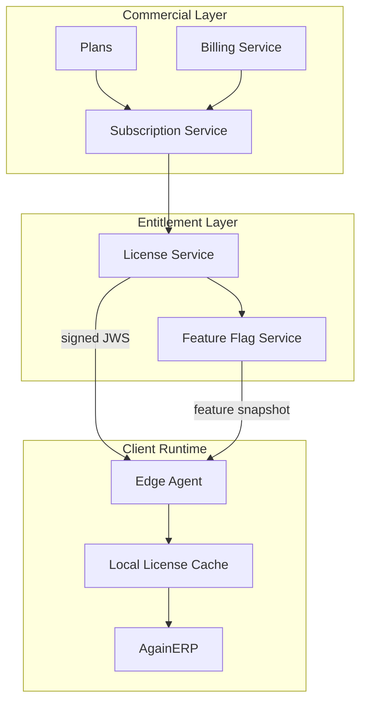
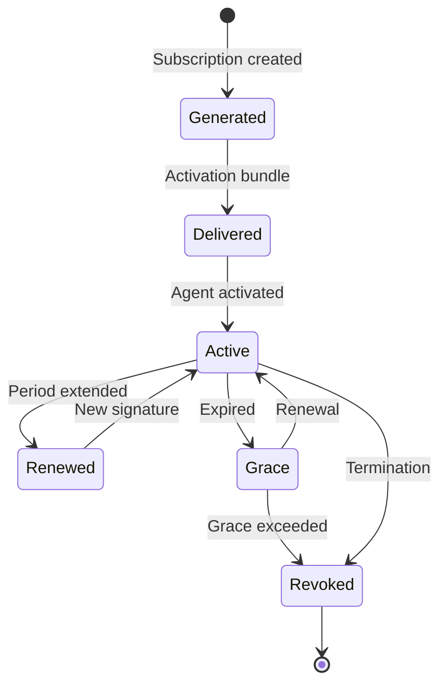
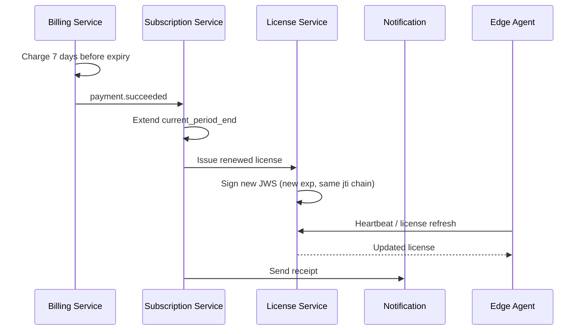
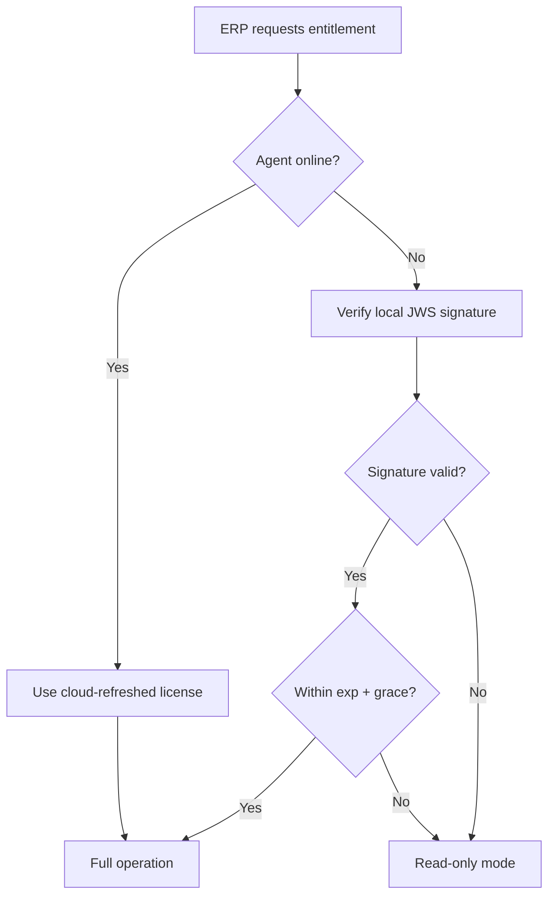

# AgainERP Control Center — Subscription & License System

> **Status:** Architecture Documentation  
> **Version:** 1.0  
> **Step:** 09 of 17  
> **Document Type:** Enterprise Architecture — Licensing  
> **Parent Index:** [MASTER_INDEX.md](./MASTER_INDEX.md)  
> **Previous:** [08 — Module Management](./08_Module_Management.md)

---

## Purpose

Document the subscription and license system — plans, features, license keys, activation, expiration, grace periods, renewal, offline validation, and enterprise licensing models.

## Scope

Commercial entitlement architecture. Payment processor integration details are summarized only.

---

## Architecture



---

## Plans

### Standard Plan Tiers

| Plan | Target | Seats | Modules | AI Credits/mo |
|------|--------|-------|---------|---------------|
| **Starter** | Small business | 5 | ecommerce, core | 1,000 |
| **Business** | Growing SMB | 25 | + crm, inventory | 10,000 |
| **Professional** | Mid-market | 100 | + marketing, finance | 50,000 |
| **Enterprise** | Large / regulated | Unlimited | All + industry | Custom |
| **Custom** | Partner deals | Negotiated | À la carte | Negotiated |

### Plan dimensions

| Dimension | Description |
|-----------|-------------|
| Base price | Monthly or annual |
| Included modules | Module codes array |
| Feature bundle | Feature flag codes |
| Seat limit | Active user count |
| AI credits | Monthly allocation |
| Grace days | Post-expiry tolerance |
| Support SLA | Response time tier |
| Update channel | stable / beta / lts |

---

## Features

Features are atomic entitlements referenced in plans and license payloads:

| Category | Examples |
|----------|----------|
| Module access | `module.ecommerce`, `module.hospital` |
| AI | `ai.chat`, `ai.automation`, `ai.developer` |
| Platform | `marketplace.install`, `multi_store`, `api.access` |
| Limits | `seats.100`, `storage.500gb` |

Features map to Feature Flag Service snapshots — see [08 — Module Management](./08_Module_Management.md).

---

## License Keys

### Key lifecycle



### Key format (display)

```
AGP-XXXX-XXXX-XXXX-XXXX
```

- Generated from cryptographically secure random bytes
- Only **hash** stored in Control Center DB
- Plaintext shown once at generation

### License payload (JWS claims)

```json
{
  "iss": "https://control.againerp.com",
  "sub": "cli_abc123",
  "instance_id": "inst_xyz789",
  "plan": "professional",
  "modules": ["core", "ecommerce", "crm", "inventory"],
  "features": ["ai.chat", "marketplace.install"],
  "seats": 100,
  "ai_credits_monthly": 50000,
  "iat": 1719561600,
  "exp": 1751097600,
  "grace_days": 14,
  "jti": "lic_uuid"
}
```

Signed with License Service KMS key (RS256 or ES256).

---

## Activation

1. Subscription created → License Service generates key + payload
2. Activation bundle delivered to client (secure channel)
3. Edge Agent submits bootstrap token + CSR
4. Control Center binds license to `instance_id`
5. Signed JWS delivered to agent
6. Agent stores in encrypted local vault
7. ERP reads entitlement via agent local API

---

## Expiration

| Event | Timing | Action |
|-------|--------|--------|
| Pre-expiry warning | 30, 14, 7, 1 days | Email + dashboard alert |
| Expiry | `exp` timestamp | Enter grace period |
| Grace warning | Daily during grace | Escalating notifications |
| Grace end | `exp + grace_days` | Suspension |

---

## Grace Period

| Plan | Default grace | Max configurable |
|------|---------------|------------------|
| Starter | 7 days | 7 |
| Business | 14 days | 14 |
| Professional | 14 days | 21 |
| Enterprise | 30 days | 30 |

### Grace behavior

| Component | During grace |
|-----------|--------------|
| Client ERP | Full operation + admin banner |
| License cache | Valid locally (signed grace_days in payload) |
| New modules | Blocked |
| Updates | Blocked except security hotfixes |
| AI credits | No replenishment |

---

## Renewal

### Automatic



### Manual (enterprise)
Finance confirms payment → operator triggers renewal → same license flow.

---

## Offline Validation

Client must operate without continuous cloud connectivity:

| Mechanism | Detail |
|-----------|--------|
| **Signed JWS cache** | Agent stores last valid license locally |
| **Embedded expiry + grace** | Client validates signature offline using pinned public key |
| **Clock skew tolerance** | ±5 minutes |
| **Max offline duration** | grace_days from embedded claims |
| **Refresh on reconnect** | Immediate license fetch when online |

### Offline validation flow



**Public key pinning:** Agent ships with AgainSoft root CA + license verification key. Key rotation via heartbeat-delivered key bundle with overlap period.

---

## Enterprise Licensing

### Enterprise-specific models

| Model | Description |
|-------|-------------|
| **Perpetual + maintenance** | Perpetual license + annual maintenance for updates |
| **Site license** | Unlimited seats at one physical site |
| **Group license** | Multiple instances under one contract |
| **Air-gapped** | Quarterly license file exchange (no continuous agent) |
| **White label** | Partner-branded; AgainSoft backend invisible |

### Enterprise features

- Custom grace periods and SLA
- Dedicated license signing ceremony (HSM)
- Manual approval for all update rollouts
- Named account manager in Control Center
- Custom module entitlements without plan tier

### Air-gapped licensing (Phase 3)

1. Client exports CSR + fingerprint via secure USB
2. AgainSoft signs license file offline
3. Client imports signed file into agent
4. Max validity 90 days; renewal repeat process

---

## Responsibilities

| Service | Owns |
|---------|------|
| Subscription Service | Plan attachment, period, status |
| Billing Service | Payment, invoices |
| License Service | Key generation, signing, revocation |
| Feature Flag Service | Entitlement distribution |
| Edge Agent | Local cache, offline verification |

---

## Best Practices

- Never store plaintext license keys in Control Center DB
- License `jti` chain preserved for audit — superseded, not deleted
- Revocation propagates via CRL + heartbeat within 60 seconds
- Trial licenses watermarked in UI (`trial_mode: true` claim)

---

## Security Notes

- License signing key in HSM — separate from JWT signing key
- Tampered license cache → agent reports to Security Center; read-only mode
- License payload contains no business data — only entitlements

Detail: [13 — Security Architecture](./13_Security.md)

---

## Future Improvements

| Improvement | Phase |
|-------------|-------|
| Usage-based billing for AI credits | Phase 2 |
| Self-service plan upgrade portal | Phase 2 |
| Blockchain-anchored license audit (optional enterprise) | Phase 4 |

---

## Summary

Subscriptions define commercial relationships; licenses are cryptographically signed entitlements delivered to Edge Agents. Grace periods and offline validation ensure business continuity. Enterprise models support air-gapped, perpetual, and custom entitlement structures without storing client business data in the Control Plane.

**Next:** [10 — Monitoring & Health](./10_Monitoring.md)
