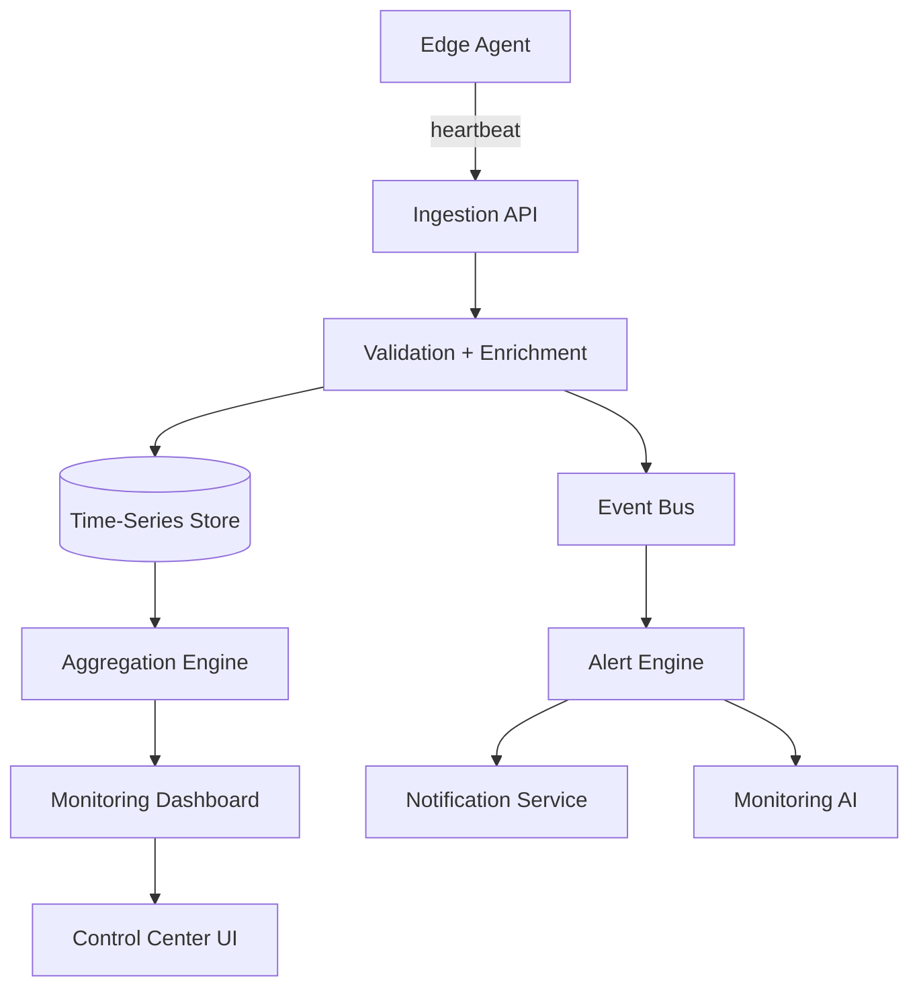
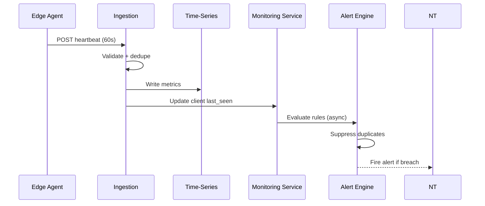
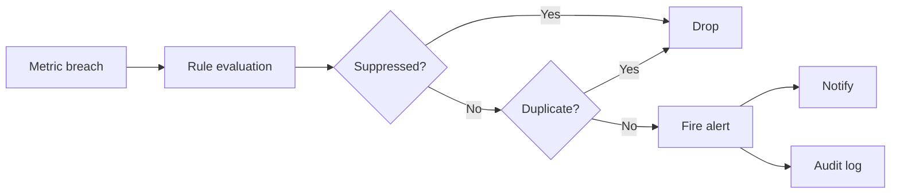

# AgainERP Control Center — Monitoring & Health

> **Status:** Architecture Documentation  
> **Version:** 1.0  
> **Step:** 10 of 17  
> **Document Type:** Enterprise Architecture — Monitoring  
> **Parent Index:** [MASTER_INDEX.md](./MASTER_INDEX.md)  
> **Previous:** [09 — Subscription & License](./09_Subscription_License.md)

---

## Purpose

Define the monitoring and health architecture — metrics collection, heartbeat processing, alerting, logging, and performance observability across all client installations.

## Scope

Control Center monitoring pipeline and operator dashboards. Client-side APM tooling selection is a deployment concern.

---

## Architecture



---

## Metrics Catalog

### Infrastructure Metrics

| Metric | Source | Unit | Alert default |
|--------|--------|------|---------------|
| **CPU** | Agent / host | % utilization | > 90% for 10 min |
| **RAM** | Agent / host | % utilization | > 85% for 10 min |
| **Disk** | Agent / host | % used | > 80% warning, > 95% critical |
| **Disk I/O** | Agent | IOPS, latency | p95 > 50ms |
| **Network** | Agent | egress/ingress Mbps | Anomaly detection |

### Docker Metrics

| Metric | Description |
|--------|-------------|
| `docker.containers.running` | Count by service |
| `docker.containers.unhealthy` | Health check failures |
| `docker.restart.count` | Restarts in window |
| `docker.image.version` | Running image tags vs expected |

### Database Metrics

| Metric | Description |
|--------|-------------|
| `db.reachable` | Boolean connectivity |
| `db.latency_ms` | Simple query round-trip |
| `db.connections.active` | Connection pool usage |
| `db.connections.max` | Pool limit |
| `db.size_mb` | Database size trend |

### Redis Metrics

| Metric | Description |
|--------|-------------|
| `redis.reachable` | Boolean |
| `redis.memory_used_mb` | Memory consumption |
| `redis.connected_clients` | Client count |
| `redis.evicted_keys` | Eviction rate |

### Queue Metrics

| Metric | Description |
|--------|-------------|
| `queue.pending_jobs` | Backlog depth |
| `queue.failed_jobs` | Failed count (1h window) |
| `queue.processing_time_p95` | Job duration |

---

## Heartbeat

Heartbeat is the primary telemetry channel — see [04 — Client Edge Agent](./04_Client_Edge_Agent.md).

### Processing pipeline



### Stale agent detection

| Condition | Status | Action |
|-----------|--------|--------|
| No heartbeat > 5 min | Warning | Dashboard yellow |
| No heartbeat > 30 min | Critical | Alert operator |
| No heartbeat > 24h | Offline | Client card red; email escalation |

---

## Performance Metrics

### Application performance (agent-reported)

| Metric | Description |
|--------|-------------|
| `api.response_time_p50` | Median API latency |
| `api.response_time_p95` | 95th percentile |
| `api.error_rate` | 5xx / total requests |
| `web.ttfb_p95` | Time to first byte |

### SLA tracking

| Tier | Uptime target | Measurement window |
|------|---------------|-------------------|
| Starter | 99.5% | 30-day rolling |
| Business | 99.9% | 30-day rolling |
| Professional | 99.95% | 30-day rolling |
| Enterprise | 99.99% | Contract-defined |

Uptime calculated from heartbeat + synthetic health checks (optional enterprise add-on).

---

## Alerts

### Alert severity levels

| Level | Response | Channels |
|-------|----------|----------|
| **Info** | Dashboard only | In-app |
| **Warning** | Review within 24h | Email |
| **Critical** | Review within 1h | Email + SMS + PagerDuty |
| **Emergency** | Immediate | All channels + on-call |

### Standard alert rules

| Alert | Condition |
|-------|-----------|
| `agent.offline` | No heartbeat > 30 min |
| `disk.critical` | Disk > 95% |
| `db.unreachable` | 3 consecutive failures |
| `docker.unhealthy` | Any container unhealthy > 5 min |
| `license.expiring` | < 7 days (from license metadata in heartbeat) |
| `update.failed` | Client update status = failed |
| `backup.overdue` | No successful backup > policy interval |
| `queue.backlog` | pending_jobs > threshold |

### Alert suppression

- Maintenance windows suppress infra alerts
- Duplicate alerts deduplicated within 15-minute window
- Flapping detection: 3 clears required to resolve



---

## Logs

### Log architecture

| Log type | Storage | Retention |
|----------|---------|-----------|
| Control Center app logs | Centralized (Loki/ELK) | 90 days |
| Agent diagnostic bundles | Object storage (on-demand) | 30 days |
| Audit logs | Append-only DB + archive | 7 years |
| Alert history | Monitoring DB | 1 year |

### Agent log collection

- Agent does **not** stream full application logs by default (bandwidth)
- On alert or operator request: agent collects diagnostics bundle
- Bundle includes: last 1000 lines per container, config redacted, system info
- Uploaded to pre-signed object storage URL

**PII rule:** Logs sent to Control Center must be scrubbed of customer PII by agent.

---

## Metrics Storage & Retention

| Granularity | Hot storage | Rollup |
|-------------|-------------|--------|
| Raw (60s) | 30 days | — |
| 5-minute avg | — | 1 year |
| 1-hour avg | — | 3 years |
| Daily summary | — | Indefinite |

---

## Dashboard Views

### Fleet overview
- Total clients by status
- Agents online / offline
- Critical alerts (24h)
- Average fleet health score

### Client detail
- Real-time metric charts (CPU, RAM, disk, DB)
- Docker container status grid
- Alert timeline
- Heartbeat history
- Performance trends (7d, 30d)

### Health score (computed)

```
health_score = weighted(
  agent_online: 25,
  db_reachable: 25,
  docker_healthy: 20,
  disk_ok: 15,
  queue_ok: 15
)
```

Score 0–100 displayed per client; AI Monitoring Agent explains drops.

---

## Responsibilities

| Component | Role |
|-----------|------|
| Edge Agent | Collect and transmit metrics |
| Ingestion API | Validate, enrich, write |
| Monitoring Service | Aggregation, dashboards, SLA |
| Alert Engine | Rule evaluation, suppression |
| Notification Service | Alert delivery |
| AI Service | Anomaly detection, root cause hints |

Detail: [14 — AI Control](./14_AI_Control.md)

---

## Best Practices

- Heartbeat payload size capped at 64 KB
- Metric cardinality controlled — no unbounded label sets
- Alert rules version-controlled; test in staging
- Fleet-wide maintenance broadcast suppresses alerts proactively

---

## Security Notes

- Metrics contain no business data — infrastructure only
- Diagnostic bundles encrypted in transit and at rest
- Operator access to diagnostics requires `clients.diagnostics` permission

---

## Future Improvements

| Improvement | Phase |
|-------------|-------|
| OpenTelemetry native export from client ERP | Phase 2 |
| Predictive disk/full alerts (ML) | Phase 3 |
| Client-visible health portal (self-service) | Phase 2 |
| Synthetic transaction monitoring | Phase 3 |

---

## Summary

Monitoring ingests Edge Agent heartbeats into a time-series pipeline, evaluates alert rules, and surfaces fleet and per-client dashboards. Infrastructure, Docker, database, Redis, queue, and performance metrics are tracked without client business data. Alerts escalate through severity levels with suppression and deduplication.

**Next:** [11 — Backup & Disaster Recovery](./11_Backup.md)
