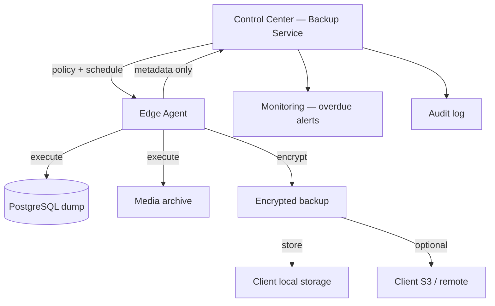
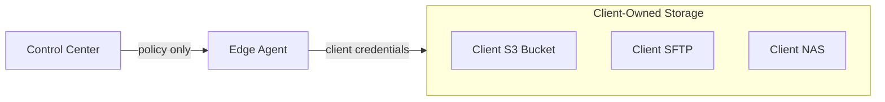
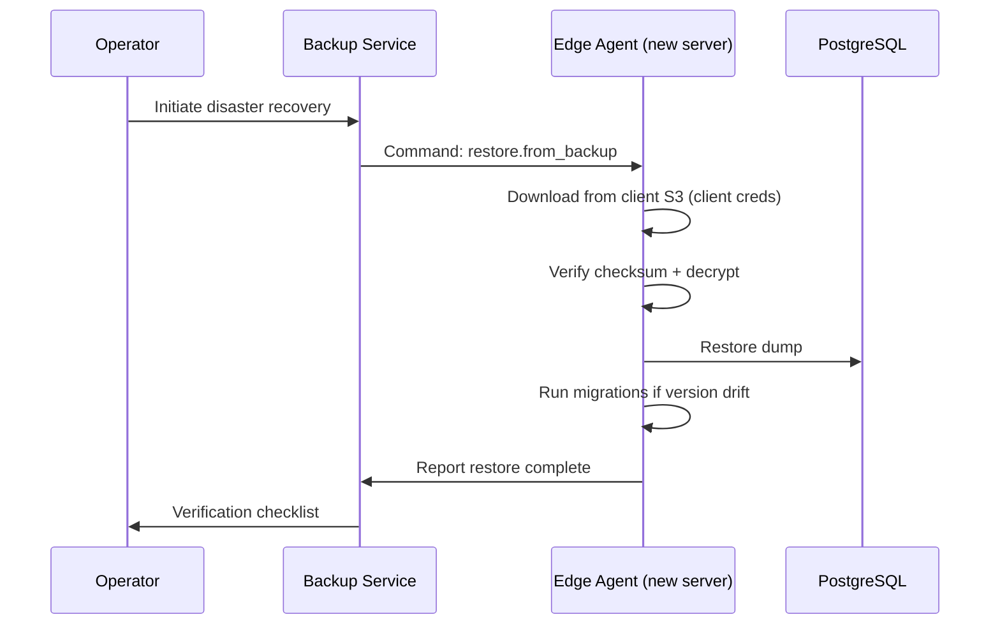
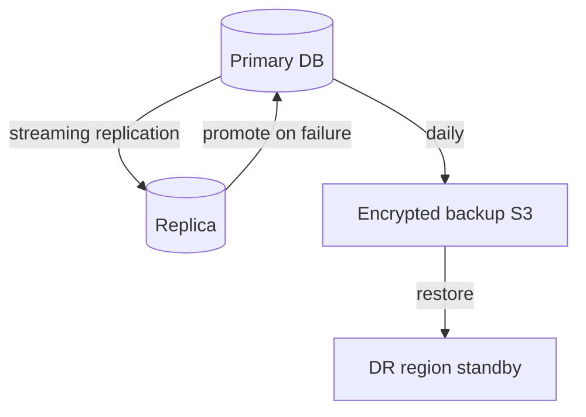
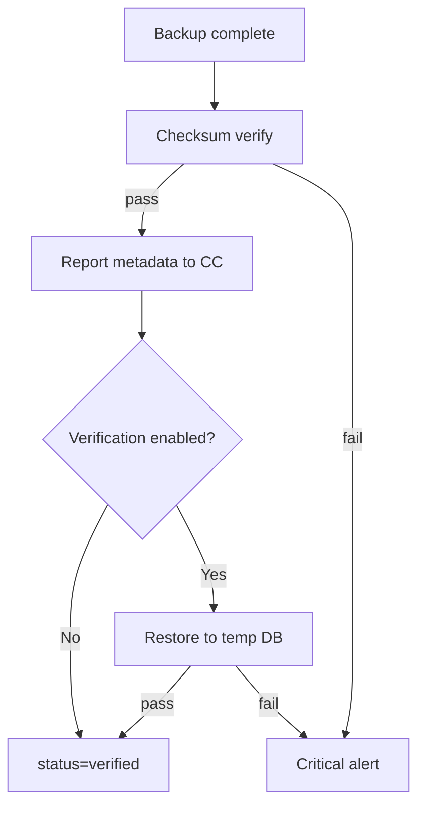

# AgainERP Control Center — Backup & Disaster Recovery

> **Status:** Architecture Documentation  
> **Version:** 1.0  
> **Step:** 11 of 17  
> **Document Type:** Enterprise Architecture — Backup & DR  
> **Parent Index:** [MASTER_INDEX.md](./MASTER_INDEX.md)  
> **Previous:** [10 — Monitoring & Health](./10_Monitoring.md)

---

## Purpose

Define backup policies, remote backup orchestration, restore procedures, snapshots, recovery workflows, verification, encryption, and retention — as managed by the Control Center and executed by the Edge Agent.

## Scope

Backup orchestration architecture. Client business data remains on client infrastructure; Control Center stores metadata only.

---

## Architecture



**Critical rule:** Backup **files** never transit through or persist in Control Center storage.

---

## Backup Policy

### Default policies by plan

| Plan | Full DB | Incremental | Media | Frequency | Retention |
|------|---------|-------------|-------|-----------|-----------|
| Starter | Daily | — | Weekly | 02:00 local | 7 days |
| Business | Daily | Hourly WAL | Daily | Configurable | 30 days |
| Professional | Daily | Hourly WAL | Daily | Configurable | 90 days |
| Enterprise | Custom | Custom | Custom | Custom | Custom |

### Policy dimensions

| Setting | Description |
|---------|-------------|
| `schedule_cron` | Cron expression (client local TZ) |
| `backup_types` | full, incremental, media, config |
| `pre_backup_hook` | Pause queues optional |
| `encryption_key_ref` | Client-managed or platform-assisted |
| `remote_target` | local, s3, sftp (client credentials) |
| `verification_enabled` | Auto restore test |
| `retention_days` | Local retention before purge |

---

## Remote Backup

### Architecture options



| Mode | Credential owner | Control Center visibility |
|------|------------------|---------------------------|
| Local only | Client | Size, checksum, timestamp |
| Client S3 | Client IAM keys (stored in agent vault) | Same metadata only |
| AgainSoft assisted | Platform bucket per client (enterprise) | Metadata + storage quota |

Control Center never holds client backup decryption keys by default (enterprise optional escrow with HSM).

---

## Restore

### Restore types

| Type | Scope | Initiated by |
|------|-------|--------------|
| **Full restore** | Entire DB + media | Client admin (local) or operator command |
| **Point-in-time** | WAL replay to timestamp | Enterprise |
| **Selective** | Single module tables | Enterprise support |
| **Disaster rebuild** | New server + restore | Migration workflow |

### Restore workflow (disaster rebuild)



---

## Snapshot

### Snapshot types

| Snapshot | Contents | Use case |
|----------|----------|----------|
| **DB snapshot** | pg_dump custom format | Daily backup |
| **Media snapshot** | tar.gz of media root | Weekly |
| **Config snapshot** | docker-compose, env redacted | Pre-update |
| **Pre-update snapshot** | DB + config | Automatic before updates |

Pre-update snapshots mandatory for major version upgrades — enforced by Update Service.

---

## Recovery

### Recovery objectives

| Target | Control Center | Client (guided) |
|--------|----------------|-----------------|
| **RPO** | 15 min (platform DB) | Per backup policy |
| **RTO** | 4 hours (platform) | Plan-dependent |
| **RPO enterprise** | 15 min | ≤ 1 hour with WAL |

### Recovery tiers

| Tier | Scenario | Procedure |
|------|----------|-----------|
| 1 | Single container crash | Docker restart (agent auto) |
| 2 | DB corruption | Restore latest verified backup |
| 3 | Server loss | New server + migration + restore |
| 4 | Region disaster | Enterprise multi-region (Phase 3) |
| 5 | Control Center outage | Clients continue offline; agent queues |

### Control Center DR



---

## Verification

### Automated verification

| Check | Frequency | Method |
|-------|-----------|--------|
| Checksum match | Every backup | SHA-256 vs manifest |
| Restore test | Weekly (enterprise) | Restore to temp DB, run smoke query |
| Size anomaly | Every backup | Compare to 7-day rolling avg |
| Age check | Continuous | Alert if overdue per policy |

Verification results stored in `backup_records` table — see [06 — Database Architecture](./06_Database_Architecture.md).



---

## Encryption

| Layer | Method |
|-------|--------|
| Backup file at rest | AES-256-GCM |
| In transit to S3 | TLS 1.3 |
| Key management | Client-managed (default) or KMS (enterprise) |
| Control Center metadata | No encrypted payload — checksums only |

### Key rotation
- Client rotates encryption keys annually (recommended)
- Agent supports dual-key decrypt during rotation window

---

## Retention Policy

### Local retention (client storage)

Managed by agent cleanup job post-backup:

```
FOR each backup WHERE age > retention_days:
  IF verified OR newer_backup_exists:
    DELETE backup file
    REPORT purge to Control Center
```

### Control Center metadata retention

| Record | Retention |
|--------|-----------|
| backup_records | 3 years |
| Verification failures | 7 years (audit) |

---

## Responsibilities

| Actor | Responsibility |
|-------|----------------|
| Backup Service | Policy definition, schedule, metadata tracking |
| Edge Agent | Execute, encrypt, store, verify, report |
| Monitoring Service | Overdue and failure alerts |
| Update Service | Pre-update snapshot trigger |
| Client admin | Credential management, restore approval |

---

## Best Practices

- 3-2-1 rule encouraged: 3 copies, 2 media types, 1 offsite (client-owned)
- Backup window outside business hours (client TZ)
- Test restore quarterly — tracked in Control Center compliance dashboard
- Never include plaintext secrets in config snapshots

---

## Security Notes

- Backup credentials stored in agent secure vault only
- Operator cannot download client backup files through Control Center
- Restore commands require MFA for enterprise tier

---

## Future Improvements

| Improvement | Phase |
|-------------|-------|
| Immutable backup storage (WORM) integration | Phase 2 |
| Cross-region backup replication templates | Phase 3 |
| Compliance report export (SOC 2 evidence) | Phase 2 |

---

## Summary

Backup orchestration is policy-driven from the Control Center and executed locally by the Edge Agent. Backup files never enter AgainSoft storage; only metadata and verification status are tracked. Encryption, retention, and automated verification ensure recoverability while preserving client data sovereignty.

**Next:** [12 — Update Management](./12_Update_Manager.md)
