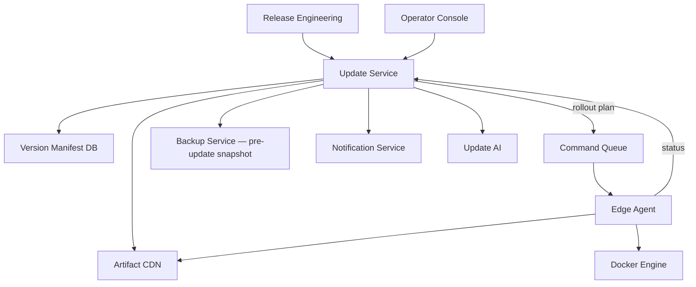
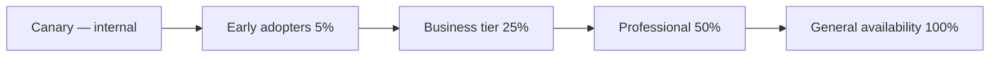
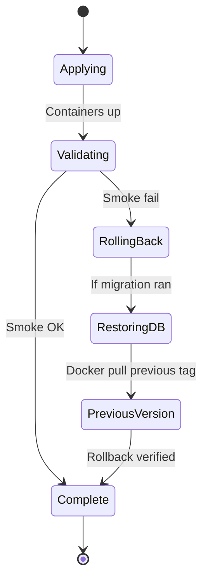

# AgainERP Control Center — Update Management

> **Status:** Architecture Documentation  
> **Version:** 1.0  
> **Step:** 12 of 17  
> **Document Type:** Enterprise Architecture — Updates  
> **Parent Index:** [MASTER_INDEX.md](./MASTER_INDEX.md)  
> **Previous:** [11 — Backup & Disaster Recovery](./11_Backup.md)

---

## Purpose

Document version control, deployment strategies, rollback, patch management, and auto/manual update flows for AgainERP client installations managed through the Control Center.

## Scope

Platform update orchestration. Client ERP release engineering process is referenced but not specified.

---

## Architecture



---

## Version Control

### Version scheme

```
YYYY.MM.PATCH[-channel]
Examples:
  2026.6.0       — stable major.minor
  2026.6.1       — patch
  2026.7.0-beta  — beta channel
  2026.4.0-lts   — long-term support
```

### Version registry

| Entity | Purpose |
|--------|---------|
| `erp_versions` | Canonical version records |
| `update_manifests` | Per-version artifact bundle |
| `client_updates` | Per-client update state |

### Channels

| Channel | Audience | Auto-update default |
|---------|----------|---------------------|
| **stable** | Production clients | Minor/patch only |
| **beta** | Early adopters | All beta releases |
| **lts** | Enterprise conservative | Security patches only |
| **hotfix** | Critical fixes | Push notification; manual apply |

---

## Deployment

### Rollout stages



| Stage | Client count | Soak time | Gate |
|-------|--------------|-----------|------|
| Canary | 1–3 internal | 24h | Zero critical failures |
| Early | 5% | 48h | Error rate < baseline + 0.1% |
| Tier rollout | 25% → 50% | 72h each | Monitoring AI approval |
| GA | Remainder | — | Operator sign-off |

### Deployment modes

| Mode | Description |
|------|-------------|
| **Scheduled** | Maintenance window (client local TZ) |
| **Immediate** | Hotfix / security — operator override |
| **Manual** | Client admin approves in local UI |
| **Auto** | Agent applies per policy when checks pass |

---

## Rollback

### Automatic rollback triggers

| Condition | Action |
|-----------|--------|
| Smoke test failure post-update | Auto rollback |
| Container unhealthy > 10 min | Auto rollback |
| DB migration failure | Auto rollback + restore pre-update snapshot |
| Operator abort command | Manual rollback |

### Rollback workflow



Previous Docker image tags retained locally (last 3 versions minimum).

---

## Patch Types

| Type | Scope | Downtime | Example |
|------|-------|----------|---------|
| **Hotfix** | Single service image | Rolling restart | Security CVE |
| **Patch** | Bug fixes, no schema | Minimal | UI fix |
| **Minor** | Features, optional migrations | Brief | New module API |
| **Major** | Breaking changes, migrations | Maintenance window | ERP 2026 → 2027 |

---

## Major Upgrade

### Preconditions

- [ ] Pre-update backup verified
- [ ] Agent version compatible
- [ ] Module compatibility matrix passed
- [ ] Maintenance window scheduled
- [ ] Client notification sent (7 days minimum enterprise)

### Steps

1. Update Service publishes manifest
2. Operator assigns to client cohort
3. Agent downloads artifacts (images + migration bundle)
4. Agent enters maintenance mode (optional banner)
5. Stop API containers
6. Run DB migrations (transactional, with down scripts)
7. Pull new images
8. Start containers
9. Run smoke tests (health, login, sample API)
10. Report success; exit maintenance mode

---

## Minor Upgrade

- Rolling Docker Compose update
- Migrations run on startup if present
- No maintenance mode required
- Auto-apply for stable channel clients with auto-update enabled

---

## Hotfix

| Property | Value |
|----------|-------|
| Priority | Critical / security |
| Rollout | Canary → 24h → accelerated GA |
| Approval | Security team + one operator |
| Client opt-out | Not allowed for critical CVE |
| Notification | Immediate email + dashboard banner |

---

## Auto Update

### Auto-update policy (per client)

```json
{
  "auto_update": {
    "enabled": true,
    "channel": "stable",
    "allow_patch": true,
    "allow_minor": true,
    "allow_major": false,
    "maintenance_window": {
      "day": "sunday",
      "start": "02:00",
      "duration_hours": 4,
      "timezone": "Asia/Dhaka"
    }
  }
}
```

### Pre-flight checks (agent)

| Check | Failure action |
|-------|----------------|
| Disk space ≥ 20% free | Defer + alert |
| Backup age < 24h (major) | Trigger backup first |
| No active critical jobs | Defer |
| License active | Block |
| ERP health score ≥ 70 | Defer + alert |

---

## Manual Update

Operator or client admin triggers via:
- Control Center UI: `POST /clients/{id}/updates`
- Client local admin panel (enterprise): forwards to agent

Manual updates still require manifest signature verification and audit logging.

---

## Update Manifest (conceptual)

```json
{
  "version": "2026.6.2",
  "channel": "stable",
  "min_agent_version": "1.2.0",
  "artifacts": [
    {
      "service": "api",
      "image": "againerp/api:2026.6.2",
      "checksum": "sha256:..."
    },
    {
      "service": "web",
      "image": "againerp/web:2026.6.2",
      "checksum": "sha256:..."
    }
  ],
  "migrations": {
    "bundle_url": "https://cdn.againerp.com/migrations/2026.6.2.tar.gz",
    "checksum": "sha256:..."
  },
  "smoke_tests": ["health", "auth.login", "catalog.products.list"],
  "signature": "JWS..."
}
```

---

## Responsibilities

| Component | Role |
|-----------|------|
| Update Service | Manifest publish, rollout orchestration |
| Backup Service | Pre-update snapshots |
| Edge Agent | Download, apply, validate, rollback |
| Monitoring Service | Post-update health watch (48h elevated) |
| Update AI | Recommend rollout pace; detect anomalies |
| Notification Service | Client and operator communications |

---

## Best Practices

- Immutable artifacts — never overwrite published versions
- Migration down scripts required for major releases
- Version drift report daily — clients not on expected channel flagged
- Staged rollout mandatory for major versions — no skip

---

## Security Notes

- All artifacts signed; agent rejects unsigned manifests
- CDN uses signed URLs with short TTL
- Update commands require valid license and operator authorization (major)

---

## Future Improvements

| Improvement | Phase |
|-------------|-------|
| Blue-green deployment for zero-downtime major upgrades | Phase 3 |
| Canary metrics auto-promote / auto-halt | Phase 2 |
| Client-staged update rings (internal departments first) | Phase 3 |

---

## Summary

Update management publishes signed version manifests through the Update Service, rolls out via staged deployment, and executes on clients through the Edge Agent with mandatory pre-update backups and smoke-test validation. Patch, minor, major, and hotfix types follow distinct policies; automatic rollback protects against failed upgrades.

**Next:** [13 — Security Architecture](./13_Security.md)
