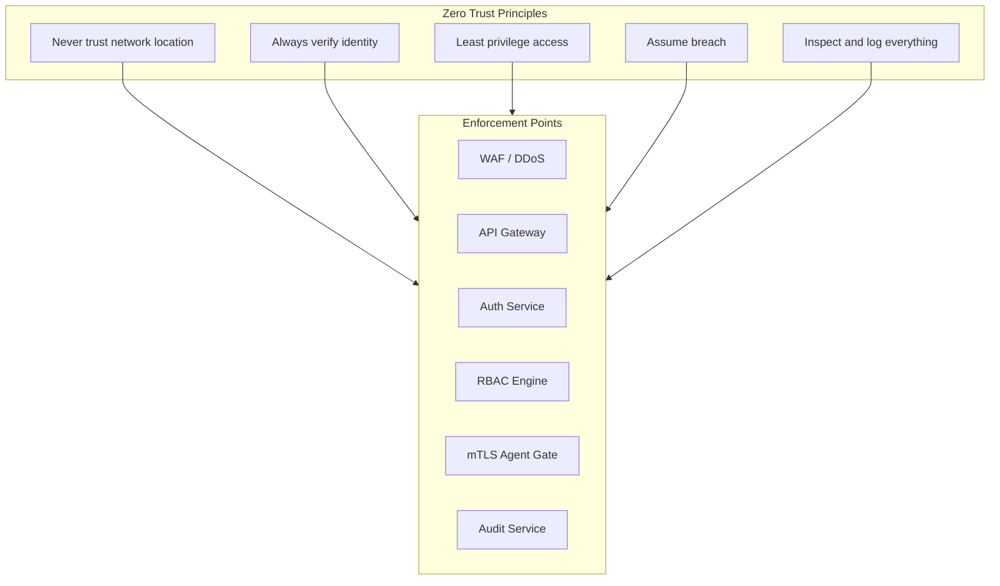
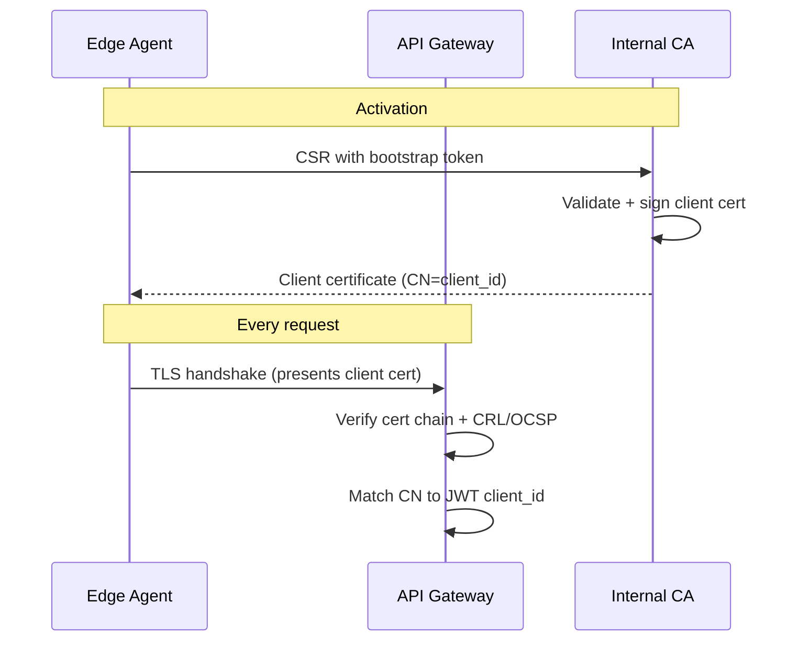
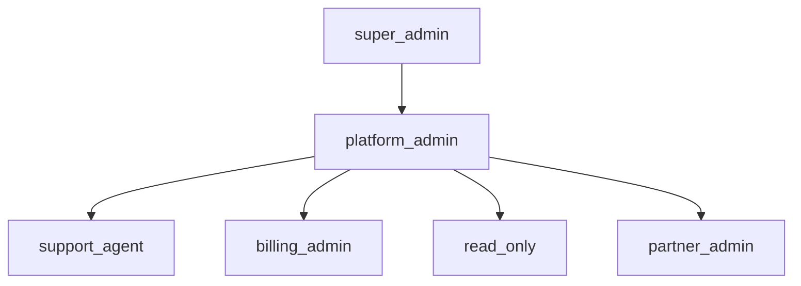
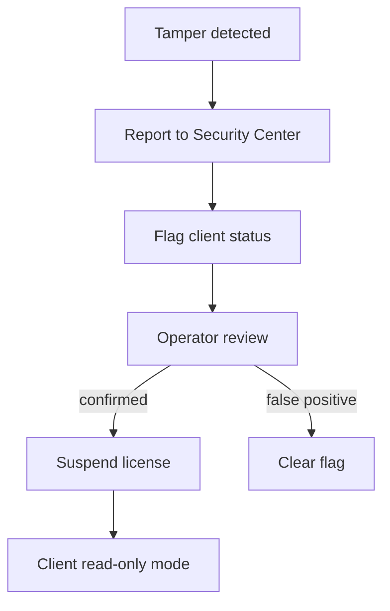
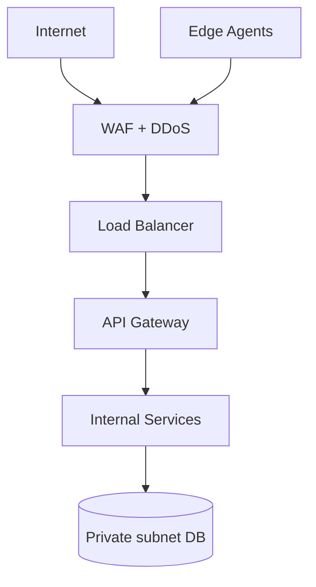

# AgainERP Control Center — Security Architecture

> **Status:** Architecture Documentation  
> **Version:** 1.0  
> **Step:** 13 of 17  
> **Document Type:** Enterprise Architecture — Security  
> **Parent Index:** [MASTER_INDEX.md](./MASTER_INDEX.md)  
> **Previous:** [12 — Update Management](./12_Update_Manager.md)

---

## Purpose

Define the security architecture for the Control Center — Zero Trust principles, encryption, authentication, authorization, audit, secrets management, MFA, network controls, token rotation, and secure agent design.

## Scope

Platform security design. Client server hardening guides are referenced as client responsibilities.

---

## Architecture

### Zero Trust Model

**Core tenet:** Every request — operator, agent, service-to-service — is authenticated, authorized, encrypted, and audited regardless of source network.

---

## Encryption

### In transit

| Path | Requirement |
|------|-------------|
| Operator → Control Center | TLS 1.3, HSTS, certificate pinning (mobile) |
| Agent → Control Center | TLS 1.3 + mTLS |
| Service mesh (internal) | mTLS (Istio/Linkerd) |
| Webhook delivery | TLS 1.3 + HMAC signature |
| CDN artifacts | HTTPS signed URLs |

### At rest

| Asset | Method |
|-------|--------|
| Control Center DB | AES-256 (TDE or disk encryption) |
| PII columns | Application-level encryption (contact email) |
| Object storage | SSE-S3 or SSE-KMS |
| Audit archives | Encrypted before upload |
| Backups (platform) | AES-256-GCM |
| Agent local vault | OS keyring / encrypted filesystem |

### Key management

| Key type | Storage |
|----------|---------|
| License signing | Cloud KMS / HSM |
| JWT signing (operator) | KMS with 90-day rotation |
| JWT signing (agent) | KMS separate key |
| Webhook HMAC secrets | Secrets manager |
| DB encryption | Cloud provider managed |

---

## JWT

See [07 — API Architecture](./07_API_Architecture.md).

| Token | Algorithm | TTL | Rotation |
|-------|-----------|-----|----------|
| Operator access | RS256 | 15 min | Refresh token rotation |
| Agent access | RS256 | 15 min | Refresh on every use |
| License payload | RS256/ES256 | Period-bound | Re-sign on renewal |

**Validation:** iss, aud, exp, nbf, jti (replay check for one-time tokens).

---

## TLS & mTLS

### Operator TLS
- Public CA certificate
- OCSP stapling
- TLS 1.2 minimum (1.3 preferred); 1.0/1.1 disabled

### Agent mTLS

Certificate lifetime: 365 days; auto-renewal at 30 days.

---

## RBAC

### Role hierarchy

### Permission enforcement

| Layer | Check |
|-------|-------|
| API Gateway | JWT valid + role present |
| Service | Resource-level permission |
| High-risk action | Step-up MFA within 5 min |
| Partner scope | client.partner_id match |

### High-risk actions (MFA required)

- License revoke
- Client terminate
- Production update deploy
- Operator role change
- API key create (production scope)
- Break-glass module install

---

## Audit

Immutable append-only audit — see [06 — Database Architecture](./06_Database_Architecture.md).

| Requirement | Implementation |
|-------------|----------------|
| Completeness | All write operations logged |
| Integrity | Hash chain per partition (Phase 2) |
| Retention | 7 years |
| Access | `audit.read` permission; no delete |
| SIEM export | Syslog/JSON stream (enterprise) |

Logged: operator login, failed auth, agent activation, license changes, update deploys, remote commands, permission changes.

---

## Secrets

| Secret | Storage | Access |
|--------|---------|--------|
| DB credentials | Secrets manager | Service identity only |
| KMS API keys | IAM role | License Service only |
| Stripe webhook secret | Secrets manager | Billing Service only |
| Agent bootstrap tokens | DB hash only | One-time display |
| Partner webhook secrets | Encrypted DB column | Notification Service |

**Rules:**
- No secrets in environment files committed to git
- Rotation calendar: 90 days default
- Break-glass secrets in physical HSM (enterprise)

---

## MFA

| Actor | Requirement |
|-------|-------------|
| All operators | TOTP or WebAuthn mandatory |
| super_admin | Hardware key (FIDO2) required |
| Client admin (local) | Client ERP policy — not Control Center |
| API keys | No MFA — scoped + rate limited |

Step-up MFA for high-risk actions re-validates within 5-minute window.

---

## IP Restriction

| Tier | Capability |
|------|------------|
| Standard | No IP restriction |
| Business | Optional operator IP allowlist |
| Enterprise | Mandatory allowlist + agent egress IP registration |
| Partner API | IP allowlist per API key |

Agent IP changes trigger audit event (not auto-block unless enterprise policy).

---

## Token Rotation

| Token | Rotation policy |
|-------|-----------------|
| Operator refresh | Rotate on every use; family detection |
| Agent refresh | Rotate on every use |
| API keys | Manual or 365-day max TTL |
| Bootstrap tokens | Single use, 24h expiry |
| Webhook secrets | Dual-secret 7-day overlap rotation |
| JWT signing keys | 90-day with published JWKS overlap |

**Compromise response:**
1. Revoke token family immediately
2. Force re-auth (operators) or cert re-issue (agents)
3. Audit forensics on affected resources
4. Notify security team within 15 minutes

---

## Secure Agent

| Control | Detail |
|---------|--------|
| Minimal image | Distroless base; no shell in production |
| Non-root | UID 1000; cap_drop ALL |
| Read-only FS | Except /var/againerp/agent/cache |
| Network | Egress-only to Control Plane + CDN |
| Command verification | JWS signature on every command |
| Tamper detection | Binary hash verify; report mismatch |
| Local admin API | localhost:127.0.0.1 only |
| Log redaction | Strip PII before upload |

### Tamper response

---

## Network Security

- Control Center DB in private subnet — no public access
- Admin UI separate origin from API (optional)
- Egress filtering on platform services (allowlist external APIs)

---

## Compliance Alignment

| Framework | Control Center relevance |
|-----------|-------------------------|
| SOC 2 Type II | Audit, access control, encryption |
| ISO 27001 | ISMS policies, risk assessment |
| GDPR | No client PII in business data; contact email only |
| PCI DSS | Billing via tokenized payment gateway — no card storage |

---

## Best Practices

- Defense in depth — no single control is sufficient
- Regular penetration testing (annual minimum)
- Dependency scanning in CI/CD
- Security champions review for every architecture change
- Incident response runbook maintained and tested quarterly

---

## Future Improvements

| Improvement | Phase |
|-------------|-------|
| Hash-chained audit log (tamper-evident) | Phase 2 |
| Continuous agent attestation (TPM) | Phase 3 |
| SOC 2 automated evidence collection | Phase 2 |

---

## Summary

Control Center security implements Zero Trust — mTLS for agents, MFA for operators, RBAC with step-up auth, KMS-backed signing, immutable audit, and encrypted data at rest and in transit. The Edge Agent is hardened, command-verified, and tamper-aware. Token and key rotation policies limit blast radius of credential compromise.

**Next:** [14 — AI Management Center](./14_AI_Control.md)
