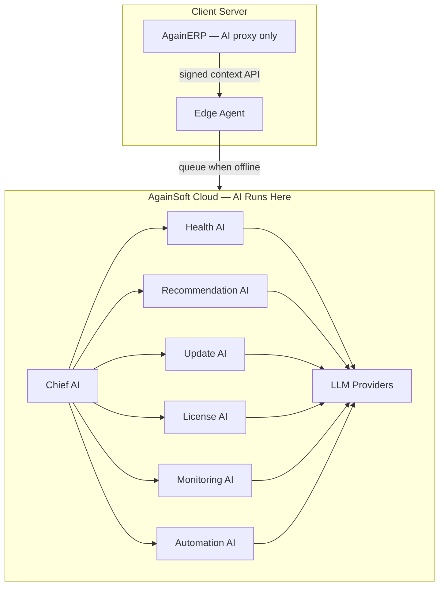
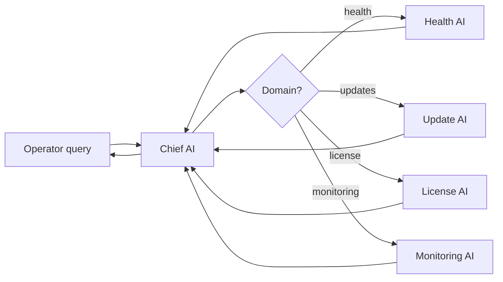
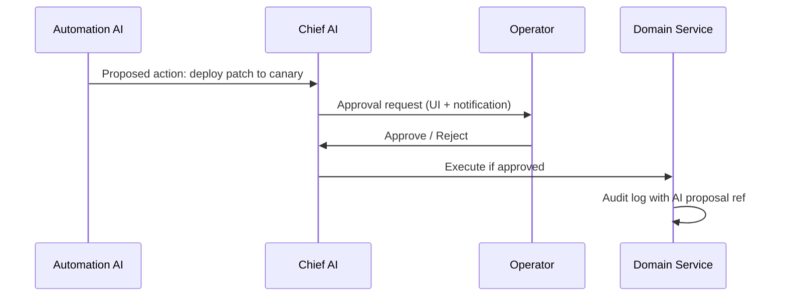
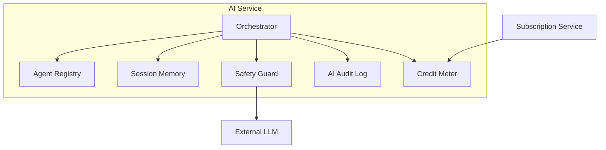
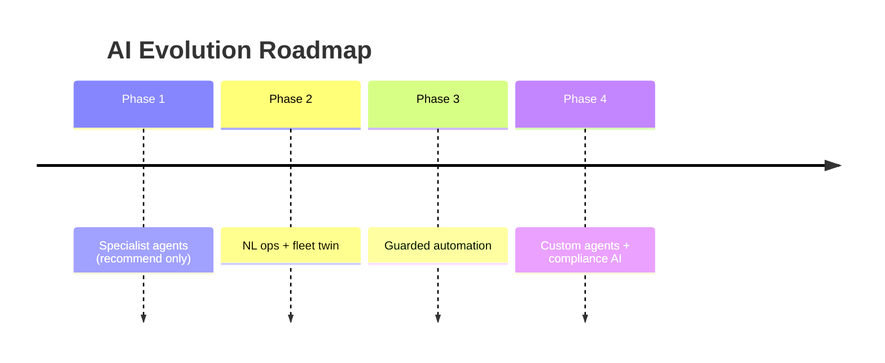

# AgainERP Control Center — AI Management Center

> **Status:** Architecture Documentation  
> **Version:** 1.0  
> **Step:** 14 of 17  
> **Document Type:** Enterprise Architecture — AI  
> **Parent Index:** [MASTER_INDEX.md](./MASTER_INDEX.md)  
> **Previous:** [13 — Security Architecture](./13_Security.md)

---

## Purpose

Design the AI Management Center — specialized AI agents that assist AgainSoft operators in managing the client fleet, plus the future AI architecture for autonomous platform operations.

## Scope

Control Plane AI orchestration. Client ERP AI OS remains cloud-proxied per [AI_OS_ARCHITECTURE.md](../../againerp/docs/06-ai/platform/ai/AI_OS_ARCHITECTURE.md).

---

## Architecture

### AI Placement Rule

**Rule:** AI models and weights never deploy to client servers by default. Clients access AI through signed HTTPS proxy.

---

## Chief AI

| Attribute | Value |
|-----------|-------|
| **Role** | Orchestrator for all Control Center AI agents |
| **Scope** | Cross-domain reasoning; delegates to specialists |
| **Autonomy** | Recommend only — no destructive actions without human approval |
| **Data access** | Platform metadata, metrics, audit — never client business DB |

### Responsibilities

- Route operator questions to specialist agents
- Synthesize fleet-wide insights for daily briefing
- Prioritize alert triage across Monitoring AI outputs
- Enforce AI credit budget across client fleet

---

## Health AI

| Function | Input | Output |
|----------|-------|--------|
| Root cause analysis | Metrics + alert history | Probable cause + suggested fix |
| Trend detection | 30-day health snapshots | Degradation warnings |
| Capacity planning | CPU/RAM/disk trends | Upgrade recommendations |
| Anomaly scoring | Baseline per client tier | Anomaly score 0–100 |

**Example output:**
> Client `cli_abc123` disk growth rate suggests full disk in 12 days. Recommend cleanup or expansion. No business data examined.

---

## Recommendation AI

| Function | Description |
|----------|-------------|
| Plan optimization | Suggest plan upgrade/downgrade based on seat usage |
| Module recommendations | Unused modules → cost savings |
| Config best practices | Compare client config to fleet benchmarks |
| Support deflection | Suggest KB articles for common alert patterns |

Outputs appear in Control Center UI as actionable cards — operator accepts or dismisses.

---

## Update AI

| Function | Description |
|----------|-------------|
| Rollout advisor | Recommend canary pace based on failure rates |
| Compatibility check | Flag clients with module/version conflicts pre-deploy |
| Risk scoring | Score each client for update risk (0–100) |
| Post-update watch | Elevated monitoring for 48h after update |

**Integration:** Update Service consults Update AI before stage promotion.

Detail: [12 — Update Manager](./12_Update_Manager.md)

---

## License AI

| Function | Description |
|----------|-------------|
| Expiry forecasting | Predict renewal failures from payment history |
| Entitlement audit | Detect over-use vs license (seat count from heartbeat metadata) |
| Fraud detection | Unusual activation patterns |
| Renewal outreach | Draft personalized renewal communications |

**Constraint:** License AI cannot modify licenses — recommendations only.

Detail: [09 — Subscription & License](./09_Subscription_License.md)

---

## Monitoring AI

| Function | Description |
|----------|-------------|
| Alert correlation | Group related alerts across clients |
| False positive reduction | Suppress known benign patterns |
| Incident summarization | Generate incident timeline for on-call |
| SLA breach prediction | Predict SLA miss before window ends |

Detail: [10 — Monitoring & Health](./10_Monitoring.md)

---

## Automation AI

| Function | Autonomy level |
|----------|----------------|
| Auto-acknowledge info alerts | Full auto |
| Schedule non-critical backups | Full auto with policy |
| Deploy patch to canary cohort | Human approval required |
| Suspend client for tamper | Human approval required |
| Terminate client | **Never autonomous** |

### Human-in-the-loop workflow

---

## AI Service Architecture

### Components

| Component | Role |
|-----------|------|
| Orchestrator | Route requests, manage agent lifecycle |
| Agent Registry | Specialist agent definitions, prompts, tools |
| Session Memory | Short-term context per operator session |
| Safety Guard | PII scrub, prompt injection filter, output validation |
| Credit Meter | Deduct AI credits per client/plan |
| AI Audit Log | Every AI request/response metadata (not full prompts in prod logs) |

---

## Client AI Proxy

Clients consume AI through Edge Agent queue:

1. Client ERP sends AI request to local agent API
2. Agent validates license `ai.*` feature
3. Agent forwards to Control Center AI Service (or queues offline)
4. AI Service executes via AI OS engines
5. Response returned through agent — no direct cloud URL in client

**Credit metering:** Each request deducts from monthly allocation; overage blocked or billed per plan.

---

## Future AI Architecture

### Phase 2 — Enhanced Intelligence

| Capability | Description |
|------------|-------------|
| Fleet digital twin | Simulated fleet for update testing |
| Natural language ops | "Show clients at risk of churn" |
| Automated runbooks | AI-generated remediation steps |
| Partner AI insights | Anonymized fleet benchmarks |

### Phase 3 — Autonomous Operations

| Capability | Guardrails |
|------------|------------|
| Self-healing agents | Restart containers — auto; DB restore — approval |
| Predictive scaling alerts | Notify client admin — not auto-scale client infra |
| Cross-client pattern learning | Federated — opt-in, anonymized metrics only |
| AI-to-AI coordination | Chief AI delegates; Audit logs all inter-agent msgs |

### Phase 4 — Advanced

| Capability | Description |
|------------|-------------|
| Custom operator agents | AgainSoft builds specialist agents via prompt studio |
| Client-facing AI support bot | Powered by cloud; context from client API only |
| Regulatory AI auditor | Compliance report generation |

---

## Responsibilities

| Agent | Primary data source | Can modify state? |
|-------|---------------------|-------------------|
| Chief AI | All platform metadata | No |
| Health AI | health_snapshots | No |
| Recommendation AI | subscriptions, usage metadata | No |
| Update AI | update_manifests, client_updates | No (advise only) |
| License AI | licenses, billing | No |
| Monitoring AI | metrics, alerts | No (suppress rules via approval) |
| Automation AI | All above | Yes — with human approval gate |

---

## Best Practices

- AI never receives raw client business records
- All AI outputs labeled "AI-generated — verify before action"
- Prompt templates version-controlled; changes audited
- AI credit budgets prevent runaway costs
- Fallback to rule-based logic when LLM unavailable

---

## Security Notes

- Prompt injection defense at Safety Guard layer
- Client context sanitized before LLM — strip PII patterns
- AI audit logs retained 1 year minimum
- No client data used for model training without explicit enterprise consent

Detail: [13 — Security Architecture](./13_Security.md)

---

## Future Improvements

| Improvement | Phase |
|-------------|-------|
| AI agent performance dashboard | Phase 2 |
| Custom prompt studio for operators | Phase 3 |
| On-prem LLM option for air-gapped (inference only) | Phase 4 |

---

## Summary

The AI Management Center deploys specialist agents — Chief, Health, Recommendation, Update, License, Monitoring, and Automation — orchestrated by the AI Service in the cloud. AI assists operators with recommendations and guarded automation; destructive actions always require human approval. Client AI access flows through the Edge Agent proxy with credit metering and strict data boundaries.

**Next:** [15 — Deployment Architecture](./15_Deployment.md)
