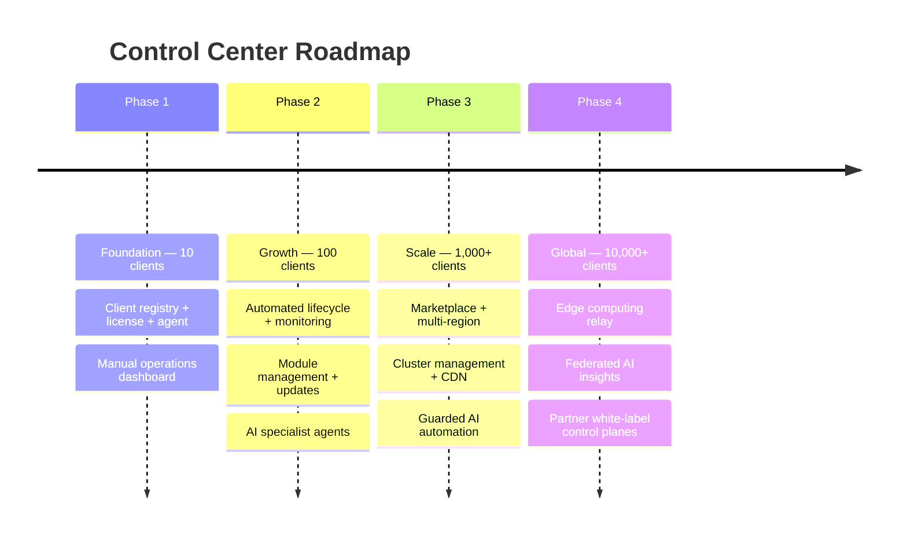
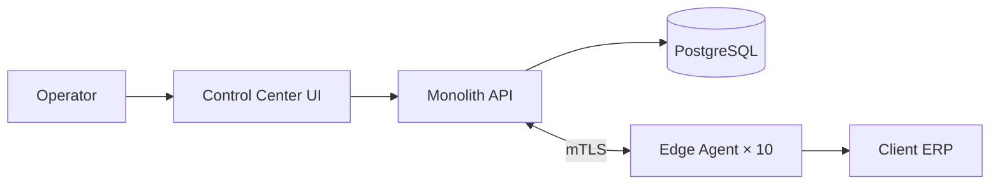
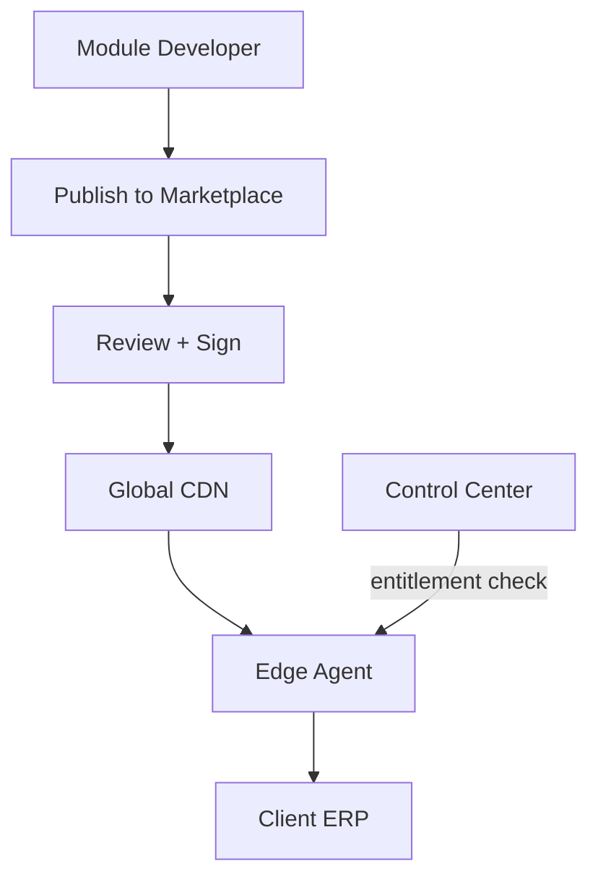
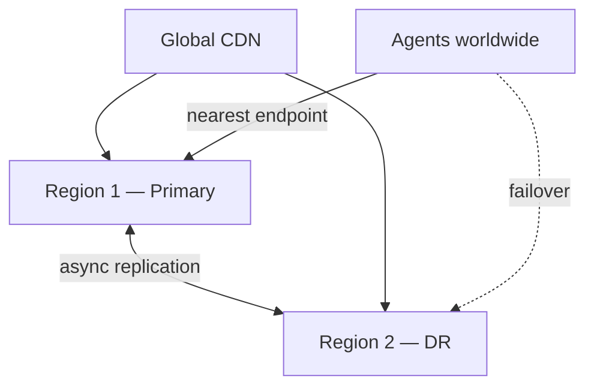
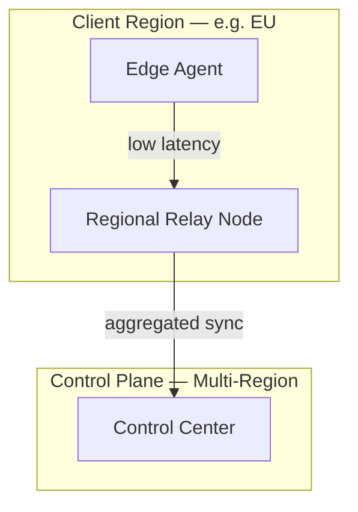

# AgainERP Control Center — Future Roadmap

> **Status:** Architecture Documentation  
> **Version:** 1.0  
> **Step:** 17 of 17  
> **Document Type:** Enterprise Architecture — Roadmap  
> **Parent Index:** [MASTER_INDEX.md](./MASTER_INDEX.md)  
> **Previous:** [16 — Project Structure](./16_Project_Structure.md)

---

## Purpose

Define the phased roadmap for Control Center — from MVP fleet management to global multi-region platform with marketplace, cluster management, CDN, AI automation, and edge computing.

## Scope

Strategic roadmap and capability timeline. Sprint planning and resource allocation are out of scope.

---

## Architecture

### Roadmap Overview

---

## Phase 1 — Foundation (0–10 Clients)

**Goal:** Prove Central Control Plane + Edge Agent model with manual operator workflows.

### Deliverables

| Capability | Document reference |
|------------|-------------------|
| Client registration & activation | [05 — Client Lifecycle](./05_Client_Lifecycle.md) |
| Edge Agent heartbeat | [04 — Client Edge Agent](./04_Client_Edge_Agent.md) |
| License generation & validation | [09 — Subscription & License](./09_Subscription_License.md) |
| Operator dashboard (client list + detail) | [03 — Component Architecture](./03_Component_Architecture.md) |
| Basic RBAC + MFA | [13 — Security Architecture](./13_Security.md) |
| Docker Compose deployment | [15 — Deployment](./15_Deployment.md) |
| Audit logging | [06 — Database Architecture](./06_Database_Architecture.md) |

### Infrastructure

- Single-region Docker Compose (DigitalOcean / Railway)
- PostgreSQL + Redis
- Manual update deployment to clients

### Success criteria

| Metric | Target |
|--------|--------|
| Client onboarding time | < 4 hours |
| Agent uptime | > 99% |
| License validation latency | < 200ms |
| Zero client business data in Control DB | 100% |

### Phase 1 architecture

---

## Phase 2 — Growth (10–100 Clients)

**Goal:** Automate lifecycle, monitoring, updates, and AI-assisted operations.

### Deliverables

| Capability | Description |
|------------|-------------|
| Automated subscription renewal | Billing webhooks + dunning |
| Monitoring dashboard + alerts | [10 — Monitoring](./10_Monitoring.md) |
| Staged update rollout | [12 — Update Manager](./12_Update_Manager.md) |
| Module enable/disable | [08 — Module Management](./08_Module_Management.md) |
| Backup orchestration | [11 — Backup](./11_Backup.md) |
| AI specialist agents | [14 — AI Control](./14_AI_Control.md) |
| Webhook integrations | [07 — API Architecture](./07_API_Architecture.md) |
| Kubernetes production deploy | [15 — Deployment](./15_Deployment.md) |
| OpenAPI specification | API docs publication |

### Infrastructure

- AWS/Azure with managed PostgreSQL
- TimescaleDB for metrics
- CDN for update artifacts (single region)
- HPA for API replicas

### Success criteria

| Metric | Target |
|--------|--------|
| Proactive issue detection | 40% of issues |
| Update success rate | > 98% |
| Mean time to onboard | < 2 hours |
| Operator AI adoption | 60% daily active |

---

## Phase 3 — Scale (100–1,000 Clients)

**Goal:** Marketplace ecosystem, multi-region, cluster support, guarded automation.

### Deliverables

| Capability | Description |
|------------|-------------|
| **Marketplace** | Signed module/theme/agent distribution |
| **Multi-region control plane** | Active-passive DR; geo-routing |
| **Global CDN** | Update artifacts + marketplace packages at edge |
| **Cluster management** | Multi-node client ERP clusters |
| **AI automation (guarded)** | Human-in-the-loop destructive ops |
| **Partner portal** | Partner-scoped client management |
| **Self-service client portal** | Renewal, health view, support tickets |
| **Advanced security** | Hash-chained audit, TPM attestation |

### Marketplace architecture

### Multi-region

### Cluster management

- Multiple ERP API nodes behind client load balancer
- Single Edge Agent leader per cluster (election)
- Shared PostgreSQL (primary/replica)
- Control Center sees cluster as one logical client with node health

### Success criteria

| Metric | Target |
|--------|--------|
| Fleet size | 1,000 clients |
| Marketplace modules | 20+ published |
| Multi-region failover RTO | < 1 hour |
| Update CDN cache hit rate | > 95% |

---

## Phase 4 — Global (1,000–10,000+ Clients)

**Goal:** Edge computing, federated AI, partner white-label, autonomous ops at scale.

### Deliverables

| Capability | Description |
|------------|-------------|
| **Edge computing relay** | Regional agent relay nodes for low-latency |
| **AI automation (advanced)** | Self-healing with policy bounds |
| **Federated AI insights** | Opt-in anonymized fleet learning |
| **Partner white-label** | Branded control planes for resellers |
| **Sharded client registry** | Horizontal DB scale |
| **Compliance automation** | SOC 2 / ISO evidence generation |
| **Air-gapped licensing** | Quarterly offline license exchange |

### Edge computing

Relay nodes cache: update manifests, feature flag snapshots, CDN artifacts. No business data at relay.

### Global CDN

| Asset type | Edge cached |
|------------|-------------|
| Docker images | Yes — registry mirror |
| Module packages | Yes |
| Update migration bundles | Yes |
| License public keys | Yes |
| AI model weights | **No** — cloud only |

### AI automation maturity

| Level | Phase | Capability |
|-------|-------|------------|
| L0 | Phase 1 | Manual ops only |
| L1 | Phase 2 | AI recommendations |
| L2 | Phase 3 | Guarded automation (approval) |
| L3 | Phase 4 | Policy-bound autonomous ops |
| L4 | Future | Full autonomous (never for termination) |

---

## Cross-Phase Capability Matrix

| Capability | P1 | P2 | P3 | P4 |
|------------|:--:|:--:|:--:|:--:|
| Client registry | ✅ | ✅ | ✅ | ✅ |
| Edge Agent | ✅ | ✅ | ✅ | ✅ |
| License/subscription | ✅ | ✅ | ✅ | ✅ |
| Monitoring/alerts | Basic | Full | AI-enhanced | Predictive |
| Updates | Manual | Staged | CDN | Edge-cached |
| Modules | Manual | API | Marketplace | Marketplace+ |
| Backup orchestration | — | ✅ | ✅ | ✅ |
| AI agents | — | Specialist | + Automation | Federated |
| Multi-region | — | — | ✅ | Active-active |
| Cluster support | — | — | ✅ | ✅ |
| Marketplace | — | — | ✅ | ✅ |
| Partner white-label | — | — | Partial | Full |
| Edge relay | — | — | — | ✅ |

---

## Marketplace (Phase 3+)

Detailed in AgainERP [marketplace module docs](../../againerp/docs/03-business-modules/marketplace/).

| Asset | Distribution | Revenue |
|-------|--------------|---------|
| ERP modules | Signed `.agpkg` | Subscription add-on |
| Industry verticals | Signed package | Tier upgrade |
| Themes | Signed bundle | One-time or subscription |
| AI agents | Cloud-registered | Credit consumption |
| Connectors | Versioned manifest | Marketplace fee |

Control Center Marketplace Service integrates with Module Service and License Service for entitlement enforcement.

---

## Cluster (Phase 3+)

| Feature | Description |
|---------|-------------|
| Node registry | Multiple servers per client_id |
| Leader agent | One agent coordinates cluster |
| Rolling updates | Node-by-node update apply |
| Health aggregation | Cluster-level health score |
| Split-brain prevention | instance_id + leader lock |

---

## Global CDN (Phase 3+)

| Provider options | Use case |
|------------------|----------|
| CloudFront | AWS primary |
| Azure CDN | Azure primary |
| Cloudflare | Multi-cloud edge |
| Self-hosted cache | Air-gapped enterprise |

---

## AI Automation (Phase 3–4)

Progressive autonomy per [14 — AI Control](./14_AI_Control.md):

- Phase 3: Auto-acknowledge alerts, schedule backups, canary deploy with approval
- Phase 4: Self-heal container crashes, predictive scaling notifications, federated anomaly models

**Never autonomous:** Client termination, license revocation, production data deletion.

---

## Edge Computing (Phase 4)

| Component | Location | Purpose |
|-----------|----------|---------|
| Control Plane | Cloud region | Authority |
| Regional relay | Edge POP | Latency reduction |
| Edge Agent | Client server | Execution |
| CDN | Global | Artifact delivery |

---

## Multi Region (Phase 3–4)

| Stage | Topology | RTO |
|-------|----------|-----|
| Phase 3 | Active-passive (1 primary + 1 DR) | 1 hour |
| Phase 4 | Active-active (read local, write primary) | 15 min |
| Phase 4+ | Sharded writes by client region | 5 min |

---

## Responsibilities by Phase

| Team focus | Phase 1 | Phase 2 | Phase 3 | Phase 4 |
|------------|---------|---------|---------|---------|
| Backend | Core API + agent | Services split | Event bus + sharding | Global scale |
| Frontend | Client list/detail | Full dashboard | Marketplace UI | Partner portal |
| DevOps | Docker Compose | K8s + CI/CD | Multi-region | Edge relay |
| AI | — | Specialist agents | Automation | Federated |
| Security | MFA + RBAC | Audit + WAF | TPM + compliance | Continuous auth |

---

## Best Practices

- Each phase completes before next begins — no skip
- Phase gate review against success criteria
- Architecture docs updated at each phase boundary
- Client count triggers infrastructure tier — not feature flags for core architecture

---

## Security Notes

- Marketplace packages require code signing review before publish
- Multi-region adds data residency controls per client region preference
- Edge relay nodes hold no signing keys — cache only

---

## Future Improvements (Beyond Phase 4)

| Vision | Description |
|--------|-------------|
| Control Plane as a Service | Partners run isolated control plane instances |
| Blockchain license anchor | Optional tamper-proof license audit |
| Quantum-ready encryption | KMS algorithm agility |
| Client AI edge inference | Local models for air-gapped (enterprise opt-in) |

---

## Summary

The Control Center roadmap progresses through four phases: **Foundation** (10 clients, prove the model), **Growth** (100 clients, automate ops + AI assist), **Scale** (1,000 clients, marketplace + multi-region + CDN), and **Global** (10,000+ clients, edge relay + federated AI + partner white-label). The Central Control Plane + Edge Agent architecture remains constant — only scale, automation maturity, and geographic distribution evolve.

---

## Document Series Complete

| Step | Document |
|------|----------|
| 01 | [System Vision](./01_System_Vision.md) |
| 02 | [High Level Architecture](./02_High_Level_Architecture.md) |
| 03 | [Component Architecture](./03_Component_Architecture.md) |
| 04 | [Client Edge Agent](./04_Client_Edge_Agent.md) |
| 05 | [Client Lifecycle](./05_Client_Lifecycle.md) |
| 06 | [Database Architecture](./06_Database_Architecture.md) |
| 07 | [API Architecture](./07_API_Architecture.md) |
| 08 | [Module Management](./08_Module_Management.md) |
| 09 | [Subscription & License](./09_Subscription_License.md) |
| 10 | [Monitoring & Health](./10_Monitoring.md) |
| 11 | [Backup & Disaster Recovery](./11_Backup.md) |
| 12 | [Update Management](./12_Update_Manager.md) |
| 13 | [Security Architecture](./13_Security.md) |
| 14 | [AI Management Center](./14_AI_Control.md) |
| 15 | [Deployment Architecture](./15_Deployment.md) |
| 16 | [Project Structure](./16_Project_Structure.md) |
| 17 | **Future Roadmap** (this document) |

**Return to:** [MASTER_INDEX.md](./MASTER_INDEX.md)
