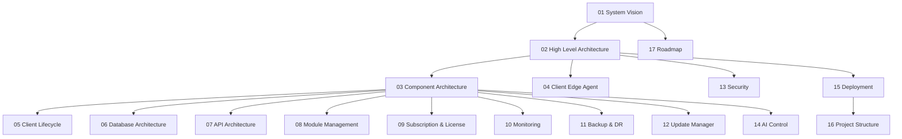

# AgainERP Control Center — Master Index

> **Status:** Architecture Documentation  
> **Version:** 1.0  
> **Project:** Control Center  
> **Document Type:** Master Documentation Navigation Hub  
> **Location:** `control/ControlCenter/`  
> **Governance:** [AgainERP GOVERNANCE](../../againerp/docs/00-foundation/GOVERNANCE.md)

---

## Purpose

Central navigation hub for all Control Center architecture documents. This index links every step of the enterprise architecture series and defines reading order for architects, security reviewers, and platform engineers.

## Scope

Covers the **AgainSoft-operated Control Plane** only. Client business data, tenant databases, and customer PII never appear in Control Center storage.

## When To Read

| Audience | Start here |
|----------|------------|
| Solution architects | [01 — System Vision](./01_System_Vision.md) |
| Security / compliance | [13 — Security Architecture](./13_Security.md) |
| Platform engineers | [02 — High Level Architecture](./02_High_Level_Architecture.md) → [04 — Edge Agent](./04_Client_Edge_Agent.md) |
| API designers | [07 — API Architecture](./07_API_Architecture.md) |
| DevOps / SRE | [15 — Deployment](./15_Deployment.md) → [11 — Backup & DR](./11_Backup.md) |

| UI/UX designers | [UI Master Index](./UI/UI_MASTER_INDEX.md) → [UI 01 Shell](./UI/UI_01_Shell_And_Design_System.md) |

---

## UI Design (Prototype)

| Step | Document | Route |
|------|----------|-------|
| UI 01 | [Shell & Design System](./UI/UI_01_Shell_And_Design_System.md) | `/center/*` layout |
| UI 04 | [Registrations & Onboarding](./UI/UI_04_Registrations.md) | `/center/registrations` |

**Live prototype:** `apps/web/src/app/center/`

---

## Document Registry

| Step | Document | Status | Summary |
|------|----------|--------|---------|
| 01 | [System Vision](./01_System_Vision.md) | ✅ Complete | Why Control Center exists, goals, problems solved |
| 02 | [High Level Architecture](./02_High_Level_Architecture.md) | ✅ Complete | Control plane, edge, secure comms, cloud components |
| 03 | [Component Architecture](./03_Component_Architecture.md) | ✅ Complete | Every major service and interaction |
| 04 | [Client Edge Agent](./04_Client_Edge_Agent.md) | ✅ Complete | Agent responsibilities, heartbeat, sync, security |
| 05 | [Client Lifecycle](./05_Client_Lifecycle.md) | ✅ Complete | Registration through termination and migration |
| 06 | [Database Architecture](./06_Database_Architecture.md) | ✅ Complete | Control Center DB schema (metadata only) |
| 07 | [API Architecture](./07_API_Architecture.md) | ✅ Complete | REST, Agent APIs, auth, webhooks |
| 08 | [Module Management](./08_Module_Management.md) | ✅ Complete | Enable/disable, dependencies, feature flags |
| 09 | [Subscription & License](./09_Subscription_License.md) | ✅ Complete | Plans, keys, grace, offline validation |
| 10 | [Monitoring & Health](./10_Monitoring.md) | ✅ Complete | Metrics, alerts, heartbeat, performance |
| 11 | [Backup & Disaster Recovery](./11_Backup.md) | ✅ Complete | Policies, restore, encryption, retention |
| 12 | [Update Management](./12_Update_Manager.md) | ✅ Complete | Version control, rollout, rollback |
| 13 | [Security Architecture](./13_Security.md) | ✅ Complete | Zero Trust, RBAC, MFA, token rotation |
| 14 | [AI Management Center](./14_AI_Control.md) | ✅ Complete | Chief AI, specialized agents, future AI |
| 15 | [Deployment Architecture](./15_Deployment.md) | ✅ Complete | Docker, K8s, cloud, on-prem, hybrid |
| 16 | [Project Structure](./16_Project_Structure.md) | ✅ Complete | Folder architecture for implementation phase |
| 17 | [Future Roadmap](./17_Roadmap.md) | ✅ Complete | Phases, marketplace, multi-region, edge |

---

## Architecture Principles

All documents adhere to:

| Principle | Application |
|-----------|-------------|
| **Security First** | Zero Trust, mTLS, signed tokens, audit everywhere |
| **Zero Trust** | Never trust agent or operator by network location alone |
| **API First** | Every capability exposed via versioned APIs before UI |
| **AI First** | AI agents assist ops; humans approve high-risk actions |
| **Event Driven** | Lifecycle, health, billing emit domain events |
| **Modular** | Services independently deployable and replaceable |
| **Multi Version Support** | Clients run different ERP versions simultaneously |
| **Docker Native** | Containers as default deployment unit |
| **Cloud / Self-Hosted / SaaS Ready** | Same architecture from 10 to 10,000+ clients |

---

## Recommended Reading Order

---

## Parent Ecosystem References

| Document | Path |
|----------|------|
| Hybrid Licensed ERP | [HYBRID_LICENSED_ERP_ARCHITECTURE.md](../../againerp/docs/01-architecture/HYBRID_LICENSED_ERP_ARCHITECTURE.md) |
| Cloud Control Plane | [CLOUD_CONTROL_PLANE.md](../../againerp/docs/07-saas/CLOUD_CONTROL_PLANE.md) |
| Technology Constitution | [TECHNOLOGY_CONSTITUTION.md](../../againerp/docs/00-foundation/TECHNOLOGY_CONSTITUTION.md) |
| Data Ownership | [DATA_OWNERSHIP.md](../../againerp/docs/07-saas/DATA_OWNERSHIP.md) |

---

## Summary

The Control Center documentation suite defines a **Central Control Plane + Client Edge Agent** architecture capable of scaling from 10 to 10,000+ client installations without architectural change. Use this index as the single entry point; each linked document is self-contained and follows AgainERP documentation standards.
