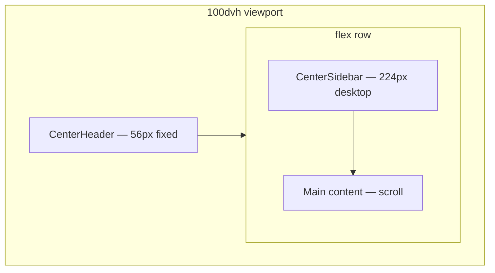
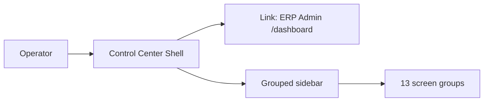
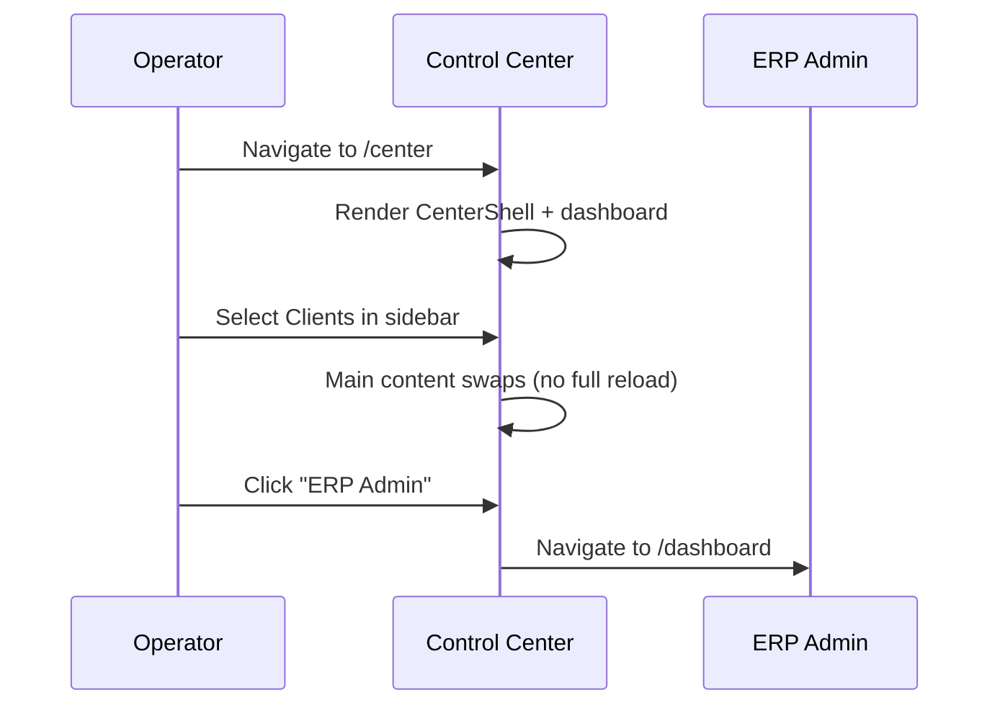

# Control Center UI — Step 01: Shell & Design System

> **Status:** UI Prototype  
> **Step:** UI 01 of 13  
> **Route namespace:** `/center/*`  
> **Parent:** [UI_MASTER_INDEX.md](./UI_MASTER_INDEX.md)  
> **Architecture:** [03 — Component Architecture](../03_Component_Architecture.md)

---

## Purpose

Define the Control Center application shell — layout, navigation, visual identity, and shared page patterns — as the foundation for all operator screens.

## Scope

Shell components, design tokens, navigation structure, responsive behavior. Individual screen content is covered in UI Steps 02–13.

---

## Architecture

### Application Shell



| Layer | Component | Responsibility |
|-------|-----------|----------------|
| Root layout | `center/layout.tsx` | Theme shell + CenterShell |
| Shell | `CenterShell` | Header + sidebar + main scroll |
| Header | `CenterHeader` | Brand, theme toggle, ERP link, operator |
| Sidebar | `CenterSidebar` | Grouped navigation |
| Content | Page routes | Screen-specific UI |

---

## Visual Identity

Control Center is **platform-level** — visually distinct from tenant ERP admin (`/dashboard`).

| Token | Value | Usage |
|-------|-------|-------|
| **Accent** | Violet (`violet-600`) | Active nav, primary CTAs, badges |
| **Brand icon** | Shield | Platform trust / operator access |
| **Background** | `bg-background` | Main canvas |
| **Sidebar** | `bg-card/50` | Subtle separation from content |
| **Preview badge** | Outline violet | Mock data indicator |

### Typography (shared with ERP admin)

| Class | Style | Use |
|-------|-------|-----|
| `.page-title` | `text-lg font-semibold` | Screen title |
| `.page-subtitle` | `text-[11px] muted` | Breadcrumb trail |
| KPI value | `text-xl font-semibold` | Dashboard metrics |
| KPI label | `text-[11px] muted` | Metric labels |

---

## Navigation Structure

Grouped sidebar aligned with architecture services:

```text
Overview
└── Dashboard                    /center

Fleet
├── Clients                      /center/clients
└── Registrations                /center/registrations

Commercial
├── Subscriptions                /center/subscriptions
├── Licenses                     /center/licenses
└── Billing                      /center/billing

Technical
├── Modules                      /center/modules
├── Updates                      /center/updates
├── Monitoring                   /center/monitoring
└── Backups                      /center/backups

Platform
├── AI Access                    /center/ai-access
├── Audit Log                    /center/audit
└── Settings                     /center/settings
```



**Removed:** `Remote Databases` — architecture rule: Control Center never queries client PostgreSQL directly. Health metrics come from Edge Agent heartbeat (UI Step 07).

---

## Page Header Pattern

Shared `CenterPageHeader` component:

```
┌─────────────────────────────────────────────────────────────┐
│ Control Center › Clients                                    │  ← subtitle (breadcrumb)
│ ERP Clients (12)                          [Preview] [+ Add] │  ← title + actions
│ Manage tenant subscriptions, modules…                       │  ← description (optional)
└─────────────────────────────────────────────────────────────┘
```

| Prop | Type | Description |
|------|------|-------------|
| `breadcrumb` | string | Dot-separated trail |
| `title` | string | Page title |
| `count` | number | Optional entity count |
| `description` | string | Optional helper text |
| `actions` | ReactNode | Right-aligned buttons |
| `preview` | boolean | Show mock data badge |

---

## Responsive Behavior

| Breakpoint | Sidebar | Header |
|------------|---------|--------|
| `< md` | Hidden; Sheet drawer on menu tap | Hamburger visible |
| `≥ md` | Fixed 224px (`w-56`) | Full operator info |

Mobile nav closes on route change via `onNavigate` callback.

---

## Header Elements

| Element | Position | Behavior |
|---------|----------|----------|
| Menu button | Left (mobile) | Opens sidebar sheet |
| Platform label | Left | "MoharazNX Platform · Control Center" |
| Theme toggle | Right | Dark/light via ThemeProvider |
| ERP Admin link | Right | Exit to tenant admin `/dashboard` |
| Operator avatar | Right | Initials + name + email |

---

## Workflow — Operator Session



---

## Component Files

| File | Role |
|------|------|
| `app/center/layout.tsx` | Wraps all center routes |
| `components/center/center-shell.tsx` | Shell layout |
| `components/center/center-header.tsx` | Top bar |
| `components/center/center-sidebar.tsx` | Grouped nav |
| `components/center/center-page-header.tsx` | Shared page header |
| `components/center/center-placeholder.tsx` | Coming-soon screens |
| `lib/navigation/center-nav.ts` | Nav config (groups + items) |

---

## Best Practices

- Keep shell components free of screen-specific business logic
- Nav badges (e.g. pending registrations) computed from mock/API in sidebar
- All new screens use `CenterPageHeader` for consistency
- Platform screens never show tenant product/order/customer data

---

## Security Notes

- Shell displays operator identity — real auth wires in implementation phase
- "ERP Admin" link is intentional escape hatch to tenant workspace
- Control Center routes should eventually require platform-level RBAC (separate from tenant roles)

---

## Future Improvements

| Improvement | Step |
|-------------|------|
| Global command palette (⌘K) | ✅ [UI 20](./UI_20_Command_Palette.md) |
| Notification bell in header | ✅ [UI 19](./UI_19_Notifications.md) |
| Partner-scoped nav filtering | Phase 2 |
| Collapsible sidebar | ✅ [UI 21](./UI_21_Collapsible_Sidebar.md) |

---

## Summary

Step 01 establishes the Control Center shell — violet platform identity, grouped sidebar navigation aligned with architecture services, responsive mobile drawer, and shared page header pattern. All subsequent UI steps plug content into this shell.

**Next:** [UI 02 — Dashboard & Overview](./UI_02_Dashboard.md) (to be created)

**Implemented in code:** `center-nav.ts` groups, `CenterPageHeader`, placeholder routes for upcoming steps.
