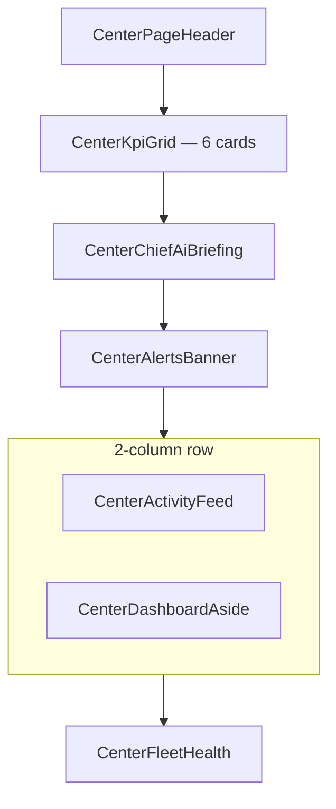
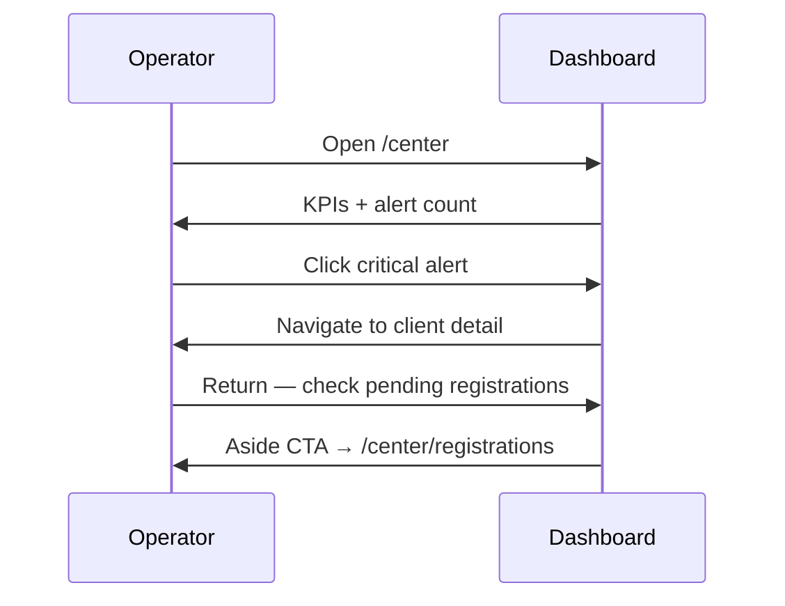

# Control Center UI — Step 02: Dashboard & Overview

> **Status:** UI Prototype  
> **Step:** UI 02 of 13  
> **Route:** `/center`  
> **Parent:** [UI_MASTER_INDEX.md](./UI_MASTER_INDEX.md)  
> **Previous:** [UI 01 — Shell & Design System](./UI_01_Shell_And_Design_System.md)  
> **Architecture:** [10 — Monitoring](../10_Monitoring.md) · [05 — Client Lifecycle](../05_Client_Lifecycle.md)

---

## Purpose

Design the Control Center operator dashboard — the first screen AgainSoft staff see when managing the client fleet. Surfaces KPIs, alerts, activity, and fleet health without exposing client business data.

## Scope

Dashboard layout, widgets, mock data contracts, and navigation targets. Charts and real-time WebSocket feeds are Phase 2.

---

## Architecture

### Widget Layout



| Zone | Component | Data source |
|------|-----------|-------------|
| Header | `CenterPageHeader` | Static |
| KPI row | `CenterKpiGrid` | `getCenterDashboardStats()` |
| Briefing | `CenterChiefAiBriefing` | `centerChiefAiBriefing` |
| Alerts | `CenterAlertsBanner` | `centerDashboardAlerts` |
| Activity | `CenterActivityFeed` | `centerRecentActivity` |
| Aside | `CenterDashboardAside` | Registrations + AI usage |
| Fleet | `CenterFleetHealth` | `centerClients` sorted by agent status |

---

## KPI Cards (6)

Computed from mock fleet via `getCenterDashboardStats()`:

| KPI | Value source | Link |
|-----|--------------|------|
| Active clients | `status ∈ active, trial` | `/center/clients` |
| MRR | Sum of `client.mrr` | `/center/billing` |
| Agents online | `dbStatus === connected` | `/center/monitoring` |
| AI OS enabled | `aiEnabled === true` | `/center/ai-access` |
| Pending signups | Registrations `pending_review` | `/center/registrations` |
| Active subscriptions | Same as active clients (prototype) | `/center/subscriptions` |

Each card: icon, value, trend/subtext, hover border, clickable.

---

## Operational Alerts

Severity-coded banner rows from `centerDashboardAlerts`:

| Severity | Color | Example |
|----------|-------|---------|
| `critical` | Red | Suspended client |
| `warning` | Amber | Agent degraded, pending registrations |
| `info` | Sky | Trial expiring soon |

**Rule:** Alerts reference agent heartbeat and billing — never "DB query failed" or business metrics.

---

## Activity Feed

`centerRecentActivity` with typed `category`:

| Category | Icon | Color |
|----------|------|-------|
| `license` | KeyRound | Violet |
| `registration` | UserPlus | Sky |
| `billing` | CreditCard | Red |
| `agent` | Activity | Amber |
| `update` | RefreshCw | Indigo |
| `ai` | Bot | Fuchsia |
| `module` | Package | Emerald |

Client names link to `/center/clients/[id]` when `clientId` present. Footer links to `/center/audit` (UI Step 12).

---

## Dashboard Aside

Right column (desktop) / stacked (mobile):

1. **Pending registrations** — list + CTA
2. **AI fleet usage** — enabled count + highest usage client progress bar
3. **Quick actions** — 2×2 grid (Deploy update disabled until UI 08)
4. **MRR snapshot** — dashed info strip

---

## Fleet Health

Full client list sorted by agent severity (`offline` → `degraded` → `connected`):

- Status badge: `active`, `trial`, `suspended`
- Agent badge: `online`, `degraded`, `offline` (from heartbeat — labeled `agent`, not `db`)
- Links to client detail

---

## Responsive Grid

| Breakpoint | KPI grid | Main row |
|------------|----------|----------|
| `< sm` | 1 column | Stacked |
| `sm–xl` | 2 columns | Stacked |
| `xl` | 3 columns | — |
| `2xl` | 6 KPI columns | Activity 2/3 + Aside 1/3 |
| `lg+` | — | Side-by-side activity + aside |

---

## Mock Data Additions

```typescript
getCenterDashboardStats()      // computed fleet stats
centerDashboardAlerts[]       // alert banner items
centerRecentActivity[]        // + category, clientId
```

---

## Component Files

```text
components/center/dashboard/
├── center-dashboard.tsx         # Page composer
├── center-kpi-grid.tsx
├── center-alerts-banner.tsx
├── center-activity-feed.tsx
├── center-dashboard-aside.tsx
└── center-fleet-health.tsx

app/center/page.tsx              # Thin route wrapper
```

---

## Workflow — Operator Morning Check



---

## Best Practices

- KPI values derived from same mock array as client list (no drift)
- All widgets link to deeper screens — dashboard is navigation hub
- Agent terminology replaces legacy "Remote DB" language
- Disabled quick actions preview future steps without broken routes

---

## Security Notes

- Dashboard shows metadata only — MRR is platform billing, not client revenue reports
- Activity feed is audit preview; full log requires RBAC in production
- No product/order/customer counts from client DB

---

## Future Improvements

| Improvement | Phase |
|-------------|-------|
| Sparkline charts on KPI cards | ✅ [UI 17](./UI_17_Monitoring_Charts.md) fleet charts |
| Real-time alert WebSocket | Implementation |
| Customizable widget layout | Phase 3 |
| Chief AI daily briefing card | ✅ [UI 14](./UI_14_Chief_AI_Briefing.md) |

---

## Summary

UI Step 02 delivers a full operator dashboard at `/center` — six linked KPI cards, severity alerts, categorized activity feed, registration/AI aside, and fleet health grid. All data is mock/computed; architecture rules (agent heartbeat, metadata only) are reflected in copy and labels.

**Next:** [UI 14 — Chief AI Daily Briefing](./UI_14_Chief_AI_Briefing.md)

**Implemented in code:** `components/center/dashboard/*`, `getCenterDashboardStats()`, enhanced mock activity/alerts.
