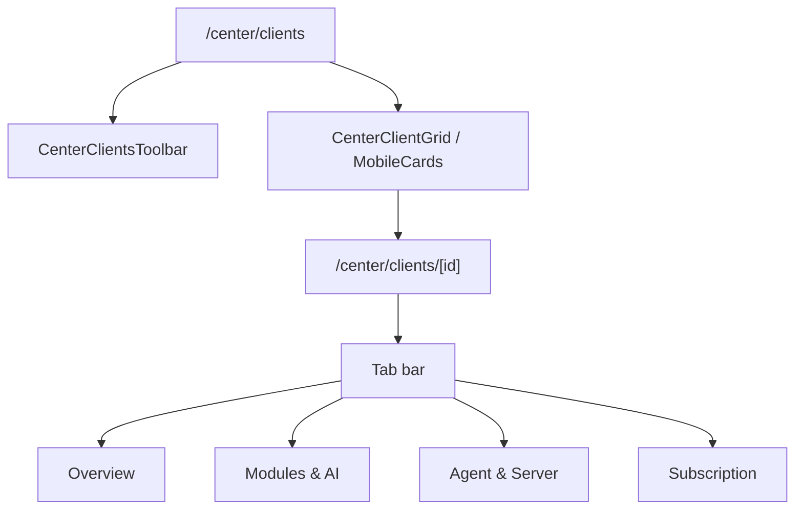

# Control Center UI — Step 03: Clients List & Detail

> **Status:** UI Prototype  
> **Step:** UI 03 of 13  
> **Routes:** `/center/clients`, `/center/clients/[id]`  
> **Parent:** [UI_MASTER_INDEX.md](./UI_MASTER_INDEX.md)  
> **Previous:** [UI 02 — Dashboard](./UI_02_Dashboard.md)  
> **Architecture:** [05 — Client Lifecycle](../05_Client_Lifecycle.md) · [06 — Database](../06_Database_Architecture.md)

---

## Purpose

Design the client fleet registry — searchable list with filters and a tabbed detail workspace for operator management of each AgainERP installation.

## Scope

List + detail UI with mock data. API wiring and write actions are implementation phase.

---

## Architecture



---

## List Page

### Layout stack

1. `CenterPageHeader` — title, count, Add client (disabled)
2. `CenterClientsToolbar` — search + filters
3. Data table (desktop) / cards (mobile)
4. Empty state when no matches

### Filters

| Filter | Options |
|--------|---------|
| Search | businessName, contactEmail, contactName, slug |
| Status tabs | All, Active, Trial, Suspended (with counts) |
| Plan select | All, Starter, Business, Enterprise, Custom |
| Agent select | All, online, degraded, offline |

Helper: `filterCenterClients()` in mock data.

### Table columns

| Column | Source |
|--------|--------|
| Business | name, email, slug |
| Plan | plan + deploymentMode |
| Status | client.status badge |
| Modules | count enabled |
| AI | On/Off |
| Agent | heartbeat status (not "DB") |
| Heartbeat | lastHeartbeat |
| MRR | formatCurrency |
| Actions | View, Agent health, Open admin |

### Row actions menu

- View details
- Agent health → `/center/monitoring?client=`
- Open client admin (external)

**Removed:** Remote DB link — violates architecture boundary.

---

## Detail Page

### URL tabs

`?tab=overview|modules|agent|subscription` — shareable, no full reload.

### Tab: Overview

- 4 stat cards: MRR, modules, subscription end, agent status
- Contact & account fields + operator notes
- Recent activity (filtered from `centerRecentActivity`)
- AI usage bar (if enabled)
- Lifecycle actions (suspend, extend trial — disabled prototype)

### Tab: Modules & AI

- Module entitlement grid with Switch (read-only)
- AI OS toggle + token usage
- Links to fleet AI settings

### Tab: Agent & Server

- Edge Agent: status, heartbeat, versions, instance ID
- Server metadata: host, deployment, client-owned DB host/name
- Architecture note: no direct DB access
- Link to monitoring

### Tab: Subscription

- Plan, status, MRR, period end
- License summary + links to subscriptions/licenses/billing
- Lifecycle actions

---

## Mock Data Extensions

`CenterClient` fields added:

| Field | Example |
|-------|---------|
| `deploymentMode` | saas, hybrid, enterprise |
| `instanceId` | inst_urbanwear_001 |
| `agentVersion` | 1.2.0 |
| `erpVersion` | 2026.6.1 |
| `lastHeartbeat` | 1 min ago |

Helpers:

- `centerAgentStatusLabel` — maps dbStatus → online/degraded/offline
- `filterCenterClients()` — list filtering

---

## Component Files

```text
components/center/clients/
├── center-clients-list.tsx
├── center-clients-toolbar.tsx
├── client-grid.tsx
└── client-detail.tsx

app/center/clients/
├── page.tsx
└── [id]/page.tsx
```

---

## Responsive Behavior

| Viewport | List |
|----------|------|
| `< md` | Mobile cards, stacked filters |
| `≥ md` | Full table |

Detail tabs scroll horizontally on narrow screens (flex-wrap).

---

## Best Practices

- Agent terminology everywhere — never imply Control Center queries client DB
- Filters client-side for prototype; API query params in implementation
- Detail tabs deep-linkable via `?tab=`
- Lifecycle buttons disabled until auth/MFA wired

---

## Security Notes

- Server/DB metadata is infrastructure info only — not business records
- Suspend / reissue license require step-up MFA in production
- External admin link opens client domain in new tab

---

## Future Improvements

| Improvement | Step |
|-------------|------|
| Bulk actions (export, notify) | UI 04+ |
| Client create drawer | UI 04 |
| Real-time agent status pulse | UI 07 |
| Activity tab with full audit | UI 12 |

---

## Summary

UI Step 03 delivers a filterable client fleet list and a four-tab detail workspace aligned with Control Center architecture — agent heartbeat over DB access, metadata-only server fields, and lifecycle/subscription/module management surfaces.

**Next:** [UI 04 — Registrations & Onboarding](./UI_04_Registrations.md) (to be created)

**Implemented in code:** toolbar, filters, enhanced grid, tabbed detail, extended mock client fields.
