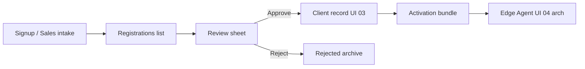

# Control Center UI — Step 04: Registrations & Onboarding

> **Status:** UI Prototype  
> **Step:** UI 04 of 13  
> **Route:** `/center/registrations`  
> **Parent:** [UI_MASTER_INDEX.md](./UI_MASTER_INDEX.md)  
> **Previous:** [UI 03 — Clients](./UI_03_Clients.md)  
> **Architecture:** [05 — Client Lifecycle](../05_Client_Lifecycle.md)

---

## Purpose

Design the registration review queue and onboarding preview — operators approve or reject new business signups before client provisioning and Edge Agent activation.

## Scope

List, filters, review sheet, onboarding pipeline visualization. API and email notifications are implementation phase.

---

## Architecture



---

## List Page

### Layout

1. `CenterPageHeader` + Manual registration (disabled)
2. Pending alert banner (count)
3. `CenterRegistrationsToolbar` — search + status tabs
4. Table (desktop) / cards (mobile)
5. Empty state

### Filters

| Filter | Values |
|--------|--------|
| Search | business, contact, industry |
| Status tabs | All, Pending, Approved, Rejected |

### Table columns

Business · Contact · Industry · Plan · Deployment · Modules · AI · Status · Actions

---

## Review Sheet

Right-side `Sheet` opened from **Review** / row click.

### Sections

| Section | Content |
|---------|---------|
| Onboarding pipeline | 5-step visual (active step highlighted) |
| Business details | Contact, deployment, region, website, source |
| Requested plan | Price, users, AI request |
| Modules | Badge list |
| Intake / rejection notes | When present |
| Operator notes | Textarea (pending only) |

### Actions (pending)

- **Approve & provision** — prototype updates local state → `approved`
- **Reject** — requires reason → `rejected`

Post-approve pipeline step advances to **Client record created** (step 3).

---

## Onboarding Pipeline Steps

1. Registration submitted  
2. Operator review ← pending registrations  
3. Client record created ← approved  
4. Activation bundle issued  
5. Edge Agent activated (heartbeat)

Component: `CenterOnboardingSteps`

---

## Mock Data

Extended `CenterRegistration`:

| Field | Purpose |
|-------|---------|
| `deploymentMode` | saas / hybrid / enterprise |
| `region` | Data residency hint |
| `website`, `employeeCount`, `referralSource` | Intake context |
| `operatorNotes` | Sales handoff |
| `reviewedAt`, `reviewedBy` | Audit preview |
| `rejectionReason` | Rejected registrations |

Sample records: 2 pending, 1 approved, 1 rejected.

Helpers: `filterCenterRegistrations`, `getCenterRegistration`, `getCenterPendingRegistrationCount`, `centerRegistrationStatusColors`.

---

## Component Files

```text
components/center/registrations/
├── center-registrations-list.tsx
├── center-registrations-toolbar.tsx
├── center-registrations-grid.tsx
├── center-registration-review-sheet.tsx
└── center-onboarding-steps.tsx

app/center/registrations/page.tsx
```

---

## Sidebar Badge

Pending count on **Registrations** nav item from `getCenterPendingRegistrationCount()` (static mock on load).

---

## Best Practices

- Approve creates client in API phase — prototype only toggles status  
- Rejection requires reason (audit requirement)  
- No database provisioning language — activation bundle + agent only  
- Architecture: metadata registry, not client DB setup  

---

## Security Notes

- Approve/reject will require MFA in production  
- PII limited to contact fields needed for onboarding  
- Rejection reasons stored in audit log (UI Step 12)  

---

## Future Improvements

| Improvement | Step |
|-------------|------|
| Email templates on approve/reject | Implementation |
| Link approved reg → new client detail | UI 03 API |
| Partner-scoped registration queue | Phase 2 |
| Manual registration form | This step API |

---

## Summary

UI Step 04 delivers a filterable registration queue with a full review sheet, approve/reject prototype actions, and a five-step onboarding pipeline aligned with Client Lifecycle architecture.

**Next:** [UI 05 — Subscriptions & Licenses](./UI_05_Subscriptions.md)

**Implemented in code:** registrations components, extended mock data, dynamic sidebar badge.
