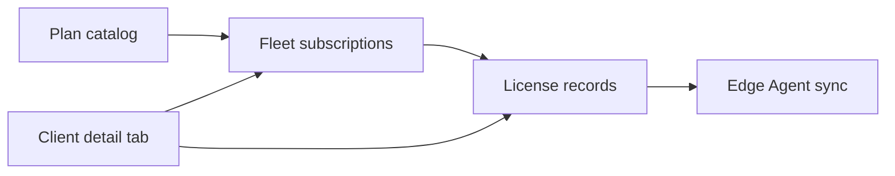

# Control Center UI — Step 05: Subscriptions & Licenses

> **Status:** UI Prototype  
> **Step:** UI 05 of 13  
> **Routes:** `/center/subscriptions`, `/center/licenses`  
> **Parent:** [UI_MASTER_INDEX.md](./UI_MASTER_INDEX.md)  
> **Previous:** [UI 04 — Registrations](./UI_04_Registrations.md)  
> **Architecture:** [09 — Subscription & License](../09_Subscription_License.md)

---

## Purpose

Design commercial operator views for subscription plans, fleet billing state, and signed license lifecycle — metadata only; license keys are masked and JWS payloads are conceptual previews.

## Scope

Plan catalog, fleet subscription table, license grid with detail sheet. Reissue/revoke actions disabled until API phase.

---

## Architecture



Plans define entitlements (modules, seats, AI credits, grace). Subscriptions track billing period per client. Licenses are signed artifacts synced to the Edge Agent.

---

## Subscriptions Page (`/center/subscriptions`)

### Layout

1. `CenterPageHeader` + link to License center  
2. Tab bar: **Plan catalog** | **Fleet subscriptions**  
3. Tab content

### Plan catalog

Card grid (`CenterPlanCatalog`) — one card per `centerPlans` entry:

| Element | Content |
|---------|---------|
| Price | Monthly or Custom |
| Seats | `maxUsers` |
| Grace | `graceDays` |
| AI | Agents + credits when included |
| Modules | Badge list from `includedModules` |

### Fleet subscriptions

Table (`CenterFleetSubscriptionsTable`):

Client · Plan · Status · Cycle · Period end · Seats · MRR · Auto-renew

Rows link to `/center/clients/[id]?tab=subscription`.

---

## Licenses Page (`/center/licenses`)

### Layout

1. `CenterPageHeader`  
2. Grace-period alert banner (when applicable)  
3. `CenterLicensesToolbar` — search + status filter  
4. Table (desktop) / cards (mobile)  
5. `CenterLicenseDetailSheet` on View

### License grid columns

Client · License key (masked) · Plan · Status · Expires · Grace · Agent sync · Actions

### Detail sheet sections

| Section | Content |
|---------|---------|
| Header | Masked key, status, plan badges |
| Client binding | Business, instance ID, modules count, AI entitlement |
| Validity | Issued, expires, days remaining, grace, last agent sync |
| JWS payload | Conceptual JSON preview — full key never stored |
| Actions | Reissue, Revoke (disabled prototype) |

---

## Mock Data

Extended types:

| Type | Key fields |
|------|------------|
| `CenterSubscriptionPlan` | `aiCreditsMonthly`, `graceDays`, `includedModules` |
| `CenterClientSubscription` | `billingCycle`, `periodEnd`, `seatsUsed/Limit`, `mrr`, `autoRenew` |
| `CenterLicense` | `licenseKeyMasked`, `graceDays`, `graceEndsAt`, `modulesCount`, `lastSyncedAt`, `revokeReason` |

Sample records: 4 plans, 5 fleet subscriptions, 5 licenses (including one in grace).

Helpers: `filterCenterLicenses`, `filterCenterSubscriptions`, `getCenterLicense`, `getCenterLicenseByClient`, `centerLicenseStatusColors`, `centerSubscriptionStatusColors`.

---

## Component Files

```text
components/center/subscriptions/
├── center-subscriptions-page.tsx
├── center-subscriptions-view.tsx
├── center-plan-catalog.tsx
└── center-fleet-subscriptions-table.tsx

components/center/licenses/
├── center-licenses-page.tsx
├── center-licenses-list.tsx
├── center-licenses-toolbar.tsx
├── center-licenses-grid.tsx
└── center-license-detail-sheet.tsx

app/center/subscriptions/page.tsx
app/center/licenses/page.tsx
```

---

## Best Practices

- Never display full license keys — masked + hash reference only  
- Grace period surfaced prominently (banner + sheet)  
- Cross-links: subscriptions ↔ licenses ↔ client subscription tab  
- MRR and billing fields are Control Center metadata, not client ERP data  

---

## Security Notes

- Reissue/revoke will require MFA + audit log entry (UI Step 12)  
- JWS preview is read-only conceptual — signing happens in License Service  

---

## Future Improvements

| Improvement | Step |
|-------------|------|
| Plan editor (create/edit tiers) | Implementation |
| Subscription upgrade/downgrade flow | API + client tab |
| License reissue with agent push status | Agent integration |
| Billing integration | UI 11 |

---

## Summary

UI Step 05 delivers a plan catalog, fleet subscription table, and filterable license center with detail sheet — aligned with Subscription & License architecture and client detail subscription tab.

**Next:** [UI 06 — Module Management](./UI_06_Module_Management.md)

**Implemented in code:** subscriptions + licenses components, extended mock data, nav updated (Licenses no longer placeholder).
