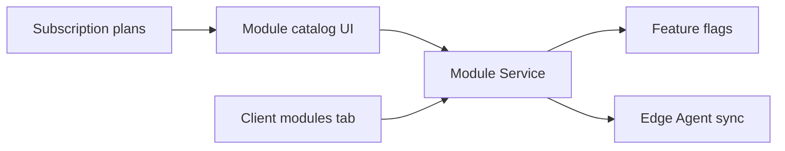

# Control Center UI — Step 06: Module Management

> **Status:** UI Prototype  
> **Step:** UI 06 of 13  
> **Route:** `/center/modules`  
> **Parent:** [UI_MASTER_INDEX.md](./UI_MASTER_INDEX.md)  
> **Previous:** [UI 05 — Subscriptions & Licenses](./UI_05_Subscriptions.md)  
> **Architecture:** [08 — Module Management](../08_Module_Management.md)

---

## Purpose

Design the platform module catalog — definitions, dependency graph, plan inclusion, and fleet usage counts. Per-client toggles remain on client detail; this screen is the operator registry view.

## Scope

Tier stats, filterable catalog, module detail sheet with dependencies and plan mapping. Fleet push and platform-default edits disabled until API phase.

---

## Architecture



Control Center stores module metadata and entitlements — not module packages or client business data.

---

## Page Layout

1. `CenterPageHeader` — count + dependency summary  
2. `CenterModuleTierStats` — core / growth / premium counts  
3. `CenterModulesToolbar` — search, tier, platform-default filters  
4. Table (desktop) / cards (mobile)  
5. `CenterModuleDetailSheet` on View

---

## Catalog Table

| Column | Content |
|--------|---------|
| Module | Label + description |
| Tier | core / growth / premium |
| Dependencies | Prerequisite module badges |
| Clients | Enabled count / fleet total |
| Min ERP | Compatibility floor |
| Platform default | Switch (read-only) |
| Actions | View → detail sheet |

---

## Detail Sheet

| Section | Content |
|---------|---------|
| Header | Label, description, tier, feature flag key |
| Fleet usage | Client count, min ERP, platform default, sample client links |
| Dependencies | Requires + Required by (reverse deps) |
| Subscription plans | Plans including module + link to catalog |
| Architecture note | Module Service → Edge Agent — no code on control plane |
| Actions | Platform default switch, Push to fleet (disabled) |

---

## Mock Data Extensions

`CenterModuleDefinition` fields added:

| Field | Purpose |
|-------|---------|
| `dependencies` | Prerequisite module IDs |
| `minErpVersion` | Compatibility check preview |
| `platformDefault` | On for new clients |
| `featureFlagKey` | Feature Flag Service key |

Helpers: `filterCenterModules`, `getCenterModule`, `getCenterModuleDependents`, `getCenterModuleClientCount`, `getCenterPlansIncludingModule`.

---

## Component Files

```text
components/center/modules/
├── center-modules-page.tsx
├── center-modules-list.tsx
├── center-modules-toolbar.tsx
├── center-modules-grid.tsx
├── center-module-detail-sheet.tsx
└── center-module-tier-stats.tsx

app/center/modules/page.tsx
```

---

## Best Practices

- Dependency resolution surfaced before enable (matches Module Service rules)  
- Cross-links to client modules tab and subscription plan catalog  
- Platform default is registry metadata — not a live fleet toggle in prototype  
- Terminology: entitlements and sync, not direct client DB or module install paths  

---

## Future Improvements

| Improvement | Step |
|-------------|------|
| Dependency graph visualization | Phase 2 |
| Version compatibility matrix | Updates UI 08 |
| Per-client enable from catalog | Client tab API |
| Marketplace module packages | Roadmap Phase 3 |

---

## Summary

UI Step 06 delivers a filterable ERP module catalog with dependency awareness, fleet usage counts, plan mapping, and a detail sheet aligned with Module Management architecture.

**Next:** [UI 07 — Monitoring & Health](./UI_07_Monitoring.md)

**Implemented in code:** modules components, extended `centerModules` mock data, refactored `/center/modules` page.
