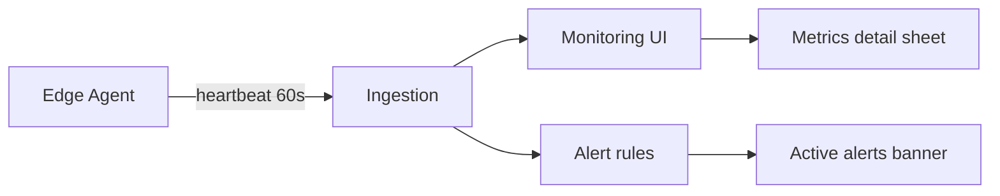

# Control Center UI — Step 07: Monitoring & Health

> **Status:** UI Prototype  
> **Step:** UI 07 of 13  
> **Route:** `/center/monitoring`  
> **Parent:** [UI_MASTER_INDEX.md](./UI_MASTER_INDEX.md)  
> **Previous:** [UI 06 — Module Management](./UI_06_Module_Management.md)  
> **Architecture:** [10 — Monitoring & Health](../10_Monitoring.md)

---

## Purpose

Design the fleet monitoring dashboard — Edge Agent heartbeat telemetry, infrastructure metrics, and operational alerts. Replaces the legacy “Remote DB” concept with agent-first health (Control Center never queries client PostgreSQL directly).

## Scope

Stats row, active alerts, filterable fleet grid, metrics detail sheet. Real-time WebSocket feeds and diagnostics upload are implementation phase.

---

## Architecture



All metrics are **agent-reported**. DB reachability is a boolean/latency field in the heartbeat payload — not a Control Plane query.

---

## Page Layout

1. `CenterPageHeader` — fleet count + online summary  
2. `CenterMonitoringStats` — online / degraded / offline / avg API p95  
3. `CenterMonitoringAlerts` — unacknowledged rule breaches  
4. `CenterMonitoringToolbar` — search, agent status, deployment mode  
5. Table (desktop) / cards (mobile)  
6. `CenterMonitoringDetailSheet` on Metrics

Deep link: `/center/monitoring?client=cl-005` opens detail sheet for that client.

---

## Fleet Grid

| Column | Source |
|--------|--------|
| Client | `businessName`, `instanceId` |
| Agent | `agentStatus` → online / degraded / offline |
| Last heartbeat | Agent-reported timestamp |
| CPU / RAM / Disk | Percent bars with warn thresholds |
| API p95 | `apiLatencyP95Ms` |
| Docker | `dockerHealthy / dockerTotal` |

---

## Detail Sheet

| Section | Content |
|---------|---------|
| Agent identity | Host, heartbeat, agent + ERP versions |
| Infrastructure | CPU, RAM, disk, API p95 (progress bars) |
| Services | Docker, DB reachable, DB latency, Redis, queue backlog |
| Architecture note | Heartbeat-only — no direct DB access |
| Actions | Request diagnostics (disabled prototype) |

---

## Mock Data

Replaced legacy `CenterDbSnapshot` (business sample metrics) with:

| Type | Purpose |
|------|---------|
| `CenterAgentHeartbeat` | Per-client agent telemetry |
| `centerAgentHeartbeats[]` | Built from `centerClients` |
| `CenterMonitoringAlert` | Rule-based alert queue |
| `centerMonitoringAlerts[]` | 4 sample alerts |

Helpers: `getCenterMonitoringStats`, `filterCenterAgentHeartbeats`, `getCenterAgentHeartbeat`, `centerMonitoringAlertColors`.

---

## Component Files

```text
components/center/monitoring/
├── center-monitoring-page.tsx
├── center-monitoring-stats.tsx
├── center-monitoring-alerts.tsx
├── center-monitoring-list.tsx
├── center-monitoring-toolbar.tsx
├── center-monitoring-grid.tsx
└── center-monitoring-detail-sheet.tsx

app/center/monitoring/page.tsx
```

---

## Cross-links

| From | To |
|------|-----|
| Dashboard KPI “Agents online” | `/center/monitoring` |
| Dashboard fleet health cards | `/center/monitoring?client=` |
| Dashboard alert (BuildPro) | `/center/monitoring?client=cl-005` |
| Grid client name | Client detail agent tab |
| Detail sheet | Client detail agent tab |
| Remote commands | `/center/agents` command queue |
| Activation onboarding | `/center/agents` activation bundles |

---

## Best Practices

- Label agent status — never “DB connected” in operator copy  
- Business metrics (orders, products) must not appear on monitoring screens  
- Alerts use rule IDs (`agent.offline`, `queue.backlog`, etc.) matching architecture doc  
- Acknowledge / diagnostics actions disabled in prototype  

---

## Future Improvements

| Improvement | Step |
|-------------|------|
| Live heartbeat WebSocket | Implementation |
| Time-series charts (24h CPU/RAM) | ✅ [UI 17](./UI_17_Monitoring_Charts.md) |
| Maintenance window suppression | Settings UI 13 |
| Diagnostics bundle upload status | ✅ [UI 16](./UI_16_Offline_Sync_Diagnostics.md) |

---

## Summary

UI Step 07 delivers agent-first fleet monitoring at `/center/monitoring` — stats, alerts, filterable telemetry grid, and metrics detail sheet aligned with Monitoring architecture. Legacy Remote DB snapshots removed from mock data.

**Next:** [UI 08 — Update Manager](./UI_08_Updates.md)

**Implemented in code:** monitoring components, `centerAgentHeartbeats` mock data, dashboard fleet links updated.
