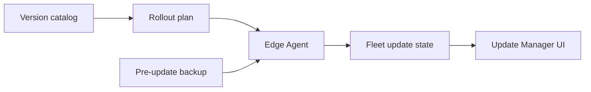

# Control Center UI — Step 08: Update Manager

> **Status:** UI Prototype  
> **Step:** UI 08 of 13  
> **Route:** `/center/updates`  
> **Parent:** [UI_MASTER_INDEX.md](./UI_MASTER_INDEX.md)  
> **Previous:** [UI 07 — Monitoring & Health](./UI_07_Monitoring.md)  
> **Architecture:** [12 — Update Management](../12_Update_Manager.md)

---

## Purpose

Design the operator console for ERP version rollouts — version catalog, staged fleet rollouts, and per-client update state. Updates execute on the client host via Edge Agent (pull images, migrations, smoke tests).

## Scope

Stats, active rollout banners, tabbed fleet/version views, client update detail sheet. Push/rollback/pause actions disabled until API phase.

---

## Architecture



Rollout stages: Canary → Early (5%) → Tier1 (25%) → Tier2 (50%) → GA.

---

## Page Layout

1. `CenterPageHeader` + New rollout (disabled)  
2. `CenterUpdateStats` — latest stable, up to date, pending, failed  
3. `CenterActiveRolloutsBanner` — progress bars for active rollouts  
4. Tab bar: **Fleet updates** | **Version catalog**  
5. Tab content + detail sheet

---

## Fleet Updates Tab

### Toolbar filters

| Filter | Values |
|--------|--------|
| Search | client name, version |
| Status | up_to_date, available, scheduled, applying, validating, failed, rolling_back |
| Channel | stable, beta, lts, hotfix |

### Table columns

Client · Current · Target · Channel · Status · Auto · Schedule · Actions

Failed-update alert banner when any client has `failed` status.

### Detail sheet

| Section | Content |
|---------|---------|
| Versions | Current, target, schedule, last attempt |
| Policy | Auto-update toggle, linked rollout |
| Error | Last failure message when present |
| Actions | Push now, Schedule, Rollback (disabled) |

---

## Version Catalog Tab

Card grid (`CenterVersionCatalog`) per `centerErpVersions` entry:

Version · Channel · Type · Rollout stage · Released · Min agent · Summary

---

## Mock Data

| Type | Purpose |
|------|---------|
| `CenterErpVersion` | Platform version registry |
| `CenterUpdateRollout` | Active rollout campaigns |
| `CenterClientUpdate` | Per-client update state |

Sample: 5 versions, 2 active rollouts (stable patch + hotfix), 5 client records aligned with `erpVersion` on clients.

Helpers: `getCenterUpdateStats`, `filterCenterClientUpdates`, `getCenterClientUpdate`, `centerClientUpdateStatusColors`, `centerRolloutStageLabels`, `centerUpdateChannelColors`.

---

## Component Files

```text
components/center/updates/
├── center-updates-page.tsx
├── center-update-stats.tsx
├── center-active-rollouts-banner.tsx
├── center-updates-view.tsx
├── center-version-catalog.tsx
├── center-fleet-updates-list.tsx
├── center-fleet-updates-toolbar.tsx
├── center-fleet-updates-grid.tsx
└── center-client-update-sheet.tsx

app/center/updates/page.tsx
```

---

## Best Practices

- Updates never run from Control Center directly — agent orchestration only  
- Pre-update backup referenced for major upgrades (architecture doc)  
- Hotfix channel surfaced separately with accelerated rollout  
- Cross-link to client agent tab for version context  

---

## Future Improvements

| Improvement | Step |
|-------------|------|
| Rollout wizard (cohort selection) | Implementation |
| Live apply/validate progress stream | Agent WebSocket |
| Module compatibility matrix gate | Modules UI 06 API |
| Rollback history | Audit UI 12 |

---

## Summary

UI Step 08 delivers version catalog, active rollout banners, filterable fleet update grid, and client update detail sheet — aligned with Update Management architecture.

**Next:** [UI 09 — Backup Status](./UI_09_Backups.md)

**Implemented in code:** updates components, mock rollout/version data, nav updated.
