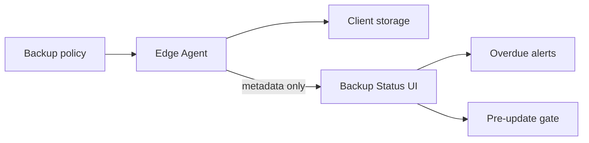

# Control Center UI — Step 09: Backup Status

> **Status:** UI Prototype  
> **Step:** UI 09 of 13  
> **Route:** `/center/backups`  
> **Parent:** [UI_MASTER_INDEX.md](./UI_MASTER_INDEX.md)  
> **Previous:** [UI 08 — Update Manager](./UI_08_Updates.md)  
> **Architecture:** [11 — Backup & Disaster Recovery](../11_Backup.md)

---

## Purpose

Design the operator view for fleet backup health — policy metadata, verification status, retention, and run history. Backup **files** stay on client infrastructure; Control Center stores checksums and status only.

## Scope

Stats row, overdue alert, tabbed fleet/recent views, client backup detail sheet. Trigger backup, verify, and restore actions disabled until API phase.

---

## Architecture



Critical rule: no backup payloads in Control Center storage.

---

## Page Layout

1. `CenterPageHeader` — fleet count + metadata-only note  
2. `CenterBackupStats` — verified, overdue/failed, awaiting verify, fleet metadata size  
3. Tab bar: **Fleet status** | **Recent runs**  
4. Tab content + detail sheet

---

## Fleet Status Tab

### Toolbar filters

| Filter | Values |
|--------|--------|
| Search | client name |
| Status | verified, completed, overdue, failed, running |
| Storage | local, client_s3, platform_assisted |

### Table columns

Client · Plan · Last backup · Type · Status · Size · Storage · Retention · Actions

Overdue/failed alert banner when applicable.

### Detail sheet

| Section | Content |
|---------|---------|
| Policy | Schedule, retention, storage, next run, checksum |
| Verification | Auto-verify toggle (read-only) |
| Recent runs | Metadata table for client |
| Actions | Trigger backup, Run verify, Initiate restore (disabled) |

---

## Recent Runs Tab

Table (`CenterBackupRunsTable`) of all `centerBackupRecords`:

Client · Type · Started · Status · Size · Storage · Checksum (masked)

---

## Mock Data

| Type | Purpose |
|------|---------|
| `CenterClientBackupStatus` | Per-client policy + last backup summary |
| `CenterBackupRecord` | Individual run metadata |
| `centerClientBackupStatuses[]` | 5 fleet records |
| `centerBackupRecords[]` | 7 recent runs |

Sample scenarios: FreshMart overdue (disk space), StyleHub failed (agent offline), BuildPro completed awaiting verify.

Helpers: `getCenterBackupStats`, `filterCenterClientBackupStatuses`, `getCenterClientBackupStatus`, `getCenterBackupRecordsForClient`, `centerBackupStatusColors`, `centerBackupStorageLabels`, `formatBackupSizeMb`.

---

## Component Files

```text
components/center/backups/
├── center-backups-page.tsx
├── center-backup-stats.tsx
├── center-backups-view.tsx
├── center-backups-list.tsx
├── center-backups-toolbar.tsx
├── center-backups-grid.tsx
├── center-backup-detail-sheet.tsx
└── center-backup-runs-table.tsx

app/center/backups/page.tsx
```

---

## Best Practices

- Never imply Control Center downloads or stores backup files  
- Checksums masked — full hash not required in UI  
- Link overdue backups to update pre-flight failures (StyleHub update failed)  
- Retention and schedule aligned with subscription plan tiers  

---

## Future Improvements

| Improvement | Step |
|-------------|------|
| Restore wizard (disaster rebuild) | Implementation |
| Verification restore-test results | Monitoring UI 07 |
| Policy editor per client | Client detail API |
| Platform-assisted storage quota | Enterprise billing |

---

## Summary

UI Step 09 delivers fleet backup status with policy metadata, verification states, recent run history, and detail sheet — aligned with Backup & DR architecture (metadata only).

**Next:** [UI 10 — AI Access & Usage](./UI_10_AI_Access.md)

**Implemented in code:** backups components, mock backup data, nav updated.
