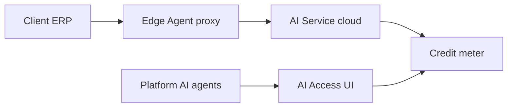

# Control Center UI — Step 10: AI Access & Usage

> **Status:** UI Prototype  
> **Step:** UI 10 of 13  
> **Route:** `/center/ai-access`  
> **Parent:** [UI_MASTER_INDEX.md](./UI_MASTER_INDEX.md)  
> **Previous:** [UI 09 — Backup Status](./UI_09_Backups.md)  
> **Architecture:** [14 — AI Management Center](../14_AI_Control.md)

---

## Purpose

Design fleet AI OS provisioning — which clients get AI agents, credit limits, tool entitlements, and platform operator AI recommendations. Client ERP accesses AI via Edge Agent cloud proxy; models never deploy to client servers.

## Scope

Stats, AI recommendation cards, fleet provisioning grid, platform AI agent registry, client detail sheet. Enable/disable and limit adjustments disabled until API phase.

---

## Architecture



Control Center AI operates on metadata only — not client business DB contents.

---

## Page Layout

1. `CenterPageHeader` — fleet count + cloud proxy note  
2. `CenterAiStats` — enabled, agents, credit usage, recommendations  
3. Tab bar: **Fleet provisioning** | **Platform AI agents**  
4. Fleet tab: recommendations → toolbar → grid → detail sheet

Deep link: `/center/ai-access?client=cl-001`

---

## Fleet Provisioning Tab

### AI recommendations

Cards from platform agents (Recommendation, License, Health, Update) with Dismiss (disabled) and View client.

### Toolbar filters

| Filter | Values |
|--------|--------|
| Search | client name |
| AI enabled | all / yes / no |
| Credit status | ok, warning, exceeded, none |

### Grid columns

Client · Plan · AI access · Agents · Credits · Usage bar · Proxy mode · Actions

### Detail sheet

| Section | Content |
|---------|---------|
| Entitlements | Enable toggle, agents, credits, last request, proxy mode |
| Tools | Enabled tool badges |
| Actions | Adjust limits, Enable/Disable (disabled) |

---

## Platform AI Agents Tab

Card grid (`CenterPlatformAiAgents`) — Chief, Health, Recommendation, Update, License, Monitoring, Automation AI with autonomy labels.

---

## Mock Data

| Type | Purpose |
|------|---------|
| `CenterClientAiAccess` | Per-client AI provisioning + usage |
| `CenterAiRecommendation` | Platform AI suggestion cards |
| `centerPlatformAiAgents[]` | Operator AI agent registry |

Sample: UrbanWear 93% credits (warning), BuildPro enterprise without AI (recommendation), FreshMart trial pending.

Helpers: `getCenterAiStats`, `filterCenterClientAiAccess`, `getCenterClientAiAccess`, `formatAiCredits`, `getAiCreditPercent`, status color maps.

---

## Component Files

```text
components/center/ai-access/
├── center-ai-access-page.tsx
├── center-ai-stats.tsx
├── center-ai-access-view.tsx
├── center-ai-access-list.tsx
├── center-ai-recommendations.tsx
├── center-ai-access-toolbar.tsx
├── center-ai-access-grid.tsx
├── center-ai-access-detail-sheet.tsx
└── center-platform-ai-agents.tsx

app/center/ai-access/page.tsx
```

---

## Best Practices

- Credit metering aligned with subscription plan `aiCreditsMonthly`  
- Proxy mode `queued` when agent offline — matches Edge Agent queue architecture  
- Platform AI recommendations are actionable cards — not autonomous execution  
- Cross-link to client modules & AI tab  

---

## Future Improvements

| Improvement | Step |
|-------------|------|
| Credit boost / overage billing | Billing UI 11 |
| Per-tool entitlement editor | Client detail API |
| AI audit log viewer | Audit UI 12 |
| Natural language fleet queries | Phase 2 |

---

## Summary

UI Step 10 delivers AI OS fleet provisioning with credit usage, platform AI recommendations, operator agent registry, and detail sheet — aligned with AI Management Center architecture.

**Next:** [UI 11 — Billing & Invoices](./UI_11_Billing.md)

**Implemented in code:** ai-access components, extended mock data, refactored `/center/ai-access` page.
