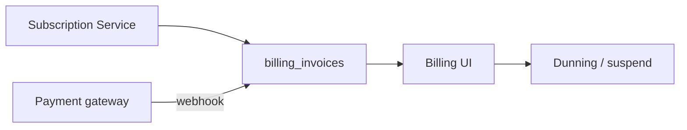

# Control Center UI — Step 11: Billing & Invoices

> **Status:** UI Prototype  
> **Step:** UI 11 of 13  
> **Route:** `/center/billing`  
> **Parent:** [UI_MASTER_INDEX.md](./UI_MASTER_INDEX.md)  
> **Previous:** [UI 10 — AI Access & Usage](./UI_10_AI_Access.md)  
> **Architecture:** [09 — Subscription & License](../09_Subscription_License.md) · [06 — Database](../06_Database_Architecture.md)

---

## Purpose

Design the operator billing console — fleet MRR, invoice metadata, payment status, and past-due dunning visibility. Payments via tokenized gateway; Control Center stores invoice records and external refs only (no card data).

## Scope

Stats row, invoice grid with detail sheet, fleet MRR tab. Record payment, send reminder, void actions disabled until API phase.

---

## Architecture



MRR on dashboard KPI links here — platform billing metadata, not client ERP revenue.

---

## Page Layout

1. `CenterPageHeader` + link to Subscriptions  
2. `CenterBillingStats` — fleet MRR, open invoices, past due, collected this month  
3. Tab bar: **Invoices** | **Fleet MRR**  
4. Invoice tab: past-due banner → toolbar → grid → detail sheet

Deep link: `/center/billing?invoice=inv-002`

---

## Invoices Tab

### Toolbar filters

| Filter | Values |
|--------|--------|
| Search | client, invoice number, gateway ref |
| Status | open, past_due, paid, draft, uncollectible, void |

### Grid columns

Invoice · Client · Period · Status · Due · Amount · Actions

### Detail sheet

| Section | Content |
|---------|---------|
| Header | Invoice number, status, currency |
| Metadata | Amount, period, issued/due/paid, gateway ref |
| Line items | Subscription + usage line breakdown |
| Actions | Record payment, Send reminder, Void (disabled) |

---

## Fleet MRR Tab

Table (`CenterBillingFleetTable`) from `centerClientSubscriptions` — plan, status, cycle, MRR, auto-renew with link to subscriptions page.

---

## Mock Data

| Type | Purpose |
|------|---------|
| `CenterBillingInvoice` | Invoice metadata + line items |
| `centerBillingInvoices[]` | 8 sample invoices |

Scenarios: StyleHub past_due (matches suspended client), FreshMart draft trial invoice, TechZone open + AI overage line item.

Helpers: `getCenterBillingStats`, `filterCenterBillingInvoices`, `getCenterBillingInvoice`, `getCenterInvoicesForClient`, `centerInvoiceStatusColors`.

---

## Component Files

```text
components/center/billing/
├── center-billing-page.tsx
├── center-billing-stats.tsx
├── center-billing-view.tsx
├── center-billing-invoices-list.tsx
├── center-billing-invoices-toolbar.tsx
├── center-billing-invoices-grid.tsx
├── center-billing-invoice-sheet.tsx
└── center-billing-fleet-table.tsx

app/center/billing/page.tsx
```

---

## Cross-links

| From | To |
|------|-----|
| Dashboard MRR KPI | `/center/billing` |
| Invoice client name | Client subscription tab |
| Fleet MRR tab | `/center/subscriptions` |
| StyleHub past due | Client suspended + license UI |

---

## Best Practices

- PCI: no card numbers — gateway refs only  
- `past_due` surfaced for dunning workflow alignment  
- MRR is recurring metadata — distinct from one-time invoice totals  
- Line items can include AI overage (Phase 2 usage billing)  

---

## Future Improvements

| Improvement | Step |
|-------------|------|
| Stripe webhook live status | Implementation |
| Dunning email templates | Settings UI 13 |
| Usage-based AI invoice lines | AI Access UI 10 API |
| Export for accounting | Phase 2 |

---

## Summary

UI Step 11 delivers billing stats, filterable invoice list with detail sheet, and fleet MRR overview — aligned with Subscription & License and `billing_invoices` schema.

**Next:** [UI 12 — Audit Log](./UI_12_Audit.md)

**Implemented in code:** billing components, mock invoice data, nav updated.
