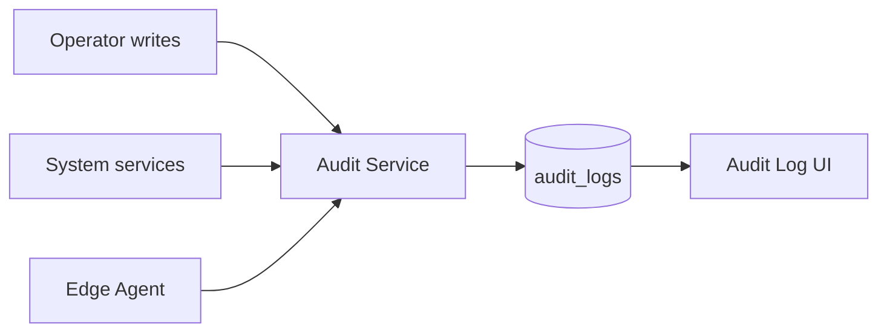

# Control Center UI — Step 12: Audit Log

> **Status:** UI Prototype  
> **Step:** UI 12 of 13  
> **Route:** `/center/audit`  
> **Parent:** [UI_MASTER_INDEX.md](./UI_MASTER_INDEX.md)  
> **Previous:** [UI 11 — Billing & Invoices](./UI_11_Billing.md)  
> **Architecture:** [06 — Database Architecture](../06_Database_Architecture.md) · [13 — Security](../13_Security.md)

---

## Purpose

Design the immutable audit log viewer — operator, system, and Edge Agent actions with correlation IDs, state diffs, and forensic detail. Append-only; no delete in application role.

## Scope

Stats row, immutable notice, filterable log grid, entry detail sheet with before/after JSON. Export and hash-chain verification are Phase 2.

---

## Architecture



Every authenticated request and write operation emits an audit record with `correlation_id`.

---

## Page Layout

1. `CenterPageHeader` — entry count + retention note  
2. `CenterAuditStats` — total, operator, system, agent (+ security count)  
3. Immutable banner — append-only, `audit.read` permission  
4. `CenterAuditToolbar` — search, actor type, resource type  
5. Table (desktop) / cards (mobile)  
6. `CenterAuditDetailSheet` on Detail

Deep link: `/center/audit?entry=aud-002`

---

## Grid columns

Time · Actor (type badge) · Action · Resource · Client · Correlation · Actions

---

## Detail sheet

| Section | Content |
|---------|---------|
| Header | Action, timestamp, actor/resource badges |
| Actor & target | Actor label, IDs, correlation, IP, client link |
| State change | Before / after JSON when present |
| Footer note | Retention and immutability |

---

## Mock Data

`CenterAuditLogEntry` aligned with `audit_logs` schema:

| Field | Example |
|-------|---------|
| `actorType` | operator, system, agent |
| `action` | `registration.approve`, `client.suspend`, `heartbeat.received` |
| `resourceType` | client, billing, license, security, … |
| `beforeState` / `afterState` | JSON diff preview |
| `correlationId` | Request trace UUID |

12 sample entries covering registration, suspension, AI limits, rollout, license sync, login.

Helpers: `getCenterAuditStats`, `filterCenterAuditLogs`, `getCenterAuditLog`, `formatAuditTimestamp`, color/label maps.

---

## Component Files

```text
components/center/audit/
├── center-audit-page.tsx
├── center-audit-stats.tsx
├── center-audit-list.tsx
├── center-audit-toolbar.tsx
├── center-audit-grid.tsx
└── center-audit-detail-sheet.tsx

app/center/audit/page.tsx
```

---

## Best Practices

- Dashboard activity feed is a subset — full audit log is authoritative  
- Agent and system actors distinguished from operators  
- State diffs for write operations; heartbeat events may omit before state  
- Cross-links to affected client records  

---

## Future Improvements

| Improvement | Step |
|-------------|------|
| Cursor pagination (high volume) | Implementation |
| Export CSV / SIEM webhook | Phase 2 |
| Hash-chained tamper evidence | Security Phase 2 |
| Client-scoped audit tab | Client detail API |

---

## Summary

UI Step 12 delivers a filterable immutable audit log with forensic detail sheet — aligned with `audit_logs` table and Security architecture.

**Next:** [UI 13 — Settings & Operators](./UI_13_Settings.md)

**Implemented in code:** audit components, `centerAuditLogs` mock data, nav updated.
