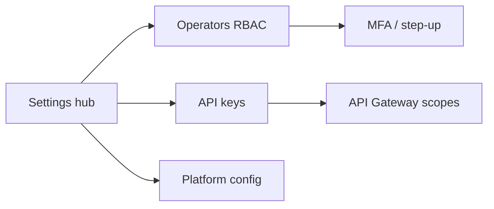

# Control Center UI — Step 13: Settings & Operators

> **Status:** UI Prototype  
> **Step:** UI 13 of 13  
> **Routes:** `/center/settings`, `/center/settings/operators`, `/center/settings/api-keys`  
> **Parent:** [UI_MASTER_INDEX.md](./UI_MASTER_INDEX.md)  
> **Previous:** [UI 12 — Audit Log](./UI_12_Audit.md)  
> **Architecture:** [13 — Security Architecture](../13_Security.md) · [06 — Database](../06_Database_Architecture.md)

---

## Purpose

Design platform settings hub — operator RBAC accounts, scoped API keys, and global configuration preview. Completes the 13-step Control Center UI prototype.

## Scope

Settings hub, operators list with detail sheet, API keys list with detail sheet. Invite/create/revoke actions disabled until API phase.

---

## Architecture



Role hierarchy: super_admin → platform_admin → support_agent / billing_admin / read_only / partner_admin.

---

## Settings Hub (`/center/settings`)

1. `CenterPageHeader`  
2. `CenterSettingsStats` — operators, API keys, MFA policy  
3. Platform configuration read-only panel (`centerPlatformSettings`)  
4. Navigation cards → Operators, API Keys  

---

## Operators (`/center/settings/operators`)

### Grid columns

Operator · Role · Status · MFA · Last login · Actions

### Detail sheet

Access metadata, MFA method, step-up note for high-risk roles, change role / disable (disabled).

Sample roles across hierarchy including invited read-only and partner_admin.

---

## API Keys (`/center/settings/api-keys`)

### Grid columns

Name · Key prefix · Owner · Scopes · Status · Last used · Actions

### Detail sheet

Metadata, scope badges, rotate/revoke (disabled). Full secret never stored — hash + prefix only.

---

## Mock Data

| Type | Purpose |
|------|---------|
| `CenterOperator` | Staff accounts with RBAC + MFA |
| `CenterApiKey` | Scoped keys with prefix display |
| `CenterPlatformSettings` | Global platform defaults |

6 operators, 4 API keys (1 revoked).

Helpers: `getCenterSettingsStats`, `filterCenterOperators`, `filterCenterApiKeys`, role/status color maps.

---

## Component Files

```text
components/center/settings/
├── center-settings-page.tsx
├── center-settings-stats.tsx
├── center-settings-hub.tsx
├── center-operators-page.tsx
├── center-operators-toolbar.tsx
├── center-operators-grid.tsx
├── center-operator-detail-sheet.tsx
├── center-api-keys-page.tsx
├── center-api-keys-toolbar.tsx
├── center-api-keys-grid.tsx
└── center-api-key-detail-sheet.tsx

app/center/settings/page.tsx
app/center/settings/operators/page.tsx
app/center/settings/api-keys/page.tsx
```

---

## Best Practices

- super_admin requires hardware MFA (FIDO2) in production  
- API key creation for production scopes requires step-up MFA  
- Partner admins scoped to partner clients only  
- Platform settings edits require super_admin  

---

## UI Prototype Complete

All 13 UI steps documented and implemented under `/center/*` with mock data. Next phase: wire Control Center API per architecture docs.

---

## Summary

UI Step 13 delivers the settings hub, operator RBAC management, and API key registry — completing the Control Center UI design prototype aligned with Security architecture.

**Implemented in code:** settings hub, operators + API keys sub-pages, mock data, nav updated.
