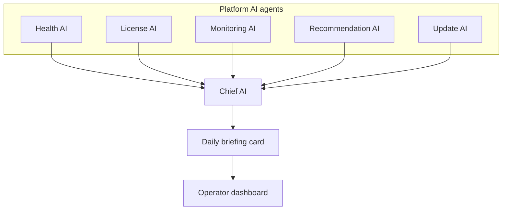

# Control Center UI — Step 14: Chief AI Daily Briefing

> **Status:** UI Prototype  
> **Step:** UI 14 (dashboard extension)  
> **Route:** `/center` (dashboard widget)  
> **Parent:** [UI_MASTER_INDEX.md](./UI_MASTER_INDEX.md)  
> **Previous:** [UI 13 — Settings & Operators](./UI_13_Settings.md)  
> **Architecture:** [14 — AI Management Center](../14_AI_Control.md)

---

## Purpose

Design the Chief AI daily briefing card — a synthesized fleet-wide operator summary on the dashboard. Chief AI orchestrates specialist agents (Health, License, Monitoring, Recommendation, Update) and surfaces actionable insights without exposing client business data.

## Scope

Single dashboard widget with mock briefing data. Interactive chat and real-time regeneration are API phase.

---

## Architecture



Chief AI **recommends only** — no destructive actions without human approval.

---

## Widget Layout

| Zone | Content |
|------|---------|
| Header | Chief AI title, generated timestamp, link to Platform AI agents |
| Summary | One-line fleet synthesis |
| Insights | 4–5 bullets with specialist agent badge + deep link |
| Footer | Credit budget note |

Placement: between KPI grid and operational alerts on `/center`.

---

## Mock Data

| Type | Export |
|------|--------|
| `CenterChiefAiBriefing` | `centerChiefAiBriefing` |
| `CenterChiefBriefingInsight` | Per-insight source agent, text, optional href |

Insights align with existing mock alerts, registrations, AI usage, and update rollout state.

---

## Component Files

```text
components/center/dashboard/
└── center-chief-ai-briefing.tsx

lib/mock-data/center.ts — centerChiefAiBriefing
```

---

## Best Practices

- Each insight cites its specialist agent — transparent provenance  
- Deep links target existing Control Center routes (monitoring, clients, registrations, ai-access, updates)  
- Copy reinforces metadata-only boundary  
- Violet gradient card matches platform identity  

---

## Summary

UI Step 14 adds the Chief AI daily briefing to the operator dashboard — completing the deferred UI 02 improvement. Fleet operators get a single synthesized view before drilling into alerts and detail screens.

**Implemented in code:** `CenterChiefAiBriefing`, `centerChiefAiBriefing` mock data, dashboard wiring.
