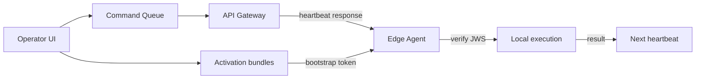

# Control Center UI — Step 15: Edge Agent Console

> **Status:** UI Prototype  
> **Step:** UI 15 (architecture extension)  
> **Route:** `/center/agents`  
> **Parent:** [UI_MASTER_INDEX.md](./UI_MASTER_INDEX.md)  
> **Previous:** [UI 14 — Chief AI Daily Briefing](./UI_14_Chief_AI_Briefing.md)  
> **Architecture:** [04 — Client Edge Agent](../04_Client_Edge_Agent.md) · [07 — API Architecture](../07_API_Architecture.md)

---

## Purpose

Design the Edge Agent operator console — signed remote command queue and activation bundle management. Complements UI 07 Monitoring (heartbeat telemetry) with command lifecycle and agent onboarding artifacts.

## Scope

Stats row, tabbed command queue + activation bundles, filters, command detail sheet. Issue command / generate bundle / cancel actions disabled until API phase.

---

## Architecture



Monitoring shows **what the agent reports**. Edge Agent Console shows **what the platform sends** and **onboarding credentials**.

---

## Page Layout

1. `CenterPageHeader` — in-flight count + mTLS note  
2. `CenterAgentStats` — pending commands, succeeded, failed/expired, pending activations  
3. Tab bar: **Command queue** | **Activation bundles** | **Offline sync queues** | **Diagnostics**  
4. Filters + table/cards + detail sheets  

Deep links: `/center/agents?command=cmd-001` · `?tab=sync&client=cl-004` · `?tab=diagnostics&diagnostic=diag-002`

---

## Command Queue Tab

### Grid columns

Client · Command type · Risk · Status · Issued · Issuer · Actions

### Command types (from architecture)

| Type | Risk |
|------|------|
| `config.reload` | Low |
| `module.enable` | Medium |
| `update.apply` | High |
| `backup.run` | Medium |
| `agent.restart` | Medium |
| `diagnostics.collect` | Low |
| `container.restart` | High |

### Detail sheet

Command ID, correlation ID, issuer, timestamps, JWS validity, payload/result summaries, cancel (disabled).

---

## Activation Bundles Tab

Bootstrap tokens for new agent install — prefix display only (24h expiry). Status: pending, activated, expired, revoked.

Grid: Client · Token prefix · Status · Created · Expires · Created by

---

## Mock Data

| Type | Count |
|------|-------|
| `CenterAgentCommand` | 8 commands across statuses |
| `CenterActivationBundle` | 5 bundles |

Helpers: `getCenterAgentConsoleStats`, `filterCenterAgentCommands`, `filterCenterActivationBundles`, `getCenterAgentCommand`, status/risk color maps.

---

## Component Files

```text
components/center/agents/
├── center-agents-page.tsx
├── center-agent-stats.tsx
├── center-agents-view.tsx
├── center-agent-commands-list.tsx
├── center-agent-commands-toolbar.tsx
├── center-agent-commands-grid.tsx
├── center-agent-command-detail-sheet.tsx
├── center-activation-bundles-list.tsx
├── center-activation-bundles-toolbar.tsx
└── center-activation-bundles-grid.tsx

app/center/agents/page.tsx
```

---

## Cross-links

| From | To |
|------|-----|
| Sidebar Technical → Edge Agents | `/center/agents` |
| Command detail → Client | `/center/clients/[id]` |
| Monitoring (telemetry) | `/center/monitoring` |
| Registrations onboarding step 5 | Activation bundles tab |

---

## Best Practices

- Never show full bootstrap token or command JWS — metadata + prefix only  
- High-risk commands note enterprise approval requirement  
- Copy reinforces outbound mTLS — no SSH/inbound from Control Center  
- Command status lifecycle matches heartbeat delivery model  

---

## Summary

UI Step 15 delivers the Edge Agent Console at `/center/agents` — signed command queue and activation bundle registry aligned with Client Edge Agent architecture. Monitoring remains telemetry-only; this screen handles platform→agent operations.

**Implemented in code:** agents components, mock data, nav entry under Technical.
