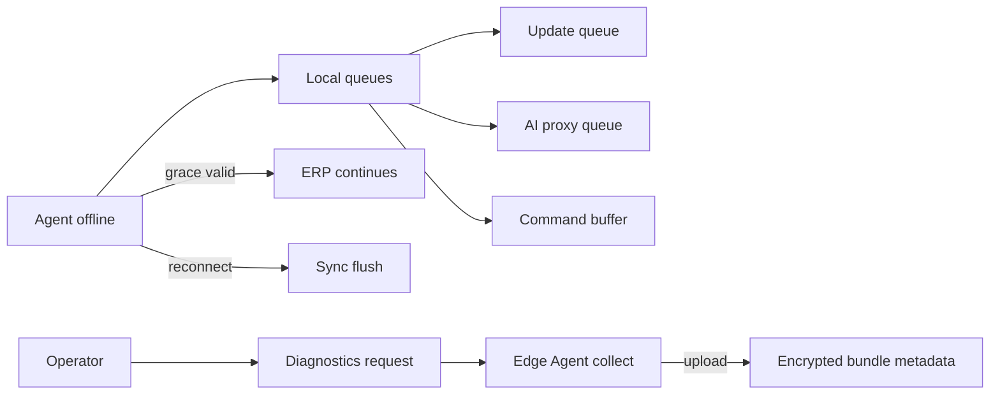

# Control Center UI — Step 16: Offline Sync Queues & Diagnostics

> **Status:** UI Prototype  
> **Step:** UI 16 (Edge Agent extension)  
> **Route:** `/center/agents?tab=sync` · `/center/agents?tab=diagnostics`  
> **Parent:** [UI_MASTER_INDEX.md](./UI_MASTER_INDEX.md)  
> **Previous:** [UI 15 — Edge Agent Console](./UI_15_Edge_Agent_Console.md)  
> **Architecture:** [04 — Client Edge Agent](../04_Client_Edge_Agent.md) · Offline mode · Remote commands

---

## Purpose

Extend the Edge Agent console with offline sync queue visibility and diagnostics bundle lifecycle — completing operator workflows for disconnected agents and support bundle collection without remote shell access.

## Scope

Two new tabs on `/center/agents`, enhanced client detail Agent tab cross-links, extended stats row. Request bundle / download actions disabled until API phase.

---

## Architecture



Aligns with Edge Agent offline mode: updates and AI queued; license grace; heartbeat buffered on reconnect.

---

## New Tabs

### Offline sync queues

| Column | Content |
|--------|---------|
| Client | Link to client agent tab |
| Connectivity | online / degraded / offline |
| Queue type | update · AI proxy · command · config |
| Pending | Item count |
| Oldest item | Timestamp |
| Grace | Active + expiry |
| Summary | Human-readable status |

Deep link: `/center/agents?tab=sync&client=cl-004`

### Diagnostics

| Column | Content |
|--------|---------|
| Client | Business name |
| Status | requested → collecting → uploading → ready / failed / expired |
| Requested | Timestamp |
| Requester | Operator or Monitoring AI |
| Bundle | Prefix only |
| Size | MB when uploaded |

Detail sheet: metadata, redaction note, download disabled, links to command + client.

Deep link: `/center/agents?tab=diagnostics&diagnostic=diag-002`

---

## Client Detail Enhancements

Agent tab now includes:
- Offline queue item count
- Links to command queue, sync queues, diagnostics
- Recent commands list (up to 4)

---

## Mock Data

| Type | Count |
|------|-------|
| `CenterAgentSyncQueue` | 5 queue rows |
| `CenterAgentDiagnostic` | 5 diagnostic bundles |

Extended `getCenterAgentConsoleStats` with offline agent count, queued items, diagnostics ready/pending.

---

## Component Files

```text
components/center/agents/
├── center-agent-sync-queues-list.tsx
├── center-agent-sync-queues-toolbar.tsx
├── center-agent-sync-queues-grid.tsx
├── center-agent-diagnostics-list.tsx
├── center-agent-diagnostics-toolbar.tsx
├── center-agent-diagnostics-grid.tsx
└── center-agent-diagnostic-detail-sheet.tsx
```

Updated: `center-agents-view.tsx`, `center-agent-stats.tsx`, `clients/client-detail.tsx`

---

## Cross-links

| From | To |
|------|-----|
| UI 07 Monitoring diagnostics future item | Diagnostics tab |
| Client detail Agent tab | All agent console tabs |
| Diagnostic detail | Related command queue entry |

---

## Summary

UI Step 16 extends the Edge Agent console with offline sync queue monitoring and diagnostics bundle tracking — matching Edge Agent offline/resilience architecture and closing the UI 07 diagnostics gap.

**Implemented in code:** sync + diagnostics tabs, mock data, client detail cross-links, 6-card stats row.
