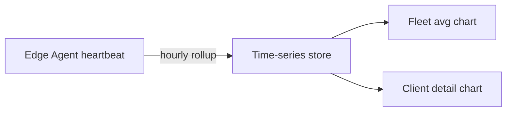

# Control Center UI — Step 17: Monitoring Time-Series Charts

> **Status:** UI Prototype  
> **Step:** UI 17 (Monitoring extension)  
> **Route:** `/center/monitoring` · detail sheet per client  
> **Parent:** [UI_MASTER_INDEX.md](./UI_MASTER_INDEX.md)  
> **Previous:** [UI 16 — Offline Sync & Diagnostics](./UI_16_Offline_Sync_Diagnostics.md)  
> **Architecture:** [10 — Monitoring & Health](../10_Monitoring.md)

---

## Purpose

Add 24-hour CPU/RAM time-series charts to fleet monitoring — closing the UI 07 Phase 2 gap. Charts use mock hourly samples derived from current heartbeat telemetry (agent-reported, not direct DB queries).

## Scope

Fleet aggregate chart on monitoring page, per-client chart in metrics detail sheet, diagnostics cross-link enabled. Live WebSocket ingestion is API phase.

---

## Architecture



Prototype generates deterministic mock series from each client's current heartbeat values.

---

## Page Additions

### Fleet chart (`CenterMonitoringFleetChart`)

- Position: below stats row on `/center/monitoring`
- Lines: fleet-average CPU %, RAM %, API p95 ms
- Subtitle notes mock hourly samples

### Client detail sheet

- `CenterMonitoringMetricsChart` below infrastructure progress bars
- 24h CPU + RAM lines for selected client
- Empty state when agent offline

### Cross-link

- **Request diagnostics** button → `/center/agents?tab=diagnostics&client=`

---

## Mock Data

| Export | Purpose |
|--------|---------|
| `CenterAgentMetricPoint` | Hourly cpu, ram, disk, apiP95 |
| `getCenterAgentMetricSeries(clientId)` | 24 points per online/degraded client |
| `getCenterFleetMetricSeries()` | Fleet average across active agents |

---

## Component Files

```text
components/center/monitoring/
├── center-monitoring-metrics-chart.tsx
└── center-monitoring-fleet-chart.tsx
```

Updated: `center-monitoring-page.tsx`, `center-monitoring-detail-sheet.tsx`

---

## Summary

UI Step 17 adds Recharts-based 24-hour monitoring trends to the Control Center — fleet overview and per-client detail — aligned with Monitoring architecture and UI 07 future improvements.

**Implemented in code:** metric series helpers, fleet + client charts, diagnostics link.
