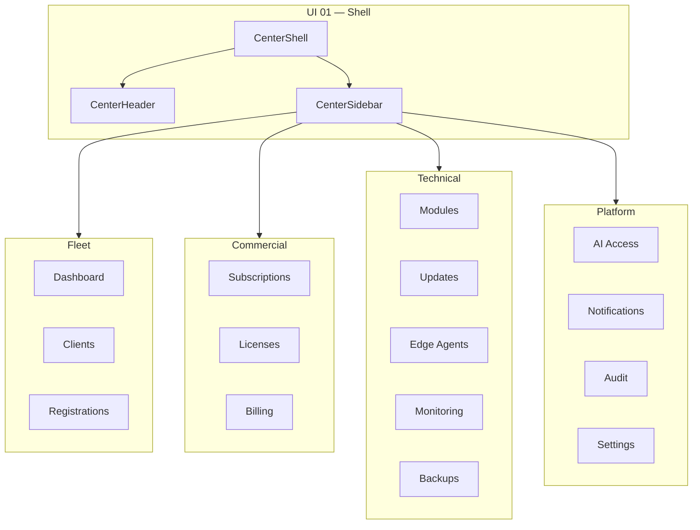

# AgainERP Control Center — UI Design Master Index

> **Status:** UI/UX Design (Prototype Phase)  
> **Version:** 1.0  
> **Route namespace:** `/center/*`  
> **Parent:** [Architecture MASTER_INDEX](../MASTER_INDEX.md)  
> **Code:** `apps/web/src/app/center/`

---

## Purpose

Step-by-step UI/UX design guide for the Control Center operator dashboard. Each step documents screen layout, components, mock data, and routes before backend wiring.

## Design Principles

| Principle | Application |
|-----------|-------------|
| **Platform identity** | Violet accent — distinct from tenant ERP admin |
| **Metadata only** | No client business data on screen labels |
| **Agent-first health** | Monitoring via heartbeat — not direct DB queries |
| **AgainERP page stack** | Breadcrumb → header → filters → content |
| **Mobile-ready** | Card list on small screens; table on desktop |
| **Prototype mode** | Mock data + `UI Preview` badge until API wired |

---

## UI Step Registry

| Step | Document | Route(s) | Status |
|------|----------|----------|--------|
| UI 01 | [Shell & Design System](./UI_01_Shell_And_Design_System.md) | Layout, nav, header | ✅ Complete |
| UI 02 | [Dashboard & Overview](./UI_02_Dashboard.md) | `/center` | ✅ Complete |
| UI 03 | [Clients List & Detail](./UI_03_Clients.md) | `/center/clients`, `/center/clients/[id]` | ✅ Complete |
| UI 04 | [Registrations & Onboarding](./UI_04_Registrations.md) | `/center/registrations` | ✅ Complete |
| UI 05 | [Subscriptions & Licenses](./UI_05_Subscriptions.md) | `/center/subscriptions`, `/center/licenses` | ✅ Complete |
| UI 06 | [Module Management](./UI_06_Module_Management.md) | `/center/modules` | ✅ Complete |
| UI 07 | [Monitoring & Health](./UI_07_Monitoring.md) | `/center/monitoring` | ✅ Complete |
| UI 08 | [Update Manager](./UI_08_Updates.md) | `/center/updates` | ✅ Complete |
| UI 09 | [Backup Status](./UI_09_Backups.md) | `/center/backups` | ✅ Complete |
| UI 10 | [AI Access & Usage](./UI_10_AI_Access.md) | `/center/ai-access` | ✅ Complete |
| UI 11 | [Billing & Invoices](./UI_11_Billing.md) | `/center/billing` | ✅ Complete |
| UI 12 | [Audit Log](./UI_12_Audit.md) | `/center/audit` | ✅ Complete |
| UI 13 | [Settings & Operators](./UI_13_Settings.md) | `/center/settings`, `/center/settings/operators`, `/center/settings/api-keys` | ✅ Complete |
| UI 14 | [Chief AI Daily Briefing](./UI_14_Chief_AI_Briefing.md) | `/center` (dashboard widget) | ✅ Complete |
| UI 15 | [Edge Agent Console](./UI_15_Edge_Agent_Console.md) | `/center/agents` | ✅ Complete |
| UI 16 | [Offline Sync & Diagnostics](./UI_16_Offline_Sync_Diagnostics.md) | `/center/agents?tab=sync`, `?tab=diagnostics` | ✅ Complete |
| UI 17 | [Monitoring Time-Series Charts](./UI_17_Monitoring_Charts.md) | `/center/monitoring` | ✅ Complete |
| UI 18 | [Loading & Empty States](./UI_18_Loading_Empty_States.md) | All `/center/*` | ✅ Complete |
| UI 19 | [Platform Notifications](./UI_19_Notifications.md) | Header · `/center/notifications` | ✅ Complete |
| UI 20 | [Command Palette (⌘K)](./UI_20_Command_Palette.md) | `/center/*` shell | ✅ Complete |
| UI 21 | [Collapsible Sidebar](./UI_21_Collapsible_Sidebar.md) | `/center/*` shell | ✅ Complete |

---

## Status

**13 core UI steps + UI 14–21 extensions complete** — prototype ready at `/center/*` with mock data. Next phase: API wiring per architecture docs.

---

## Navigation Map



---

## Code Structure

```text
apps/web/src/
├── app/center/                    # Routes
├── components/center/             # UI components
│   ├── center-shell.tsx
│   ├── center-header.tsx
│   ├── center-sidebar.tsx
│   ├── center-page-header.tsx
│   └── clients/
└── lib/
    ├── navigation/center-nav.ts
    └── mock-data/center.ts
```

---

## Read Next

[UI 01 — Shell & Design System](./UI_01_Shell_And_Design_System.md)
